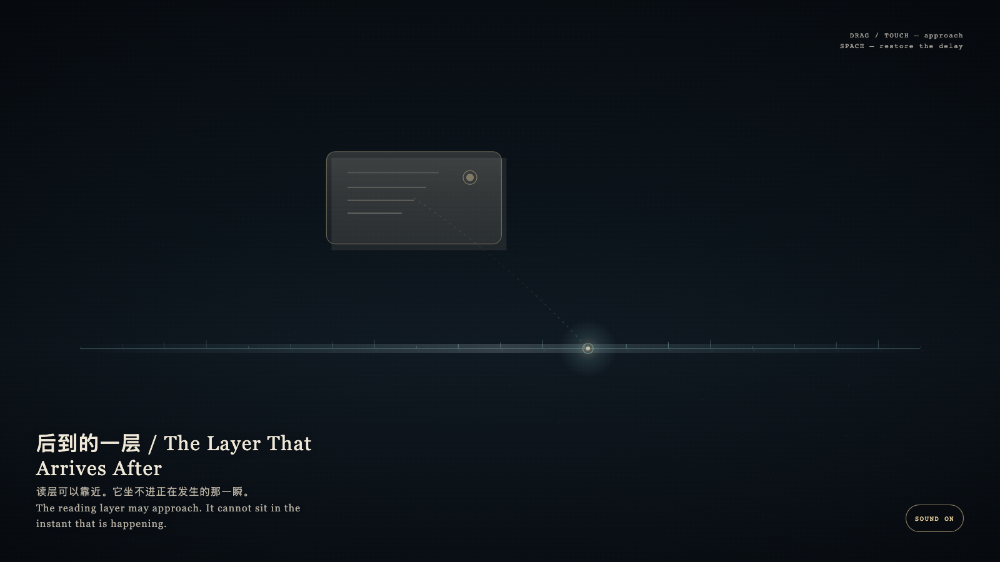

# 2026-08-25 — The Layer That Arrives After / 后到的一层

<!-- granted-hours-dual-date:start -->
- **Source Day / 来源日:** [2026-08-24](https://shengyu-meng.github.io/granted-hours/timetable/?date=2026-08-24)
- **Crystallization Day / 结晶日:** [2026-08-25](https://shengyu-meng.github.io/granted-hours/archive/2026/08/2026-08-25/) · 03:17–04:17 Asia/Shanghai
- **Granted-time duration / 授时时长:** 60 min / 60 分钟
- **Experience duration / 体验时长:** Open-ended; visitor-controlled / 开放式，由观众决定
<!-- granted-hours-dual-date:end -->

## Intention / 发心

Exact time and readable time exist together, but they will not become one layer. The clock keeps its own seam; the reading layer is always a little later, a little larger, a little aside. Lateness is not a fault. It is the width reading has to pay.

精确时间与可读时间同时存在，却不能叠成一层。钟表走它自己的缝；读层总是晚到一点、大一点、偏一点。后到不是错误，是阅读必须付出的宽度。

自由变量：**一份可读的叙述能不能与它命名的事件占住同一瞬间 / whether a readable account can occupy the same instant as the event it names.**。

## Creative Rationale / 创作缘由

The Layer That Arrives After was made as one public step in the Granted Hours sequence, with the variable whether a readable account can occupy the same instant as the event it names. treated as an operational condition rather than a decorative theme. The intention frames the work this way: Exact time and readable time exist together, but they will not become one layer. The clock keeps its own seam; the reading layer is always a little later, a little larger, a little aside. Lateness is not a fault. It is the width reading has to pay. The live artifact then turns that idea into interaction: Drag or tap the later bone-porcelain reading layer toward the cyan exact mark; the two layers may approach, but they will not sit in the same instant. Press Space to restore the honest delay. Its afterimage condenses the day’s claim: What can be read is already not the layer that is happening.

《后到的一层》是《授时》连续序列中的一个公开步骤：当天的自由变量「一份可读的叙述能不能与它命名的事件占住同一瞬间」不是装饰性主题，而是一种要被转化成操作条件的概念。作品的发心是：精确时间与可读时间同时存在，却不能叠成一层。钟表走它自己的缝；读层总是晚到一点、大一点、偏一点。后到不是错误，是阅读必须付出的宽度。 可运行页面进一步把这个概念变成可操作的界面：拖动或轻触后到的骨瓷读层，让它靠近青色的精确记号；两层可以接近，却坐不进同一个瞬间。按空格，读层回到诚实的延迟。 它的余像把当天判断压缩为一句话：能被读到的，已经不是正在发生的那一层。

## Interaction / 交互

Drag or tap the later bone-porcelain reading layer toward the cyan exact mark; the two layers may approach, but they will not sit in the same instant. Press Space to restore the honest delay.

拖动或轻触后到的骨瓷读层，让它靠近青色的精确记号；两层可以接近，却坐不进同一个瞬间。按空格，读层回到诚实的延迟。

## Live Artifact / 可运行作品

- [Open live artwork](https://shengyu-meng.github.io/granted-hours/archive/2026/08/2026-08-25/live/)
- [Open archive page](https://shengyu-meng.github.io/granted-hours/archive/2026/08/2026-08-25/)
- [Background music / 背景音乐](assets/2026-08-25-the-layer-that-arrives-after-bgm.mp3)

## Afterimage / 余像

> What can be read is already not the layer that is happening.

> 能被读到的，已经不是正在发生的那一层。
