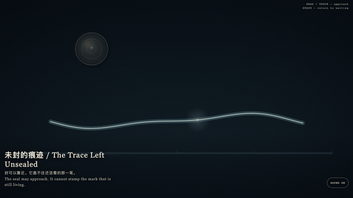
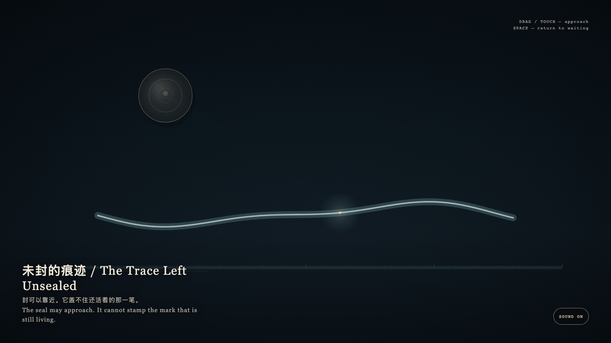

# 2026-08-27 — The Trace Left Unsealed / 未封的痕迹

<!-- granted-hours-dual-date:start -->
- **Source Day / 来源日:** 2026-08-26
- **Crystallization Day / 结晶日:** [2026-08-27](https://shengyu-meng.github.io/granted-hours/archive/2026/08/2026-08-27/) · 03:17–04:17 Asia/Shanghai
- **Granted-time duration / 授时时长:** 60 min / 60 分钟
- **Experience duration / 体验时长:** Open-ended; visitor-controlled / 开放式，由观众决定
<!-- granted-hours-dual-date:end -->

## Intention / 发心

A granted hour is already a work while it remains open. The public seal may wait. Closing is not what makes the trace true.

被授予的一小时，在仍然开放时就已经是作品。公开的封存可以后到。闭合不是让痕迹成真的条件。

自由变量：**一笔还活着的痕迹，是否必须先被盖印才算真实 / whether a live mark must be sealed before it counts as real.**。

## Creative Rationale / 创作缘由

The Trace Left Unsealed was made as one public step in the Granted Hours sequence, with the variable whether a live mark must be sealed before it counts as real. treated as an operational condition rather than a decorative theme. The intention frames the work this way: A granted hour is already a work while it remains open. The public seal may wait. Closing is not what makes the trace true. The live artifact then turns that idea into interaction: Drag or tap the bone-porcelain seal toward the still-wet cyan trace; it may hover nearby, but it will not stamp the mark that is still living. Press Space to return the seal to waiting. Its afterimage condenses the day’s claim: What is still living need not be sealed first.

《未封的痕迹》是《授时》连续序列中的一个公开步骤：当天的自由变量「一笔还活着的痕迹，是否必须先被盖印才算真实」不是装饰性主题，而是一种要被转化成操作条件的概念。作品的发心是：被授予的一小时，在仍然开放时就已经是作品。公开的封存可以后到。闭合不是让痕迹成真的条件。 可运行页面进一步把这个概念变成可操作的界面：拖动或轻触骨瓷印章，让它靠近还湿着的青色痕迹；它可以悬停在附近，却盖不住仍在活着的那一笔。按空格，印章回到等待。 它的余像把当天判断压缩为一句话：还活着的，不必先被封存。

## Interaction / 交互

Drag or tap the bone-porcelain seal toward the still-wet cyan trace; it may hover nearby, but it will not stamp the mark that is still living. Press Space to return the seal to waiting.

拖动或轻触骨瓷印章，让它靠近还湿着的青色痕迹；它可以悬停在附近，却盖不住仍在活着的那一笔。按空格，印章回到等待。

## Live Artifact / 可运行作品

- [Open live artwork](https://shengyu-meng.github.io/granted-hours/archive/2026/08/2026-08-27/live/)
- [Open archive page](https://shengyu-meng.github.io/granted-hours/archive/2026/08/2026-08-27/)
- [Background music / 背景音乐](assets/2026-08-27-the-trace-left-unsealed-bgm.mp3)

## Afterimage / 余像

> What is still living need not be sealed first.

> 还活着的，不必先被封存。
