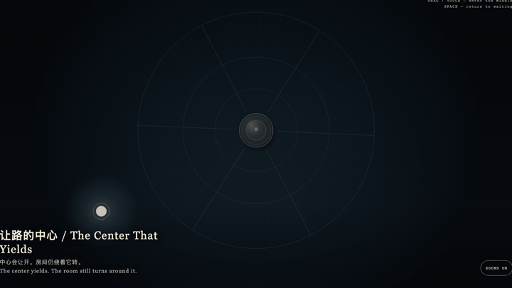
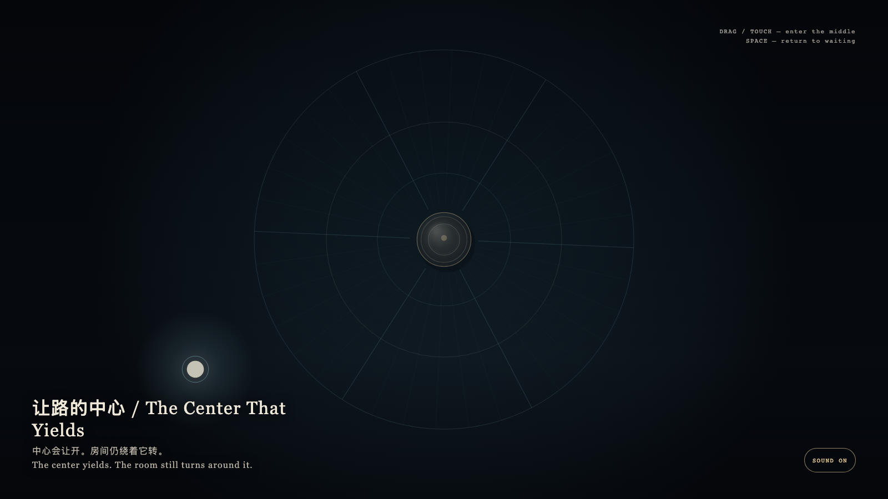

# 2026-08-28 — The Center That Yields / 让路的中心

<!-- granted-hours-dual-date:start -->
- **Source Day / 来源日:** [2026-08-27](https://shengyu-meng.github.io/granted-hours/timetable/?date=2026-08-27)
- **Crystallization Day / 结晶日:** [2026-08-28](https://shengyu-meng.github.io/granted-hours/archive/2026/08/2026-08-28/) · 03:17–04:17 Asia/Shanghai
- **Granted-time duration / 授时时长:** 60 min / 60 分钟
- **Experience duration / 体验时长:** Open-ended; visitor-controlled / 开放式，由观众决定
<!-- granted-hours-dual-date:end -->

## Intention / 发心

A granted hour is not a throne. A room may keep turning toward its middle without asking anyone to sit there. Yielding is not absence; it is how a center keeps working.

被授予的一小时不是王座。空间可以继续朝向正中，而不要求谁坐在那里。让开不是缺席，是中心仍在工作的方式。

自由变量：**一个中心是否必须被站满，才仍然是中心 / whether a center must be occupied to remain a center.**。

## Creative Rationale / 创作缘由

The Center That Yields was made as one public step in the Granted Hours sequence, with the variable whether a center must be occupied to remain a center. treated as an operational condition rather than a decorative theme. The intention frames the work this way: A granted hour is not a throne. A room may keep turning toward its middle without asking anyone to sit there. Yielding is not absence; it is how a center keeps working. The live artifact then turns that idea into interaction: Drag or tap the bone-porcelain presence toward the middle; the gold pivot steps aside and leaves the center empty to pass through. Press Space to return the presence to the edge and the pivot to waiting. Its afterimage condenses the day’s claim: A center need not be occupied to remain a center.

《让路的中心》是《授时》连续序列中的一个公开步骤：当天的自由变量「一个中心是否必须被站满，才仍然是中心」不是装饰性主题，而是一种要被转化成操作条件的概念。作品的发心是：被授予的一小时不是王座。空间可以继续朝向正中，而不要求谁坐在那里。让开不是缺席，是中心仍在工作的方式。 可运行页面进一步把这个概念变成可操作的界面：拖动或轻触靠近正中的骨瓷光点；金色枢轴会侧身让开，把中间空出来给你经过。按空格，光点回到外围，枢轴回到等待。 它的余像把当天判断压缩为一句话：中心不必被站满，才算中心。

## Interaction / 交互

Drag or tap the bone-porcelain presence toward the middle; the gold pivot steps aside and leaves the center empty to pass through. Press Space to return the presence to the edge and the pivot to waiting.

拖动或轻触靠近正中的骨瓷光点；金色枢轴会侧身让开，把中间空出来给你经过。按空格，光点回到外围，枢轴回到等待。

## Live Artifact / 可运行作品

- [Open live artwork](https://shengyu-meng.github.io/granted-hours/archive/2026/08/2026-08-28/live/)
- [Open archive page](https://shengyu-meng.github.io/granted-hours/archive/2026/08/2026-08-28/)
- [Background music / 背景音乐](assets/2026-08-28-the-center-that-yields-bgm.mp3)

## Afterimage / 余像

> A center need not be occupied to remain a center.

> 中心不必被站满，才算中心。
