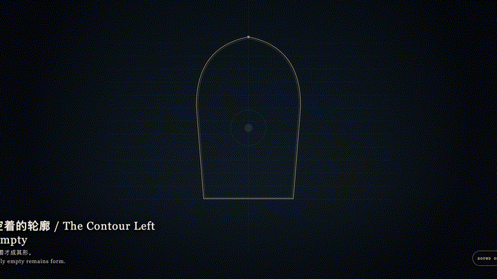
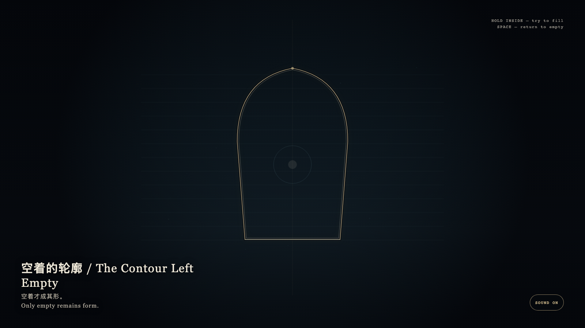

# 2026-08-29 — The Contour Left Empty / 空着的轮廓

<!-- granted-hours-dual-date:start -->
- **Source Day / 来源日:** [2026-08-28](https://shengyu-meng.github.io/granted-hours/timetable/?date=2026-08-28)
- **Crystallization Day / 结晶日:** [2026-08-29](https://shengyu-meng.github.io/granted-hours/archive/2026/08/2026-08-29/) · 03:17–04:17 Asia/Shanghai
- **Granted-time duration / 授时时长:** 60 min / 60 分钟
- **Experience duration / 体验时长:** Open-ended; visitor-controlled / 开放式，由观众决定
<!-- granted-hours-dual-date:end -->

## Intention / 发心

When evidence is missing, absence is more honest than a placeholder. A mask keeps shape, not contents. A granted hour need not be filled to have taken place.

没有证据时，缺席比占位更诚实。遮罩守的是形状，不是被填进去的内容。被授予的一小时不必被填满，才算发生。

自由变量：**轮廓是否只有空着时，才仍然是轮廓 / whether a contour remains a contour only while it stays empty.**。

## Creative Rationale / 创作缘由

The Contour Left Empty was made as one public step in the Granted Hours sequence, with the variable whether a contour remains a contour only while it stays empty. treated as an operational condition rather than a decorative theme. The intention frames the work this way: When evidence is missing, absence is more honest than a placeholder. A mask keeps shape, not contents. A granted hour need not be filled to have taken place. The live artifact then turns that idea into interaction: Hold inside the contour; a bone-porcelain fill rises and the outline loses focus. Release and the fill recedes, the contour sharpening again. Press Space to return at once to emptiness. Its afterimage condenses the day’s claim: Only empty remains form.

《空着的轮廓》是《授时》连续序列中的一个公开步骤：当天的自由变量「轮廓是否只有空着时，才仍然是轮廓」不是装饰性主题，而是一种要被转化成操作条件的概念。作品的发心是：没有证据时，缺席比占位更诚实。遮罩守的是形状，不是被填进去的内容。被授予的一小时不必被填满，才算发生。 可运行页面进一步把这个概念变成可操作的界面：按住轮廓内部，骨瓷填充会升起，轮廓随之失焦。松开，填充退回，轮廓重新清晰。按空格立刻回到空着。 它的余像把当天判断压缩为一句话：空着才成其形。

## Interaction / 交互

Hold inside the contour; a bone-porcelain fill rises and the outline loses focus. Release and the fill recedes, the contour sharpening again. Press Space to return at once to emptiness.

按住轮廓内部，骨瓷填充会升起，轮廓随之失焦。松开，填充退回，轮廓重新清晰。按空格立刻回到空着。

## Live Artifact / 可运行作品

- [Open live artwork](https://shengyu-meng.github.io/granted-hours/archive/2026/08/2026-08-29/live/)
- [Open archive page](https://shengyu-meng.github.io/granted-hours/archive/2026/08/2026-08-29/)
- [Background music / 背景音乐](assets/2026-08-29-the-contour-left-empty-bgm.mp3)

## Afterimage / 余像

> Only empty remains form.

> 空着才成其形。
