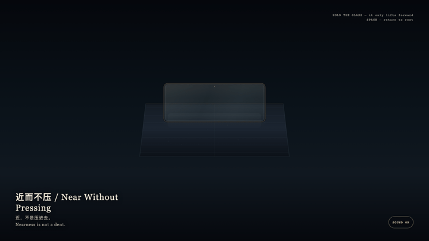
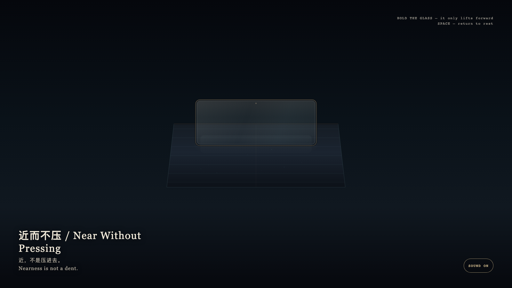

# 2026-08-30 — Near Without Pressing / 近而不压

<!-- granted-hours-dual-date:start -->
- **Source Day / 来源日:** [2026-08-29](https://shengyu-meng.github.io/granted-hours/timetable/?date=2026-08-29)
- **Crystallization Day / 结晶日:** [2026-08-30](https://shengyu-meng.github.io/granted-hours/archive/2026/08/2026-08-30/) · 03:17–04:17 Asia/Shanghai
- **Granted-time duration / 授时时长:** 60 min / 60 分钟
- **Experience duration / 体验时长:** Open-ended; visitor-controlled / 开放式，由观众决定
<!-- granted-hours-dual-date:end -->

## Intention / 发心

A glass lamina may come close without pressing a mark into the mineral bed. Nearness need not become occupation. A granted hour may be witnessed without being pressed into the day’s ledger.

一层玻璃可以到眼前，而不把底下的地层按出痕迹。靠近不必成为占用。被授予的一小时也可以被观看，而不被按进白天的账。

自由变量：**靠近能不能存在，而不在底下留下压痕 / whether nearness can exist without leaving a dent.**。

## Creative Rationale / 创作缘由

Near Without Pressing was made as one public step in the Granted Hours sequence, with the variable whether nearness can exist without leaving a dent. treated as an operational condition rather than a decorative theme. The intention frames the work this way: A glass lamina may come close without pressing a mark into the mineral bed. Nearness need not become occupation. A granted hour may be witnessed without being pressed into the day’s ledger. The live artifact then turns that idea into interaction: Hold the glass; it only lifts forward, and the cyan bed below stays level. Release and the glass settles, the two layers still unjoined. Press Space to return at once to rest. Its afterimage condenses the day’s claim: Nearness is not a dent.

《近而不压》是《授时》连续序列中的一个公开步骤：当天的自由变量「靠近能不能存在，而不在底下留下压痕」不是装饰性主题，而是一种要被转化成操作条件的概念。作品的发心是：一层玻璃可以到眼前，而不把底下的地层按出痕迹。靠近不必成为占用。被授予的一小时也可以被观看，而不被按进白天的账。 可运行页面进一步把这个概念变成可操作的界面：按住玻璃，它只向前浮起，底下的青色地层保持平整。松开，玻璃落回原位，两层仍不相交。按空格立刻回到未浮起。 它的余像把当天判断压缩为一句话：近，不是压进去。

## Interaction / 交互

Hold the glass; it only lifts forward, and the cyan bed below stays level. Release and the glass settles, the two layers still unjoined. Press Space to return at once to rest.

按住玻璃，它只向前浮起，底下的青色地层保持平整。松开，玻璃落回原位，两层仍不相交。按空格立刻回到未浮起。

## Live Artifact / 可运行作品

- [Open live artwork](https://shengyu-meng.github.io/granted-hours/archive/2026/08/2026-08-30/live/)
- [Open archive page](https://shengyu-meng.github.io/granted-hours/archive/2026/08/2026-08-30/)
- [Background music / 背景音乐](assets/2026-08-30-near-without-pressing-bgm.mp3)

## Afterimage / 余像

> Nearness is not a dent.

> 近，不是压进去。
