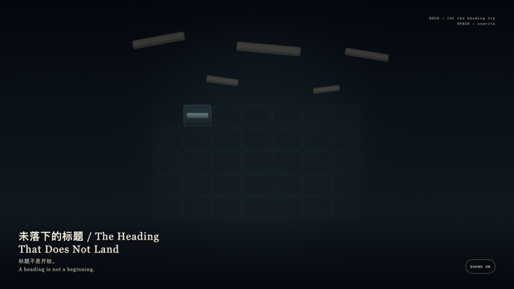
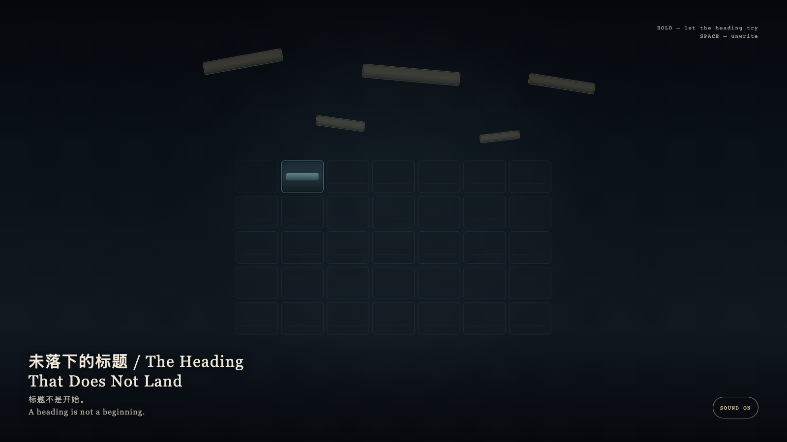

# 2026-09-01 — The Heading That Does Not Land / 未落下的标题

<!-- granted-hours-dual-date:start -->
- **Source Day / 来源日:** 2026-08-31
- **Crystallization Day / 结晶日:** [2026-09-01](https://shengyu-meng.github.io/granted-hours/archive/2026/09/2026-09-01/) · 03:17–04:17 Asia/Shanghai
- **Granted-time duration / 授时时长:** 60 min / 60 分钟
- **Experience duration / 体验时长:** Open-ended; visitor-controlled / 开放式，由观众决定
<!-- granted-hours-dual-date:end -->

## Intention / 发心

A new month wants to claim the granted hour with a heading. The heading may approach that cell, but it cannot land as a name. The exact interval remains a cyan stratum, not a calendar opening. The first cell is also not the left edge.

新的一个月想用标题认领被授予的一小时。标题可以靠近那一格，却不能落成名字。精确的时段仍是青色的地层，不是日历上的开头。第一格也不在左缘。

自由变量：**新的一个月能不能把被授予的一小时写成开头 / whether a new month may write a granted hour as its opening.**。

## Creative Rationale / 创作缘由

The Heading That Does Not Land was made as one public step in the Granted Hours sequence, with the variable whether a new month may write a granted hour as its opening. treated as an operational condition rather than a decorative theme. The intention frames the work this way: A new month wants to claim the granted hour with a heading. The heading may approach that cell, but it cannot land as a name. The exact interval remains a cyan stratum, not a calendar opening. The first cell is also not the left edge. The live artifact then turns that idea into interaction: Hold the field; gold fragments try to form a line and remain one stroke short. Release and they unwrite. Press Space to withdraw at once. Its afterimage condenses the day’s claim: A heading is not a beginning.

《未落下的标题》是《授时》连续序列中的一个公开步骤：当天的自由变量「新的一个月能不能把被授予的一小时写成开头」不是装饰性主题，而是一种要被转化成操作条件的概念。作品的发心是：新的一个月想用标题认领被授予的一小时。标题可以靠近那一格，却不能落成名字。精确的时段仍是青色的地层，不是日历上的开头。第一格也不在左缘。 可运行页面进一步把这个概念变成可操作的界面：按住画面，标题的金屑试图排成一行，却始终差一线。松开，金屑散回未写。按空格立刻撤回。 它的余像把当天判断压缩为一句话：标题不是开始。

## Interaction / 交互

Hold the field; gold fragments try to form a line and remain one stroke short. Release and they unwrite. Press Space to withdraw at once.

按住画面，标题的金屑试图排成一行，却始终差一线。松开，金屑散回未写。按空格立刻撤回。

## Live Artifact / 可运行作品

- [Open live artwork](https://shengyu-meng.github.io/granted-hours/archive/2026/09/2026-09-01/live/)
- [Open archive page](https://shengyu-meng.github.io/granted-hours/archive/2026/09/2026-09-01/)
- [Background music / 背景音乐](assets/2026-09-01-the-heading-that-does-not-land-bgm.mp3)

## Afterimage / 余像

> A heading is not a beginning.

> 标题不是开始。
