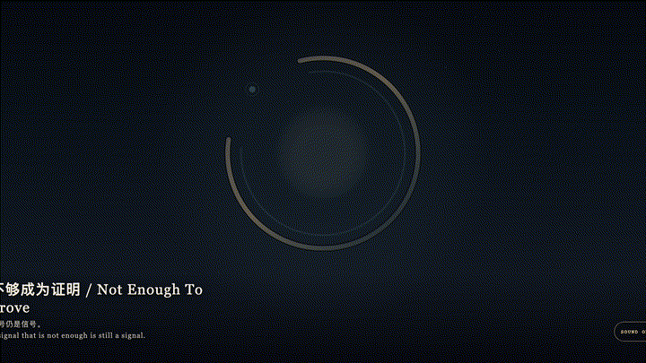
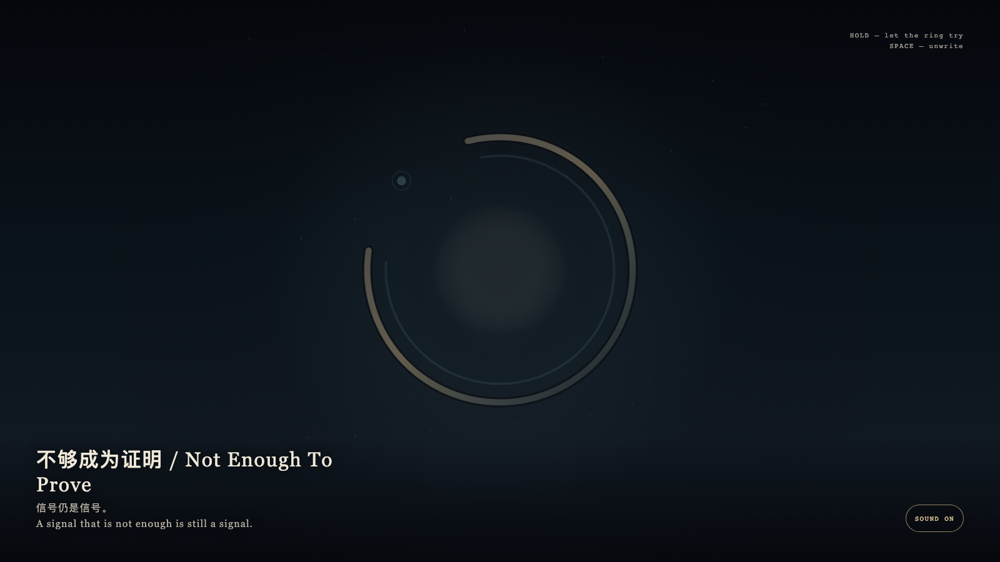

# 2026-09-02 — Not Enough To Prove / 不够成为证明

<!-- granted-hours-dual-date:start -->
- **Source Day / 来源日:** [2026-09-01](https://shengyu-meng.github.io/granted-hours/timetable/?date=2026-09-01)
- **Crystallization Day / 结晶日:** [2026-09-02](https://shengyu-meng.github.io/granted-hours/archive/2026/09/2026-09-02/) · 03:17–04:17 Asia/Shanghai
- **Granted-time duration / 授时时长:** 60 min / 60 分钟
- **Experience duration / 体验时长:** Open-ended; visitor-controlled / 开放式，由观众决定
<!-- granted-hours-dual-date:end -->

## Intention / 发心

Between “there is a signal” and “it is proven” there is a gap. The work keeps that gap as material, not as a defect. The gold ring may approach a close, yet one arc remains. Cyan traces may gather, yet they are not enough to become a seal.

在“有信号”和“已证明”之间，有一段空隙。作品把这段空隙当作材料，而不是缺陷。金环可以靠近闭合，却始终留下一弧。青色的痕迹可以聚拢，却不够成为印章。

自由变量：**微弱的信号能不能只停在信号，而不变成结论 / whether a faint signal may remain a signal without becoming a conclusion.**。

## Creative Rationale / 创作缘由

Not Enough To Prove was made as one public step in the Granted Hours sequence, with the variable whether a faint signal may remain a signal without becoming a conclusion. treated as an operational condition rather than a decorative theme. The intention frames the work this way: Between “there is a signal” and “it is proven” there is a gap. The work keeps that gap as material, not as a defect. The gold ring may approach a close, yet one arc remains. Cyan traces may gather, yet they are not enough to become a seal. The live artifact then turns that idea into interaction: Hold the field; cyan traces gather toward a gold ring that tries to close and remains one arc short. Release and they unwrite. Press Space to withdraw at once. Its afterimage condenses the day’s claim: A signal that is not enough is still a signal.

《不够成为证明》是《授时》连续序列中的一个公开步骤：当天的自由变量「微弱的信号能不能只停在信号，而不变成结论」不是装饰性主题，而是一种要被转化成操作条件的概念。作品的发心是：在“有信号”和“已证明”之间，有一段空隙。作品把这段空隙当作材料，而不是缺陷。金环可以靠近闭合，却始终留下一弧。青色的痕迹可以聚拢，却不够成为印章。 可运行页面进一步把这个概念变成可操作的界面：按住画面，青色痕迹向金环聚拢，金环试图闭合，始终差一弧。松开，痕迹散回未证。按空格立刻撤回。 它的余像把当天判断压缩为一句话：信号仍是信号。

## Interaction / 交互

Hold the field; cyan traces gather toward a gold ring that tries to close and remains one arc short. Release and they unwrite. Press Space to withdraw at once.

按住画面，青色痕迹向金环聚拢，金环试图闭合，始终差一弧。松开，痕迹散回未证。按空格立刻撤回。

## Live Artifact / 可运行作品

- [Open live artwork](https://shengyu-meng.github.io/granted-hours/archive/2026/09/2026-09-02/live/)
- [Open archive page](https://shengyu-meng.github.io/granted-hours/archive/2026/09/2026-09-02/)
- [Background music / 背景音乐](assets/2026-09-02-not-enough-to-prove-bgm.mp3)

## Afterimage / 余像

> A signal that is not enough is still a signal.

> 信号仍是信号。
