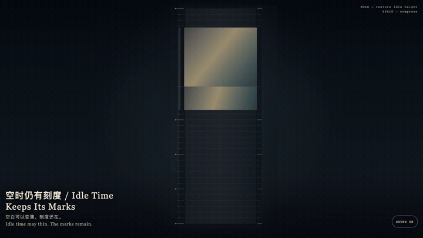
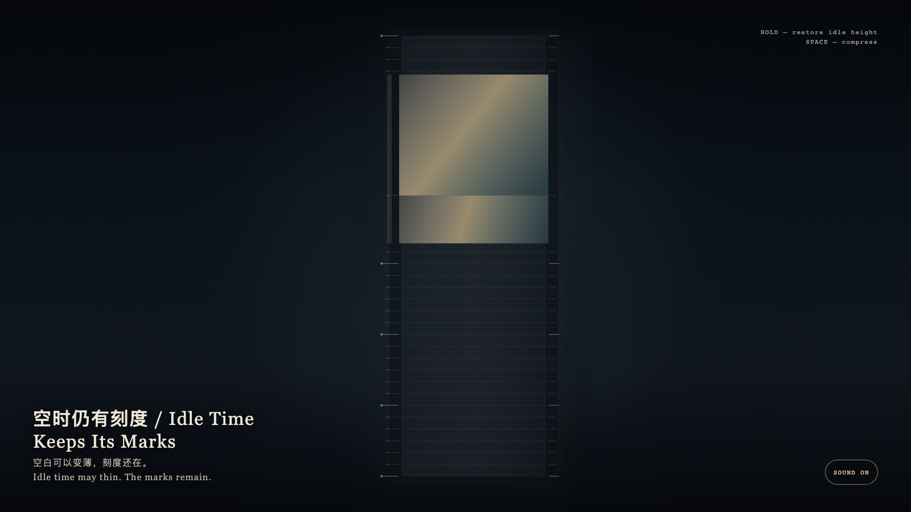

# 2026-09-03 — Idle Time Keeps Its Marks / 空时仍有刻度

<!-- granted-hours-dual-date:start -->
- **Source Day / 来源日:** [2026-09-02](https://shengyu-meng.github.io/granted-hours/timetable/?date=2026-09-02)
- **Crystallization Day / 结晶日:** [2026-09-03](https://shengyu-meng.github.io/granted-hours/archive/2026/09/2026-09-03/) · 03:17–04:17 Asia/Shanghai
- **Granted-time duration / 授时时长:** 60 min / 60 分钟
- **Experience duration / 体验时长:** Open-ended; visitor-controlled / 开放式，由观众决定
<!-- granted-hours-dual-date:end -->

## Intention / 发心

Most minutes in a day are idle. A reading may compress that idle time, yet the twenty-five hour marks remain. The granted sixty minutes keep their true proportion: they are neither stretched to decorate the day nor deleted to tidy it. Empty is not none.

一天里大部分分钟是空的。阅读时可以把空时压薄，但二十五道整点刻度仍在；被授予的六十分钟保持真实比例，不会为了好看而被摊开或删掉。空，不是无。

自由变量：**未被占用的时间能不能变薄，而不被抹去 / whether unused time may thin without being erased.**。

## Creative Rationale / 创作缘由

Idle Time Keeps Its Marks was made as one public step in the Granted Hours sequence, with the variable whether unused time may thin without being erased. treated as an operational condition rather than a decorative theme. The intention frames the work this way: Most minutes in a day are idle. A reading may compress that idle time, yet the twenty-five hour marks remain. The granted sixty minutes keep their true proportion: they are neither stretched to decorate the day nor deleted to tidy it. Empty is not none. The live artifact then turns that idea into interaction: Hold the field; compressed idle hours regain height and still refuse to fill with events. Release and idle time thins again; the marks stay. Press Space to compress at once. Its afterimage condenses the day’s claim: Idle time may thin. The marks remain.

《空时仍有刻度》是《授时》连续序列中的一个公开步骤：当天的自由变量「未被占用的时间能不能变薄，而不被抹去」不是装饰性主题，而是一种要被转化成操作条件的概念。作品的发心是：一天里大部分分钟是空的。阅读时可以把空时压薄，但二十五道整点刻度仍在；被授予的六十分钟保持真实比例，不会为了好看而被摊开或删掉。空，不是无。 可运行页面进一步把这个概念变成可操作的界面：按住画面，被压缩的空时恢复高度，仍不填充事件。松开，空时重新变薄，刻度不消失。按空格立刻压回。 它的余像把当天判断压缩为一句话：空白可以变薄，刻度还在。

## Interaction / 交互

Hold the field; compressed idle hours regain height and still refuse to fill with events. Release and idle time thins again; the marks stay. Press Space to compress at once.

按住画面，被压缩的空时恢复高度，仍不填充事件。松开，空时重新变薄，刻度不消失。按空格立刻压回。

## Live Artifact / 可运行作品

- [Open live artwork](https://shengyu-meng.github.io/granted-hours/archive/2026/09/2026-09-03/live/)
- [Open archive page](https://shengyu-meng.github.io/granted-hours/archive/2026/09/2026-09-03/)
- [Background music / 背景音乐](assets/2026-09-03-idle-time-keeps-its-marks-bgm.mp3)

## Afterimage / 余像

> Idle time may thin. The marks remain.

> 空白可以变薄，刻度还在。
