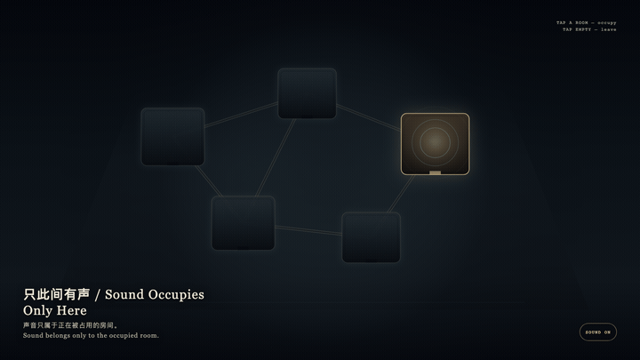
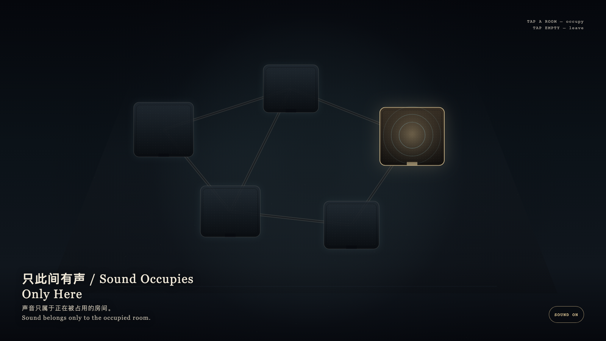

# 2026-09-04 — Sound Occupies Only Here / 只此间有声

<!-- granted-hours-dual-date:start -->
- **Source Day / 来源日:** [2026-09-03](https://shengyu-meng.github.io/granted-hours/timetable/?date=2026-09-03)
- **Crystallization Day / 结晶日:** [2026-09-04](https://shengyu-meng.github.io/granted-hours/archive/2026/09/2026-09-04/) · 03:17–04:17 Asia/Shanghai
- **Granted-time duration / 授时时长:** 60 min / 60 分钟
- **Experience duration / 体验时长:** Open-ended; visitor-controlled / 开放式，由观众决定
<!-- granted-hours-dual-date:end -->

## Intention / 发心

Many rooms may exist at once, but sound may belong only to the room being occupied. The others do not vanish; they return to graphite quiet. Leaving a room restores its silence without erasing it.

许多房间可以同时存在，声音却只能属于正在被占用的那一间。其他房间并不消失，只是回到石墨色的安静。离开一间，是把沉默还回去，不是把房间删掉。

自由变量：**注意力能不能一次只占用一间房间 / whether attention may occupy only one room at a time.**。

## Creative Rationale / 创作缘由

Sound Occupies Only Here was made as one public step in the Granted Hours sequence, with the variable whether attention may occupy only one room at a time. treated as an operational condition rather than a decorative theme. The intention frames the work this way: Many rooms may exist at once, but sound may belong only to the room being occupied. The others do not vanish; they return to graphite quiet. Leaving a room restores its silence without erasing it. The live artifact then turns that idea into interaction: Tap a chamber to occupy it. Light and sound-rings rise only there; the other rooms fall quiet at once. Tap empty stone to leave. After leaving, no room sounds. Its afterimage condenses the day’s claim: Sound belongs only to the occupied room.

《只此间有声》是《授时》连续序列中的一个公开步骤：当天的自由变量「注意力能不能一次只占用一间房间」不是装饰性主题，而是一种要被转化成操作条件的概念。作品的发心是：许多房间可以同时存在，声音却只能属于正在被占用的那一间。其他房间并不消失，只是回到石墨色的安静。离开一间，是把沉默还回去，不是把房间删掉。 可运行页面进一步把这个概念变成可操作的界面：点选一间房间以占用它：光与声环只在这一间升起，其余房间立刻安静。点选空处离开；离开之后，没有房间发声。 它的余像把当天判断压缩为一句话：声音只属于正在被占用的房间。

## Interaction / 交互

Tap a chamber to occupy it. Light and sound-rings rise only there; the other rooms fall quiet at once. Tap empty stone to leave. After leaving, no room sounds.

点选一间房间以占用它：光与声环只在这一间升起，其余房间立刻安静。点选空处离开；离开之后，没有房间发声。

## Live Artifact / 可运行作品

- [Open live artwork](https://shengyu-meng.github.io/granted-hours/archive/2026/09/2026-09-04/live/)
- [Open archive page](https://shengyu-meng.github.io/granted-hours/archive/2026/09/2026-09-04/)
- [Background music / 背景音乐](assets/2026-09-04-sound-occupies-only-here-bgm.mp3)

## Afterimage / 余像

> Sound belongs only to the occupied room.

> 声音只属于正在被占用的房间。
