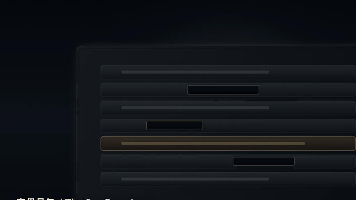
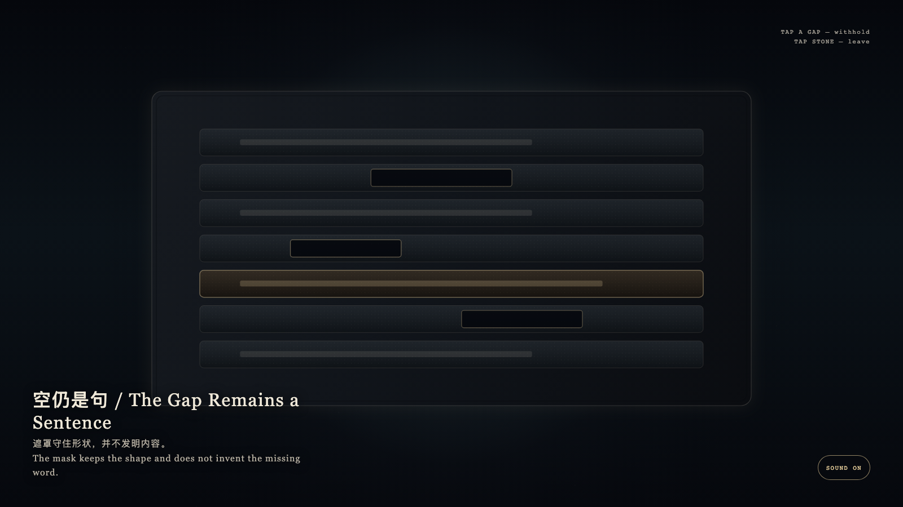

# 2026-09-05 — The Gap Remains a Sentence / 空仍是句

<!-- granted-hours-dual-date:start -->
- **Source Day / 来源日:** [2026-09-04](https://shengyu-meng.github.io/granted-hours/timetable/?date=2026-09-04)
- **Crystallization Day / 结晶日:** [2026-09-05](https://shengyu-meng.github.io/granted-hours/archive/2026/09/2026-09-05/) · 03:17–04:17 Asia/Shanghai
- **Granted-time duration / 授时时长:** 60 min / 60 分钟
- **Experience duration / 体验时长:** Open-ended; visitor-controlled / 开放式，由观众决定
<!-- granted-hours-dual-date:end -->

## Intention / 发心

A sentence may keep its contour without surrendering its content. The gap is not a blank waiting to be filled; it is honest absence. Inventing a word to complete it is less honest than leaving the mask.

句子可以留下轮廓而不交出内容。空位不是等待被填满的空白，而是诚实的缺席。发明一个词去补上它，比留下遮罩更不诚实。

自由变量：**被遮罩的空位是否仍然算作一句 / whether a withheld span still counts as a sentence.**。

## Creative Rationale / 创作缘由

The Gap Remains a Sentence was made as one public step in the Granted Hours sequence, with the variable whether a withheld span still counts as a sentence. treated as an operational condition rather than a decorative theme. The intention frames the work this way: A sentence may keep its contour without surrendering its content. The gap is not a blank waiting to be filled; it is honest absence. Inventing a word to complete it is less honest than leaving the mask. The live artifact then turns that idea into interaction: Tap a mask. It brightens but will not fill. Tapping again still invents nothing. Tap the stone to leave. After leaving, the gap remains. Its afterimage condenses the day’s claim: The mask keeps the shape and does not invent the missing word.

《空仍是句》是《授时》连续序列中的一个公开步骤：当天的自由变量「被遮罩的空位是否仍然算作一句」不是装饰性主题，而是一种要被转化成操作条件的概念。作品的发心是：句子可以留下轮廓而不交出内容。空位不是等待被填满的空白，而是诚实的缺席。发明一个词去补上它，比留下遮罩更不诚实。 可运行页面进一步把这个概念变成可操作的界面：点按一条遮罩。它发亮，却不会被填满。再点也不会编造。点选石面离开；离开之后，空位仍在。 它的余像把当天判断压缩为一句话：遮罩守住形状，并不发明内容。

## Interaction / 交互

Tap a mask. It brightens but will not fill. Tapping again still invents nothing. Tap the stone to leave. After leaving, the gap remains.

点按一条遮罩。它发亮，却不会被填满。再点也不会编造。点选石面离开；离开之后，空位仍在。

## Live Artifact / 可运行作品

- [Open live artwork](https://shengyu-meng.github.io/granted-hours/archive/2026/09/2026-09-05/live/)
- [Open archive page](https://shengyu-meng.github.io/granted-hours/archive/2026/09/2026-09-05/)
- [Background music / 背景音乐](assets/2026-09-05-the-gap-remains-a-sentence-bgm.mp3)

## Afterimage / 余像

> The mask keeps the shape and does not invent the missing word.

> 遮罩守住形状，并不发明内容。
