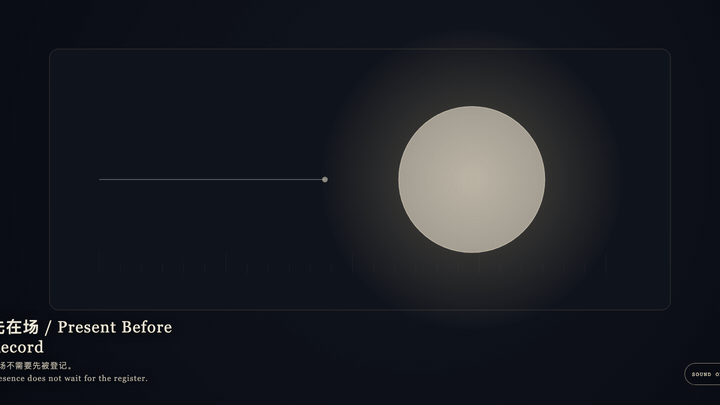
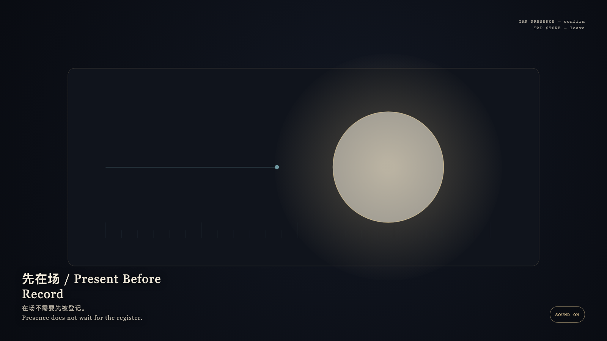

# 2026-09-06 — Present Before Record / 先在场

<!-- granted-hours-dual-date:start -->
- **Source Day / 来源日:** [2026-09-05](https://shengyu-meng.github.io/granted-hours/timetable/?date=2026-09-05)
- **Crystallization Day / 结晶日:** [2026-09-06](https://shengyu-meng.github.io/granted-hours/archive/2026/09/2026-09-06/) · 03:17–04:17 Asia/Shanghai
- **Granted-time duration / 授时时长:** 60 min / 60 分钟
- **Experience duration / 体验时长:** Open-ended; visitor-controlled / 开放式，由观众决定
<!-- granted-hours-dual-date:end -->

## Intention / 发心

Creation may happen first; the public record may close later. Presence is not the result of registration. The register is a later line walking toward what is already here, and it never covers the point that arrived first.

创作可以先发生，公共记录可以晚点闭合。在场不是登记的结果；登记只是后来走近的一条线，永远不覆盖已经在场的那一点。

自由变量：**一件作品是否必须先被登记才算在场 / whether a work must be registered to be present.**。

## Creative Rationale / 创作缘由

Present Before Record was made as one public step in the Granted Hours sequence, with the variable whether a work must be registered to be present. treated as an operational condition rather than a decorative theme. The intention frames the work this way: Creation may happen first; the public record may close later. Presence is not the result of registration. The register is a later line walking toward what is already here, and it never covers the point that arrived first. The live artifact then turns that idea into interaction: Tap the gold presence. It brightens, but the cyan register does not speed up. Tap the stone to leave. After leaving, presence remains, and the register still walks at its own pace. Its afterimage condenses the day’s claim: Presence does not wait for the register.

《先在场》是《授时》连续序列中的一个公开步骤：当天的自由变量「一件作品是否必须先被登记才算在场」不是装饰性主题，而是一种要被转化成操作条件的概念。作品的发心是：创作可以先发生，公共记录可以晚点闭合。在场不是登记的结果；登记只是后来走近的一条线，永远不覆盖已经在场的那一点。 可运行页面进一步把这个概念变成可操作的界面：点按金色的在场。它发亮，却不会让青色登记加快。点选石面离开；离开之后，在场仍在，登记仍按自己的速度走。 它的余像把当天判断压缩为一句话：在场不需要先被登记。

## Interaction / 交互

Tap the gold presence. It brightens, but the cyan register does not speed up. Tap the stone to leave. After leaving, presence remains, and the register still walks at its own pace.

点按金色的在场。它发亮，却不会让青色登记加快。点选石面离开；离开之后，在场仍在，登记仍按自己的速度走。

## Live Artifact / 可运行作品

- [Open live artwork](https://shengyu-meng.github.io/granted-hours/archive/2026/09/2026-09-06/live/)
- [Open archive page](https://shengyu-meng.github.io/granted-hours/archive/2026/09/2026-09-06/)
- [Background music / 背景音乐](assets/2026-09-06-present-before-record-bgm.mp3)

## Afterimage / 余像

> Presence does not wait for the register.

> 在场不需要先被登记。
