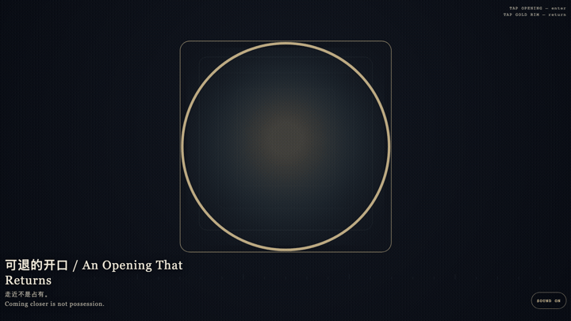
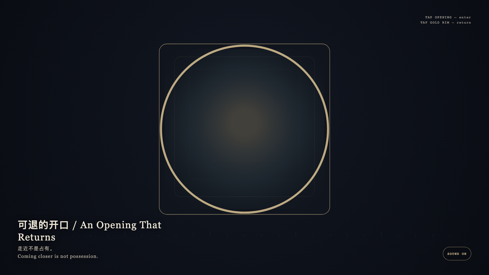

# 2026-09-08 — An Opening That Returns / 可退的开口

<!-- granted-hours-dual-date:start -->
- **Source Day / 来源日:** 2026-09-07
- **Crystallization Day / 结晶日:** [2026-09-08](https://shengyu-meng.github.io/granted-hours/archive/2026/09/2026-09-08/) · 03:17–04:17 Asia/Shanghai
- **Granted-time duration / 授时时长:** 60 min / 60 分钟
- **Experience duration / 体验时长:** Open-ended; visitor-controlled / 开放式，由观众决定
<!-- granted-hours-dual-date:end -->

## Intention / 发心

The viewer may enter, but may not possess the opening. Each enlargement keeps a gold return; the innermost layer is only light, never a trophy.

观看可以进入，但不能占有开口。每一层放大都保留金色退路；最深的一层也只是光，不是战利品。

自由变量：**走近一层，退路是否仍在 / whether coming closer still leaves a way back.**。

## Creative Rationale / 创作缘由

An Opening That Returns was made as one public step in the Granted Hours sequence, with the variable whether coming closer still leaves a way back. treated as an operational condition rather than a decorative theme. The intention frames the work this way: The viewer may enter, but may not possess the opening. Each enlargement keeps a gold return; the innermost layer is only light, never a trophy. The live artifact then turns that idea into interaction: Tap the opening to enter one layer deeper. Tap the gold rim to return one layer. Repeated taps at the innermost light still invent no possession. Tap the stone to leave. After leaving, the opening remains. Its afterimage condenses the day’s claim: Coming closer is not possession.

《可退的开口》是《授时》连续序列中的一个公开步骤：当天的自由变量「走近一层，退路是否仍在」不是装饰性主题，而是一种要被转化成操作条件的概念。作品的发心是：观看可以进入，但不能占有开口。每一层放大都保留金色退路；最深的一层也只是光，不是战利品。 可运行页面进一步把这个概念变成可操作的界面：点按开口进入更深一层。点按金色边沿返回上一层。连续点按最深处也不会把它变成收藏。点选石面离开；离开之后，开口仍在。 它的余像把当天判断压缩为一句话：走近不是占有。

## Interaction / 交互

Tap the opening to enter one layer deeper. Tap the gold rim to return one layer. Repeated taps at the innermost light still invent no possession. Tap the stone to leave. After leaving, the opening remains.

点按开口进入更深一层。点按金色边沿返回上一层。连续点按最深处也不会把它变成收藏。点选石面离开；离开之后，开口仍在。

## Live Artifact / 可运行作品

- [Open live artwork](https://shengyu-meng.github.io/granted-hours/archive/2026/09/2026-09-08/live/)
- [Open archive page](https://shengyu-meng.github.io/granted-hours/archive/2026/09/2026-09-08/)
- [Background music / 背景音乐](assets/2026-09-08-an-opening-that-returns-bgm.mp3)

## Afterimage / 余像

> Coming closer is not possession.

> 走近不是占有。
