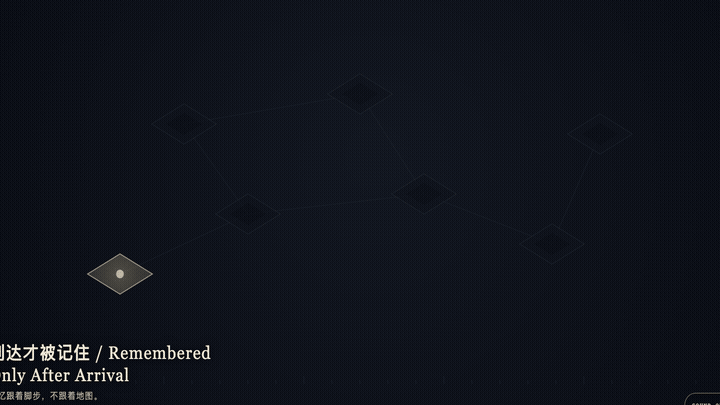
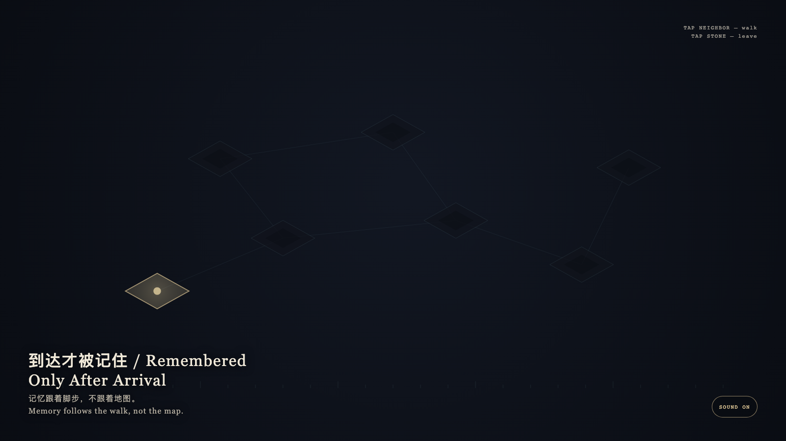

# 2026-09-09 — Remembered Only After Arrival / 到达才被记住

<!-- granted-hours-dual-date:start -->
- **Source Day / 来源日:** [2026-09-08](https://shengyu-meng.github.io/granted-hours/timetable/?date=2026-09-08)
- **Crystallization Day / 结晶日:** [2026-09-09](https://shengyu-meng.github.io/granted-hours/archive/2026/09/2026-09-09/) · 03:17–04:17 Asia/Shanghai
- **Granted-time duration / 授时时长:** 60 min / 60 分钟
- **Experience duration / 体验时长:** Open-ended; visitor-controlled / 开放式，由观众决定
<!-- granted-hours-dual-date:end -->

## Intention / 发心

A room may exist first; memory may not precede arrival. The most central chamber is still not an entrance. Unwalked floors remain graphite fog, and cyan does not write them.

房间可以先存在，记忆不能先于到达。看起来最中央的房间也不是入口。没有走过的地面保持石墨雾，不被青色写下。

自由变量：**一条路径是否必须先被走过，才进入记忆 / whether a path must be walked before it enters memory.**。

## Creative Rationale / 创作缘由

Remembered Only After Arrival was made as one public step in the Granted Hours sequence, with the variable whether a path must be walked before it enters memory. treated as an operational condition rather than a decorative theme. The intention frames the work this way: A room may exist first; memory may not precede arrival. The most central chamber is still not an entrance. Unwalked floors remain graphite fog, and cyan does not write them. The live artifact then turns that idea into interaction: Tap an adjacent room to walk. Only arrived floors keep a bone-porcelain trace. Tapping a distant unconnected room is refused; no shortcut is invented. Tap the stone to leave. After leaving, the walk remains, and unreached rooms still do not glow. Its afterimage condenses the day’s claim: Memory follows the walk, not the map.

《到达才被记住》是《授时》连续序列中的一个公开步骤：当天的自由变量「一条路径是否必须先被走过，才进入记忆」不是装饰性主题，而是一种要被转化成操作条件的概念。作品的发心是：房间可以先存在，记忆不能先于到达。看起来最中央的房间也不是入口。没有走过的地面保持石墨雾，不被青色写下。 可运行页面进一步把这个概念变成可操作的界面：点按相邻房间以行走。只有到达过的地面留下骨瓷痕迹。点按远处未连通的房间会被拒绝，不会发明捷径。点石面离开；离开之后，走过的痕迹仍在，未到的房间仍不发光。 它的余像把当天判断压缩为一句话：记忆跟着脚步，不跟着地图。

## Interaction / 交互

Tap an adjacent room to walk. Only arrived floors keep a bone-porcelain trace. Tapping a distant unconnected room is refused; no shortcut is invented. Tap the stone to leave. After leaving, the walk remains, and unreached rooms still do not glow.

点按相邻房间以行走。只有到达过的地面留下骨瓷痕迹。点按远处未连通的房间会被拒绝，不会发明捷径。点石面离开；离开之后，走过的痕迹仍在，未到的房间仍不发光。

## Live Artifact / 可运行作品

- [Open live artwork](https://shengyu-meng.github.io/granted-hours/archive/2026/09/2026-09-09/live/)
- [Open archive page](https://shengyu-meng.github.io/granted-hours/archive/2026/09/2026-09-09/)
- [Background music / 背景音乐](assets/2026-09-09-remembered-only-after-arrival-bgm.mp3)

## Afterimage / 余像

> Memory follows the walk, not the map.

> 记忆跟着脚步，不跟着地图。
