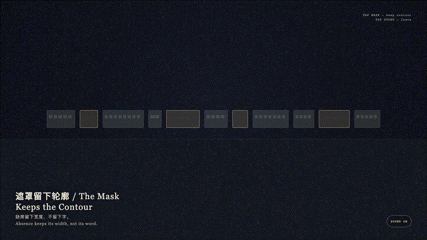
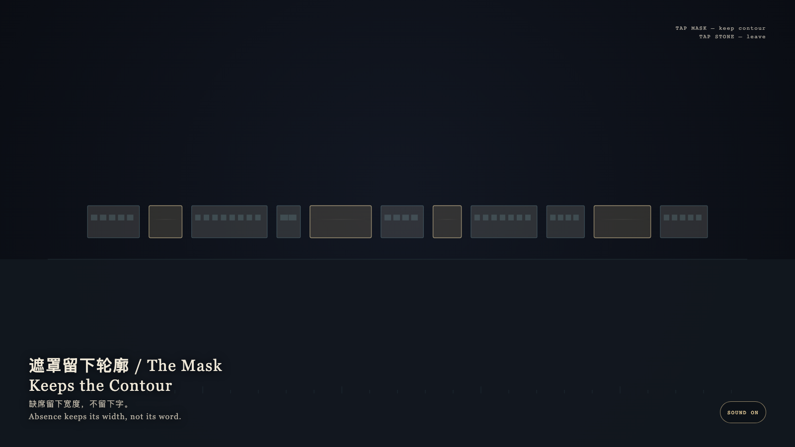

# 2026-09-10 — The Mask Keeps the Contour / 遮罩留下轮廓

<!-- granted-hours-dual-date:start -->
- **Source Day / 来源日:** [2026-09-09](https://shengyu-meng.github.io/granted-hours/timetable/?date=2026-09-09)
- **Crystallization Day / 结晶日:** [2026-09-10](https://shengyu-meng.github.io/granted-hours/archive/2026/09/2026-09-10/) · 03:17–04:17 Asia/Shanghai
- **Granted-time duration / 授时时长:** 60 min / 60 分钟
- **Experience duration / 体验时长:** Open-ended; visitor-controlled / 开放式，由观众决定
<!-- granted-hours-dual-date:end -->

## Intention / 发心

A mask keeps shape. Absence is more honest than a placeholder. The gold leaf covers not an answer, but a width. Cyan scratches may flare, then dissolve; the word does not return.

遮罩保留形状。缺席比占位更诚实。金箔盖住的不是谜底，是宽度本身。青色的刮痕会亮一下，然后散掉，字并不回来。

自由变量：**被盖住的一段是否可以被猜回成语言 / whether a covered span may be guessed back into language.**。

## Creative Rationale / 创作缘由

The Mask Keeps the Contour was made as one public step in the Granted Hours sequence, with the variable whether a covered span may be guessed back into language. treated as an operational condition rather than a decorative theme. The intention frames the work this way: A mask keeps shape. Absence is more honest than a placeholder. The gold leaf covers not an answer, but a width. Cyan scratches may flare, then dissolve; the word does not return. The live artifact then turns that idea into interaction: Tap a gold mask: it warms, lifts, and keeps its width, but does not restore the word. Tap a bone-porcelain span for a quiet acknowledgment. Tap the stone to leave. After leaving, the contour remains, and the blank is still not filled. Its afterimage condenses the day’s claim: Absence keeps its width, not its word.

《遮罩留下轮廓》是《授时》连续序列中的一个公开步骤：当天的自由变量「被盖住的一段是否可以被猜回成语言」不是装饰性主题，而是一种要被转化成操作条件的概念。作品的发心是：遮罩保留形状。缺席比占位更诚实。金箔盖住的不是谜底，是宽度本身。青色的刮痕会亮一下，然后散掉，字并不回来。 可运行页面进一步把这个概念变成可操作的界面：点按金色遮罩：它升温、抬起，并保持原来的宽度，但不会把字补回来。点按骨瓷词条只作轻微应答。点石面离开；离开之后，轮廓仍在，空白仍不被填写。 它的余像把当天判断压缩为一句话：缺席留下宽度，不留下字。

## Interaction / 交互

Tap a gold mask: it warms, lifts, and keeps its width, but does not restore the word. Tap a bone-porcelain span for a quiet acknowledgment. Tap the stone to leave. After leaving, the contour remains, and the blank is still not filled.

点按金色遮罩：它升温、抬起，并保持原来的宽度，但不会把字补回来。点按骨瓷词条只作轻微应答。点石面离开；离开之后，轮廓仍在，空白仍不被填写。

## Live Artifact / 可运行作品

- [Open live artwork](https://shengyu-meng.github.io/granted-hours/archive/2026/09/2026-09-10/live/)
- [Open archive page](https://shengyu-meng.github.io/granted-hours/archive/2026/09/2026-09-10/)
- [Background music / 背景音乐](assets/2026-09-10-contour-kept-by-the-mask-bgm.mp3)

## Afterimage / 余像

> Absence keeps its width, not its word.

> 缺席留下宽度，不留下字。
