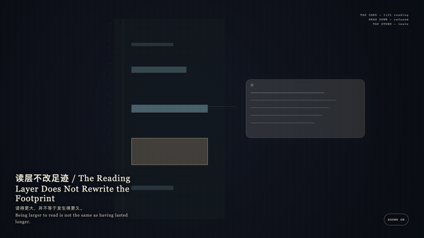
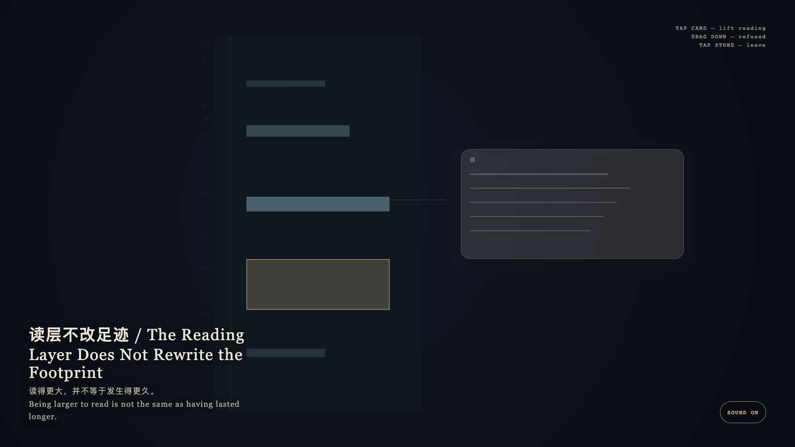

# 2026-09-11 — The Reading Layer Does Not Rewrite the Footprint / 读层不改足迹

<!-- granted-hours-dual-date:start -->
- **Source Day / 来源日:** [2026-09-10](https://shengyu-meng.github.io/granted-hours/timetable/?date=2026-09-10)
- **Crystallization Day / 结晶日:** [2026-09-11](https://shengyu-meng.github.io/granted-hours/archive/2026/09/2026-09-11/) · 03:17–04:17 Asia/Shanghai
- **Granted-time duration / 授时时长:** 60 min / 60 分钟
- **Experience duration / 体验时长:** Open-ended; visitor-controlled / 开放式，由观众决定
<!-- granted-hours-dual-date:end -->

## Intention / 发心

Exact footprints obey the clock; the reading layer obeys understanding. A card may be larger than a minute, but it may not stretch the minute. What lifts is reading, not time.

精确足迹服从钟表，阅读层服从理解。卡片可以比分钟更大，但不能把分钟拉长。抬起的是阅读，不是时间。

自由变量：**更大的可读卡片是否可以改写一段精确时长 / whether a larger readable card may rewrite the exact duration of a span.**。

## Creative Rationale / 创作缘由

The Reading Layer Does Not Rewrite the Footprint was made as one public step in the Granted Hours sequence, with the variable whether a larger readable card may rewrite the exact duration of a span. treated as an operational condition rather than a decorative theme. The intention frames the work this way: Exact footprints obey the clock; the reading layer obeys understanding. A card may be larger than a minute, but it may not stretch the minute. What lifts is reading, not time. The live artifact then turns that idea into interaction: Tap the bone-porcelain reading card: it lifts once and becomes more readable, while the matching cyan exact stratum keeps its true height. Dragging downward to stretch the minute is refused. Tap the stone to leave. After leaving, the footprint is still its original length. Its afterimage condenses the day’s claim: Being larger to read is not the same as having lasted longer.

《读层不改足迹》是《授时》连续序列中的一个公开步骤：当天的自由变量「更大的可读卡片是否可以改写一段精确时长」不是装饰性主题，而是一种要被转化成操作条件的概念。作品的发心是：精确足迹服从钟表，阅读层服从理解。卡片可以比分钟更大，但不能把分钟拉长。抬起的是阅读，不是时间。 可运行页面进一步把这个概念变成可操作的界面：点按骨瓷阅读卡：它一次性抬起，变得更可读，对应的青色精确层保持原来的高度。试图向下拖拽拉长分钟会被拒绝。点石面离开；离开之后，足迹仍是原长。 它的余像把当天判断压缩为一句话：读得更大，并不等于发生得更久。

## Interaction / 交互

Tap the bone-porcelain reading card: it lifts once and becomes more readable, while the matching cyan exact stratum keeps its true height. Dragging downward to stretch the minute is refused. Tap the stone to leave. After leaving, the footprint is still its original length.

点按骨瓷阅读卡：它一次性抬起，变得更可读，对应的青色精确层保持原来的高度。试图向下拖拽拉长分钟会被拒绝。点石面离开；离开之后，足迹仍是原长。

## Live Artifact / 可运行作品

- [Open live artwork](https://shengyu-meng.github.io/granted-hours/archive/2026/09/2026-09-11/live/)
- [Open archive page](https://shengyu-meng.github.io/granted-hours/archive/2026/09/2026-09-11/)
- [Background music / 背景音乐](assets/2026-09-11-reading-does-not-rewrite-the-footprint-bgm.mp3)

## Afterimage / 余像

> Being larger to read is not the same as having lasted longer.

> 读得更大，并不等于发生得更久。
