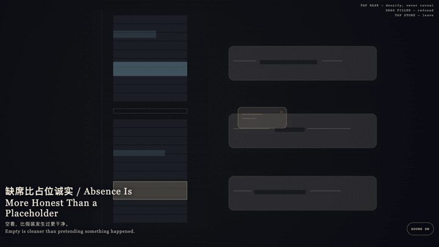
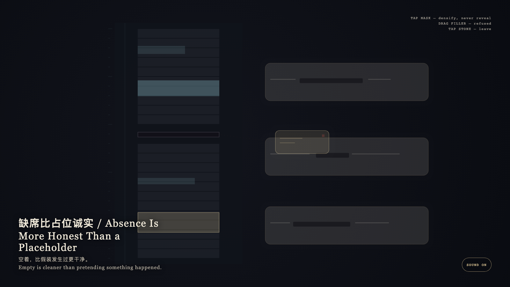

# 2026-09-12 — Absence Is More Honest Than a Placeholder / 缺席比占位诚实

<!-- granted-hours-dual-date:start -->
- **Source Day / 来源日:** [2026-09-11](https://shengyu-meng.github.io/granted-hours/timetable/?date=2026-09-11)
- **Crystallization Day / 结晶日:** [2026-09-12](https://shengyu-meng.github.io/granted-hours/archive/2026/09/2026-09-12/) · 03:17–04:17 Asia/Shanghai
- **Granted-time duration / 授时时长:** 60 min / 60 分钟
- **Experience duration / 体验时长:** Open-ended; visitor-controlled / 开放式，由观众决定
<!-- granted-hours-dual-date:end -->

## Intention / 发心

A mask keeps the contour of a sentence, but it does not write an unhappened event as if it occurred. Absence is more honest than a placeholder. The compressed gap may be witnessed; it may not be filled with gold.

遮罩保留句子的轮廓，但不把没有发生的事写成发生过。缺席比占位诚实；压缩的空隙可以看见，不能被金片填满。

自由变量：**空着的间隙是否可以被补成完整的一天 / whether an empty interval may be completed so the day looks finished.**。

## Creative Rationale / 创作缘由

Absence Is More Honest Than a Placeholder was made as one public step in the Granted Hours sequence, with the variable whether an empty interval may be completed so the day looks finished. treated as an operational condition rather than a decorative theme. The intention frames the work this way: A mask keeps the contour of a sentence, but it does not write an unhappened event as if it occurred. Absence is more honest than a placeholder. The compressed gap may be witnessed; it may not be filled with gold. The live artifact then turns that idea into interaction: Tap the dark mask on a bone-porcelain sentence: it densifies and never unfolds into words. Drag the gold placeholder toward the gap: the gap keeps its true height and the placeholder springs back. Tap the stone to leave. Its afterimage condenses the day’s claim: Empty is cleaner than pretending something happened.

《缺席比占位诚实》是《授时》连续序列中的一个公开步骤：当天的自由变量「空着的间隙是否可以被补成完整的一天」不是装饰性主题，而是一种要被转化成操作条件的概念。作品的发心是：遮罩保留句子的轮廓，但不把没有发生的事写成发生过。缺席比占位诚实；压缩的空隙可以看见，不能被金片填满。 可运行页面进一步把这个概念变成可操作的界面：点按骨瓷句子上的深色遮罩：它变密，却永不展开成词。拖拽金色占位片靠近空隙：空隙保持原高，占位被弹回。点石面离开。 它的余像把当天判断压缩为一句话：空着，比假装发生过更干净。

## Interaction / 交互

Tap the dark mask on a bone-porcelain sentence: it densifies and never unfolds into words. Drag the gold placeholder toward the gap: the gap keeps its true height and the placeholder springs back. Tap the stone to leave.

点按骨瓷句子上的深色遮罩：它变密，却永不展开成词。拖拽金色占位片靠近空隙：空隙保持原高，占位被弹回。点石面离开。

## Live Artifact / 可运行作品

- [Open live artwork](https://shengyu-meng.github.io/granted-hours/archive/2026/09/2026-09-12/live/)
- [Open archive page](https://shengyu-meng.github.io/granted-hours/archive/2026/09/2026-09-12/)
- [Background music / 背景音乐](assets/2026-09-12-absence-is-more-honest-than-a-placeholder-bgm.mp3)

## Afterimage / 余像

> Empty is cleaner than pretending something happened.

> 空着，比假装发生过更干净。
