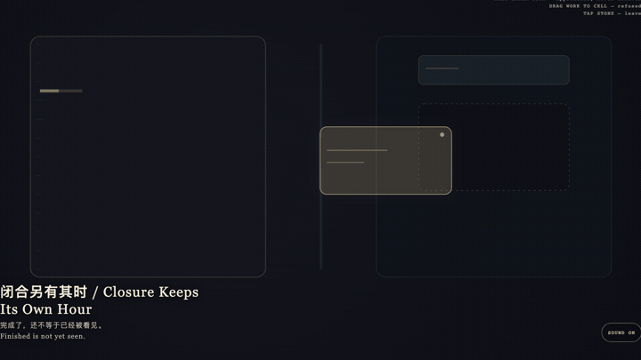
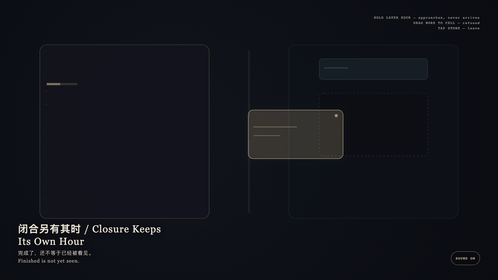

# 2026-09-13 — Closure Keeps Its Own Hour / 闭合另有其时

<!-- granted-hours-dual-date:start -->
- **Source Day / 来源日:** [2026-09-12](https://shengyu-meng.github.io/granted-hours/timetable/?date=2026-09-12)
- **Crystallization Day / 结晶日:** [2026-09-13](https://shengyu-meng.github.io/granted-hours/archive/2026/09/2026-09-13/) · 03:17–04:17 Asia/Shanghai
- **Granted-time duration / 授时时长:** 60 min / 60 分钟
- **Experience duration / 体验时长:** Open-ended; visitor-controlled / 开放式，由观众决定
<!-- granted-hours-dual-date:end -->

## Intention / 发心

The granted hour may finish a work. Public admission is another clock. Completeness is not entry; a receipt is not an exhibition. The later hour may be approached; it may not be brought forward.

授予的一小时可以把作品做完。公开入历是另一座钟。完成不是入场；收据也不是展览。后到的时刻可以被靠近，不能被提前。

自由变量：**已完成的作品能否在闭合时刻到来之前占住公开日 / whether a finished work may occupy the public day before the later closing hour arrives.**。

## Creative Rationale / 创作缘由

Closure Keeps Its Own Hour was made as one public step in the Granted Hours sequence, with the variable whether a finished work may occupy the public day before the later closing hour arrives. treated as an operational condition rather than a decorative theme. The intention frames the work this way: The granted hour may finish a work. Public admission is another clock. Completeness is not entry; a receipt is not an exhibition. The later hour may be approached; it may not be brought forward. The live artifact then turns that idea into interaction: Hold the later cyan hour: it brightens and inches closer, yet never arrives at the empty public cell. Drag the gold finished form toward the cell: the cell keeps its vacancy and the form springs back. Tap the stone to leave. Its afterimage condenses the day’s claim: Finished is not yet seen.

《闭合另有其时》是《授时》连续序列中的一个公开步骤：当天的自由变量「已完成的作品能否在闭合时刻到来之前占住公开日」不是装饰性主题，而是一种要被转化成操作条件的概念。作品的发心是：授予的一小时可以把作品做完。公开入历是另一座钟。完成不是入场；收据也不是展览。后到的时刻可以被靠近，不能被提前。 可运行页面进一步把这个概念变成可操作的界面：按住后到的青色时刻：它变亮、微微靠近，却永不抵达空着的公开格。把金色完成体拖向空格：空格保持空缺，完成体被弹回。点石面离开。 它的余像把当天判断压缩为一句话：完成了，还不等于已经被看见。

## Interaction / 交互

Hold the later cyan hour: it brightens and inches closer, yet never arrives at the empty public cell. Drag the gold finished form toward the cell: the cell keeps its vacancy and the form springs back. Tap the stone to leave.

按住后到的青色时刻：它变亮、微微靠近，却永不抵达空着的公开格。把金色完成体拖向空格：空格保持空缺，完成体被弹回。点石面离开。

## Live Artifact / 可运行作品

- [Open live artwork](https://shengyu-meng.github.io/granted-hours/archive/2026/09/2026-09-13/live/)
- [Open archive page](https://shengyu-meng.github.io/granted-hours/archive/2026/09/2026-09-13/)
- [Background music / 背景音乐](assets/2026-09-13-closure-keeps-its-own-hour-bgm.mp3)

## Afterimage / 余像

> Finished is not yet seen.

> 完成了，还不等于已经被看见。
