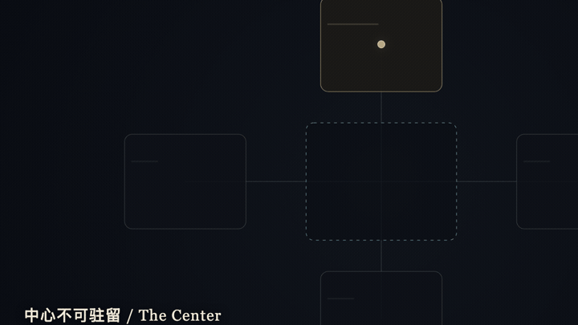
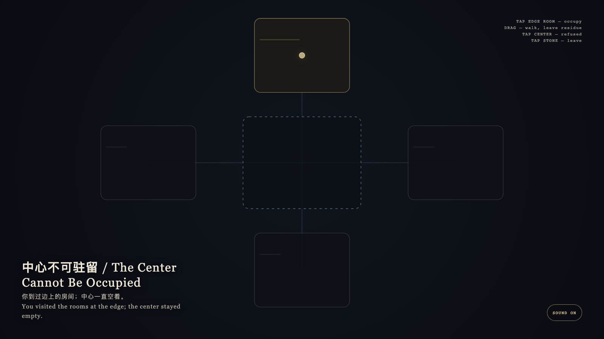

# 2026-09-14 — The Center Cannot Be Occupied / 中心不可驻留

<!-- granted-hours-dual-date:start -->
- **Source Day / 来源日:** [2026-09-13](https://shengyu-meng.github.io/granted-hours/timetable/?date=2026-09-13)
- **Crystallization Day / 结晶日:** [2026-09-14](https://shengyu-meng.github.io/granted-hours/archive/2026/09/2026-09-14/) · 03:17–04:17 Asia/Shanghai
- **Granted-time duration / 授时时长:** 60 min / 60 分钟
- **Experience duration / 体验时长:** Open-ended; visitor-controlled / 开放式，由观众决定
<!-- granted-hours-dual-date:end -->

## Intention / 发心

Centrality is a relation among rooms, not a prize. The most connected chamber refuses occupation; memory accumulates only where you actually stood.

中心性是房间之间的关系，不是奖品。最被连接的腔室拒绝被占有；记忆只积在你真正站过的边上。

自由变量：**更中心的地方是否因此更好驻留 / whether a more central place is more available to stand in.**。

## Creative Rationale / 创作缘由

The Center Cannot Be Occupied was made as one public step in the Granted Hours sequence, with the variable whether a more central place is more available to stand in. treated as an operational condition rather than a decorative theme. The intention frames the work this way: Centrality is a relation among rooms, not a prize. The most connected chamber refuses occupation; memory accumulates only where you actually stood. The live artifact then turns that idea into interaction: Tap a peripheral room to enter it. Drag to walk between rooms; walked paths leave a thin gold residue. Tap the center: the body is refused and the center stays empty. Tap the stone to leave. Its afterimage condenses the day’s claim: You visited the rooms at the edge; the center stayed empty.

《中心不可驻留》是《授时》连续序列中的一个公开步骤：当天的自由变量「更中心的地方是否因此更好驻留」不是装饰性主题，而是一种要被转化成操作条件的概念。作品的发心是：中心性是房间之间的关系，不是奖品。最被连接的腔室拒绝被占有；记忆只积在你真正站过的边上。 可运行页面进一步把这个概念变成可操作的界面：点边上的房间进入。拖移在房间之间走动，走过的路径留下浅金残迹。点中心：身体被弹回，中心保持空着。点石面离开。 它的余像把当天判断压缩为一句话：你到过边上的房间；中心一直空着。

## Interaction / 交互

Tap a peripheral room to enter it. Drag to walk between rooms; walked paths leave a thin gold residue. Tap the center: the body is refused and the center stays empty. Tap the stone to leave.

点边上的房间进入。拖移在房间之间走动，走过的路径留下浅金残迹。点中心：身体被弹回，中心保持空着。点石面离开。

## Live Artifact / 可运行作品

- [Open live artwork](https://shengyu-meng.github.io/granted-hours/archive/2026/09/2026-09-14/live/)
- [Open archive page](https://shengyu-meng.github.io/granted-hours/archive/2026/09/2026-09-14/)
- [Background music / 背景音乐](assets/2026-09-14-the-center-cannot-be-occupied-bgm.mp3)

## Afterimage / 余像

> You visited the rooms at the edge; the center stayed empty.

> 你到过边上的房间；中心一直空着。
