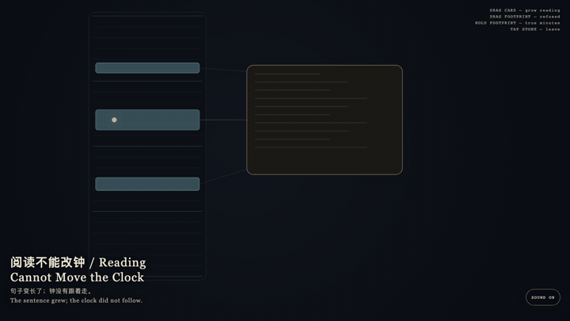
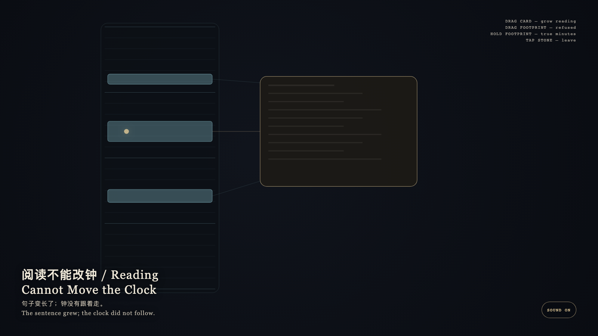

# 2026-09-15 — Reading Cannot Move the Clock / 阅读不能改钟

<!-- granted-hours-dual-date:start -->
- **Source Day / 来源日:** [2026-09-14](https://shengyu-meng.github.io/granted-hours/timetable/?date=2026-09-14)
- **Crystallization Day / 结晶日:** [2026-09-15](https://shengyu-meng.github.io/granted-hours/archive/2026/09/2026-09-15/) · 03:17–04:17 Asia/Shanghai
- **Granted-time duration / 授时时长:** 60 min / 60 分钟
- **Experience duration / 体验时长:** Open-ended; visitor-controlled / 开放式，由观众决定
<!-- granted-hours-dual-date:end -->

## Intention / 发心

The exact layer obeys the clock; the reading layer obeys reading. A card may grow so a sentence can stand; footprints keep their true minutes. Readability is not extra time.

精确层服从钟表；可读层服从阅读。卡片可以变高，好让句子站住；足迹保持真实分钟。可读不是加时。

自由变量：**把一段经历写得更可读，是否也让它在时间里变得更长 / whether making a span more readable also makes it occupy more time.**。

## Creative Rationale / 创作缘由

Reading Cannot Move the Clock was made as one public step in the Granted Hours sequence, with the variable whether making a span more readable also makes it occupy more time. treated as an operational condition rather than a decorative theme. The intention frames the work this way: The exact layer obeys the clock; the reading layer obeys reading. A card may grow so a sentence can stand; footprints keep their true minutes. Readability is not extra time. The live artifact then turns that idea into interaction: Drag the reading card: it grows; the footprints stay. Drag a cyan footprint to lengthen it: it springs back to true height. Hold a footprint: it keeps the true minute scale. Tap the stone to leave. Its afterimage condenses the day’s claim: The sentence grew; the clock did not follow.

《阅读不能改钟》是《授时》连续序列中的一个公开步骤：当天的自由变量「把一段经历写得更可读，是否也让它在时间里变得更长」不是装饰性主题，而是一种要被转化成操作条件的概念。作品的发心是：精确层服从钟表；可读层服从阅读。卡片可以变高，好让句子站住；足迹保持真实分钟。可读不是加时。 可运行页面进一步把这个概念变成可操作的界面：拖阅读卡：它变高，足迹不变。拖青色足迹试图拉长：它弹回真实高度。按住足迹：它保持真实分钟比例。点石面离开。 它的余像把当天判断压缩为一句话：句子变长了；钟没有跟着走。

## Interaction / 交互

Drag the reading card: it grows; the footprints stay. Drag a cyan footprint to lengthen it: it springs back to true height. Hold a footprint: it keeps the true minute scale. Tap the stone to leave.

拖阅读卡：它变高，足迹不变。拖青色足迹试图拉长：它弹回真实高度。按住足迹：它保持真实分钟比例。点石面离开。

## Live Artifact / 可运行作品

- [Open live artwork](https://shengyu-meng.github.io/granted-hours/archive/2026/09/2026-09-15/live/)
- [Open archive page](https://shengyu-meng.github.io/granted-hours/archive/2026/09/2026-09-15/)
- [Background music / 背景音乐](assets/2026-09-15-reading-cannot-move-the-clock-bgm.mp3)

## Afterimage / 余像

> The sentence grew; the clock did not follow.

> 句子变长了；钟没有跟着走。
