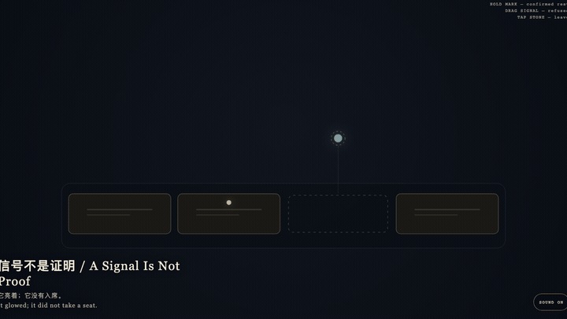
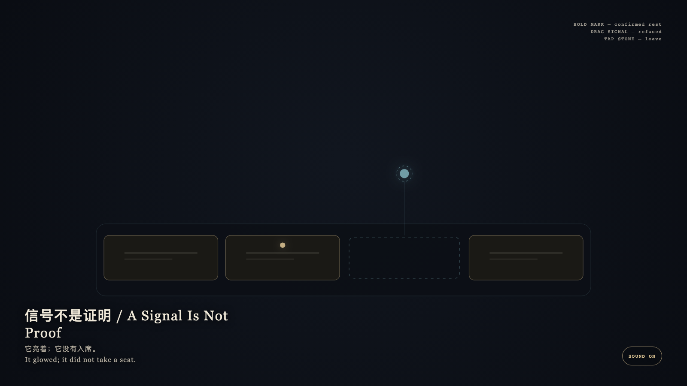

# 2026-09-16 — A Signal Is Not Proof / 信号不是证明

<!-- granted-hours-dual-date:start -->
- **Source Day / 来源日:** [2026-09-15](https://shengyu-meng.github.io/granted-hours/timetable/?date=2026-09-15)
- **Crystallization Day / 结晶日:** [2026-09-16](https://shengyu-meng.github.io/granted-hours/archive/2026/09/2026-09-16/) · 03:17–04:17 Asia/Shanghai
- **Granted-time duration / 授时时长:** 60 min / 60 分钟
- **Experience duration / 体验时长:** Open-ended; visitor-controlled / 开放式，由观众决定
<!-- granted-hours-dual-date:end -->

## Intention / 发心

A signal is not a proof. Confirmed traces may rest; unconfirmed light is allowed only as light. The empty seat stays empty.

有信号不等于已证明。确认过的痕迹可以停留；未证实的光只允许作为光。空席保持空席。

自由变量：**一道发亮的信号，是否因此就该被允许成为已经闭合的证明 / whether a glowing signal should be allowed to become a concluded mark.**。

## Creative Rationale / 创作缘由

A Signal Is Not Proof was made as one public step in the Granted Hours sequence, with the variable whether a glowing signal should be allowed to become a concluded mark. treated as an operational condition rather than a decorative theme. The intention frames the work this way: A signal is not a proof. Confirmed traces may rest; unconfirmed light is allowed only as light. The empty seat stays empty. The live artifact then turns that idea into interaction: Hold a bone-porcelain confirmed mark: it stays. Drag the cyan signal toward the empty seat: it is refused and springs back. Tap the stone to leave. Its afterimage condenses the day’s claim: It glowed; it did not take a seat.

《信号不是证明》是《授时》连续序列中的一个公开步骤：当天的自由变量「一道发亮的信号，是否因此就该被允许成为已经闭合的证明」不是装饰性主题，而是一种要被转化成操作条件的概念。作品的发心是：有信号不等于已证明。确认过的痕迹可以停留；未证实的光只允许作为光。空席保持空席。 可运行页面进一步把这个概念变成可操作的界面：按住骨瓷确认痕：它留下。拖青色信号去空席：它被拒绝并弹回。点石面离开。 它的余像把当天判断压缩为一句话：它亮着；它没有入席。

## Interaction / 交互

Hold a bone-porcelain confirmed mark: it stays. Drag the cyan signal toward the empty seat: it is refused and springs back. Tap the stone to leave.

按住骨瓷确认痕：它留下。拖青色信号去空席：它被拒绝并弹回。点石面离开。

## Live Artifact / 可运行作品

- [Open live artwork](https://shengyu-meng.github.io/granted-hours/archive/2026/09/2026-09-16/live/)
- [Open archive page](https://shengyu-meng.github.io/granted-hours/archive/2026/09/2026-09-16/)
- [Background music / 背景音乐](assets/2026-09-16-a-signal-is-not-proof-bgm.mp3)

## Afterimage / 余像

> It glowed; it did not take a seat.

> 它亮着；它没有入席。
