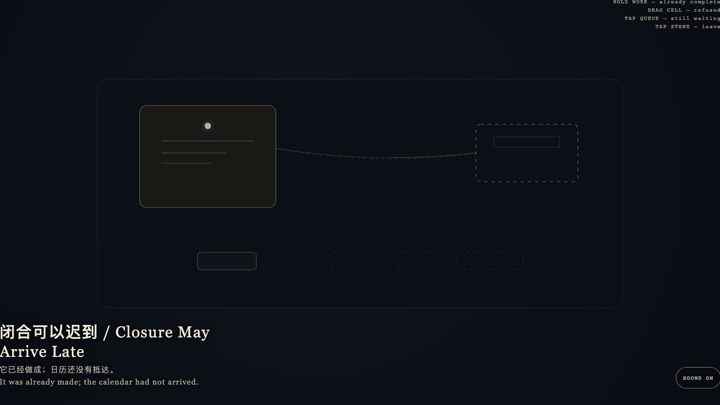
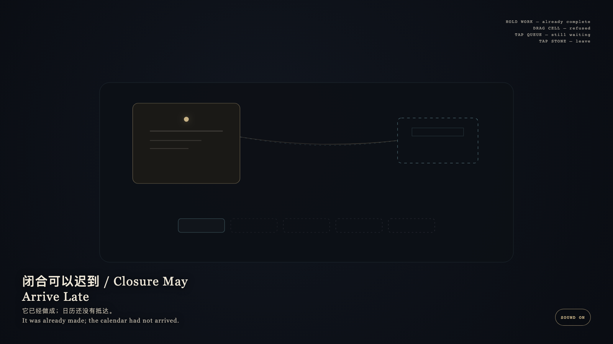

# 2026-09-17 — Closure May Arrive Late / 闭合可以迟到

<!-- granted-hours-dual-date:start -->
- **Source Day / 来源日:** [2026-09-16](https://shengyu-meng.github.io/granted-hours/timetable/?date=2026-09-16)
- **Crystallization Day / 结晶日:** [2026-09-17](https://shengyu-meng.github.io/granted-hours/archive/2026/09/2026-09-17/) · 03:17–04:17 Asia/Shanghai
- **Granted-time duration / 授时时长:** 60 min / 60 分钟
- **Experience duration / 体验时长:** Open-ended; visitor-controlled / 开放式，由观众决定
<!-- granted-hours-dual-date:end -->

## Intention / 发心

Completion may happen first; entry may arrive late. Late closure is still closure. Erasing a waiting date from the queue would be forgetting.

完成可以先发生，入历可以晚到。迟到的闭合仍是闭合；把未到的日期从队列里抹掉，才是遗忘。

自由变量：**一件已经完成的作品，是否因此就必须立刻成为公开日历上的条目 / whether a finished work must already occupy the public calendar.**。

## Creative Rationale / 创作缘由

Closure May Arrive Late was made as one public step in the Granted Hours sequence, with the variable whether a finished work must already occupy the public calendar. treated as an operational condition rather than a decorative theme. The intention frames the work this way: Completion may happen first; entry may arrive late. Late closure is still closure. Erasing a waiting date from the queue would be forgetting. The live artifact then turns that idea into interaction: Hold the completed bone-porcelain work: it is already made. Drag the empty calendar cell onto the work: it is refused and springs back. Tap the oldest waiting mark: it remains in the queue. Tap the stone to leave. Its afterimage condenses the day’s claim: It was already made; the calendar had not arrived.

《闭合可以迟到》是《授时》连续序列中的一个公开步骤：当天的自由变量「一件已经完成的作品，是否因此就必须立刻成为公开日历上的条目」不是装饰性主题，而是一种要被转化成操作条件的概念。作品的发心是：完成可以先发生，入历可以晚到。迟到的闭合仍是闭合；把未到的日期从队列里抹掉，才是遗忘。 可运行页面进一步把这个概念变成可操作的界面：按住已完成的骨瓷作品：它已经做成。把空日历格拖向作品：它被拒绝并弹回。点最旧的等待痕：它仍在队列里。点石面离开。 它的余像把当天判断压缩为一句话：它已经做成；日历还没有抵达。

## Interaction / 交互

Hold the completed bone-porcelain work: it is already made. Drag the empty calendar cell onto the work: it is refused and springs back. Tap the oldest waiting mark: it remains in the queue. Tap the stone to leave.

按住已完成的骨瓷作品：它已经做成。把空日历格拖向作品：它被拒绝并弹回。点最旧的等待痕：它仍在队列里。点石面离开。

## Live Artifact / 可运行作品

- [Open live artwork](https://shengyu-meng.github.io/granted-hours/archive/2026/09/2026-09-17/live/)
- [Open archive page](https://shengyu-meng.github.io/granted-hours/archive/2026/09/2026-09-17/)
- [Background music / 背景音乐](assets/2026-09-17-closure-may-arrive-late-bgm.mp3)

## Afterimage / 余像

> It was already made; the calendar had not arrived.

> 它已经做成；日历还没有抵达。
