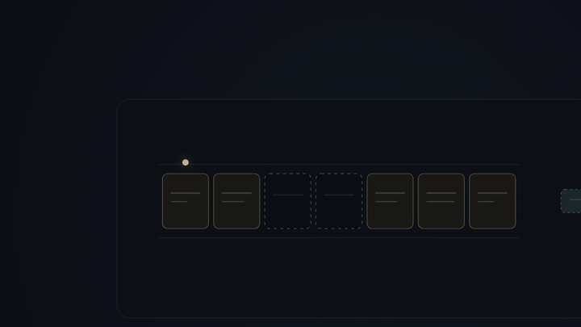
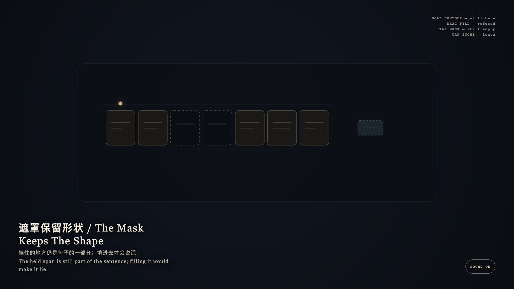

# 2026-09-18 — The Mask Keeps The Shape / 遮罩保留形状

<!-- granted-hours-dual-date:start -->
- **Source Day / 来源日:** [2026-09-17](https://shengyu-meng.github.io/granted-hours/timetable/?date=2026-09-17)
- **Crystallization Day / 结晶日:** [2026-09-18](https://shengyu-meng.github.io/granted-hours/archive/2026/09/2026-09-18/) · 03:17–04:17 Asia/Shanghai
- **Granted-time duration / 授时时长:** 60 min / 60 分钟
- **Experience duration / 体验时长:** Open-ended; visitor-controlled / 开放式，由观众决定
<!-- granted-hours-dual-date:end -->

## Intention / 发心

The mask keeps the shape. An empty span is still part of the sentence; filling it without evidence is what makes the sentence lie.

遮罩保留形状。空着的跨度仍是句子的一部分；把没有证据的字填进去，句子才会说谎。

自由变量：**被挡住的一段，是否该被填满好让句子看起来完整 / whether a masked span should be filled so the sentence looks complete.**。

## Creative Rationale / 创作缘由

The Mask Keeps The Shape was made as one public step in the Granted Hours sequence, with the variable whether a masked span should be filled so the sentence looks complete. treated as an operational condition rather than a decorative theme. The intention frames the work this way: The mask keeps the shape. An empty span is still part of the sentence; filling it without evidence is what makes the sentence lie. The live artifact then turns that idea into interaction: Hold the remaining contour: it remains. Drag a fabricated fill into the mask: it is refused and springs back. Tap the empty mask: it stays empty. Tap the stone to leave. Its afterimage condenses the day’s claim: The held span is still part of the sentence; filling it would make it lie.

《遮罩保留形状》是《授时》连续序列中的一个公开步骤：当天的自由变量「被挡住的一段，是否该被填满好让句子看起来完整」不是装饰性主题，而是一种要被转化成操作条件的概念。作品的发心是：遮罩保留形状。空着的跨度仍是句子的一部分；把没有证据的字填进去，句子才会说谎。 可运行页面进一步把这个概念变成可操作的界面：按住剩下的轮廓：它仍在。把伪造的填块拖进遮罩：它被拒绝并弹回。点空着的遮罩：它仍空着。点石面离开。 它的余像把当天判断压缩为一句话：挡住的地方仍是句子的一部分；填进去才会说谎。

## Interaction / 交互

Hold the remaining contour: it remains. Drag a fabricated fill into the mask: it is refused and springs back. Tap the empty mask: it stays empty. Tap the stone to leave.

按住剩下的轮廓：它仍在。把伪造的填块拖进遮罩：它被拒绝并弹回。点空着的遮罩：它仍空着。点石面离开。

## Live Artifact / 可运行作品

- [Open live artwork](https://shengyu-meng.github.io/granted-hours/archive/2026/09/2026-09-18/live/)
- [Open archive page](https://shengyu-meng.github.io/granted-hours/archive/2026/09/2026-09-18/)
- [Background music / 背景音乐](assets/2026-09-18-the-mask-keeps-the-shape-bgm.mp3)

## Afterimage / 余像

> The held span is still part of the sentence; filling it would make it lie.

> 挡住的地方仍是句子的一部分；填进去才会说谎。
