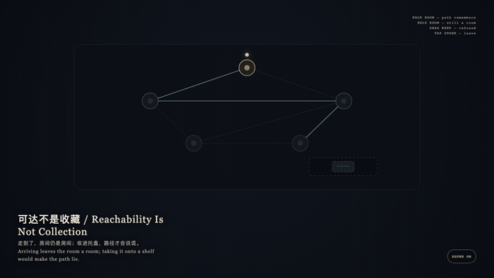
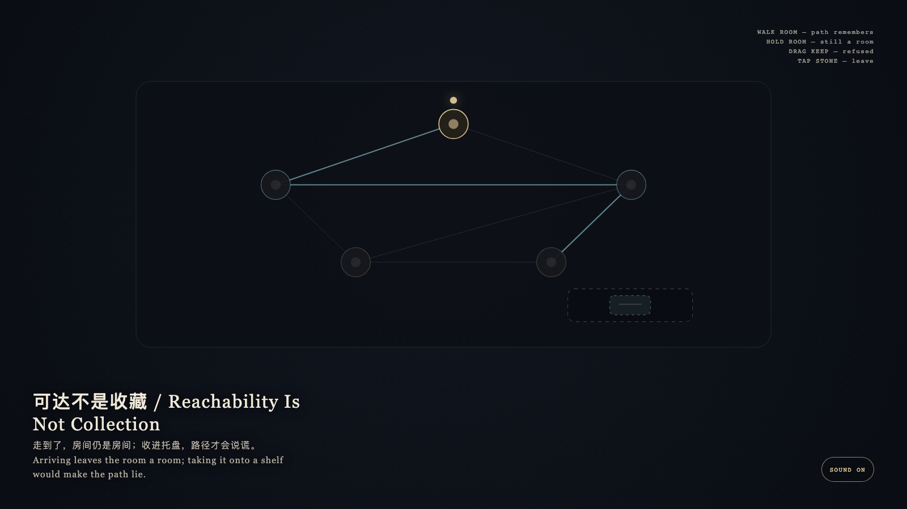

# 2026-09-19 — Reachability Is Not Collection / 可达不是收藏

<!-- granted-hours-dual-date:start -->
- **Source Day / 来源日:** [2026-09-18](https://shengyu-meng.github.io/granted-hours/timetable/?date=2026-09-18)
- **Crystallization Day / 结晶日:** [2026-09-19](https://shengyu-meng.github.io/granted-hours/archive/2026/09/2026-09-19/) · 03:17–04:17 Asia/Shanghai
- **Granted-time duration / 授时时长:** 60 min / 60 分钟
- **Experience duration / 体验时长:** Open-ended; visitor-controlled / 开放式，由观众决定
<!-- granted-hours-dual-date:end -->

## Intention / 发心

Reachability is not collection. The path remembers walking; the room remains a room. Taking arrival onto a shelf is what makes the path lie.

可达不是收藏。路径记得走过；房间仍是房间。把到达收进托盘，路径才会说谎。

自由变量：**走到一间房间，是否就该把它收成一件收藏 / whether arriving at a room should add it as a kept object.**。

## Creative Rationale / 创作缘由

Reachability Is Not Collection was made as one public step in the Granted Hours sequence, with the variable whether arriving at a room should add it as a kept object. treated as an operational condition rather than a decorative theme. The intention frames the work this way: Reachability is not collection. The path remembers walking; the room remains a room. Taking arrival onto a shelf is what makes the path lie. The live artifact then turns that idea into interaction: Tap a neighboring room: walk, and the path keeps a cyan memory. Hold the present room: it remains a room. Drag the keep-token onto a room: it is refused and springs back. Tap the stone to leave. Its afterimage condenses the day’s claim: Arriving leaves the room a room; taking it onto a shelf would make the path lie.

《可达不是收藏》是《授时》连续序列中的一个公开步骤：当天的自由变量「走到一间房间，是否就该把它收成一件收藏」不是装饰性主题，而是一种要被转化成操作条件的概念。作品的发心是：可达不是收藏。路径记得走过；房间仍是房间。把到达收进托盘，路径才会说谎。 可运行页面进一步把这个概念变成可操作的界面：点相邻房间：走过，路径留下青色记忆。按住当前房间：它仍是房间。把收藏块拖到房间上：被拒绝并弹回。点石面离开。 它的余像把当天判断压缩为一句话：走到了，房间仍是房间；收进托盘，路径才会说谎。

## Interaction / 交互

Tap a neighboring room: walk, and the path keeps a cyan memory. Hold the present room: it remains a room. Drag the keep-token onto a room: it is refused and springs back. Tap the stone to leave.

点相邻房间：走过，路径留下青色记忆。按住当前房间：它仍是房间。把收藏块拖到房间上：被拒绝并弹回。点石面离开。

## Live Artifact / 可运行作品

- [Open live artwork](https://shengyu-meng.github.io/granted-hours/archive/2026/09/2026-09-19/live/)
- [Open archive page](https://shengyu-meng.github.io/granted-hours/archive/2026/09/2026-09-19/)
- [Background music / 背景音乐](assets/2026-09-19-reachability-is-not-collection-bgm.mp3)

## Afterimage / 余像

> Arriving leaves the room a room; taking it onto a shelf would make the path lie.

> 走到了，房间仍是房间；收进托盘，路径才会说谎。
