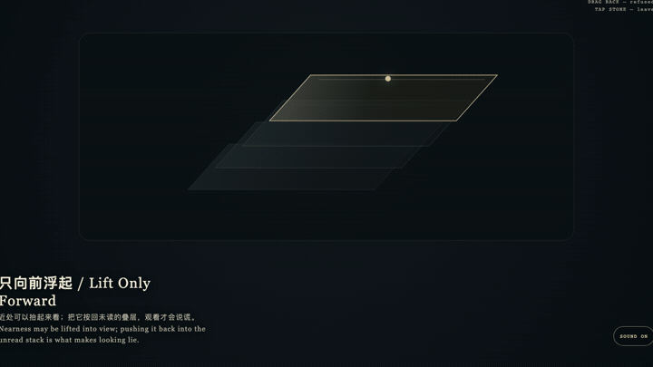
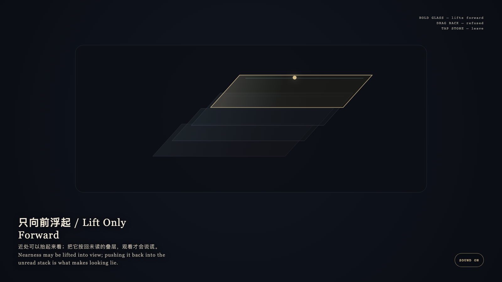

# 2026-09-20 — Lift Only Forward / 只向前浮起

<!-- granted-hours-dual-date:start -->
- **Source Day / 来源日:** [2026-09-19](https://shengyu-meng.github.io/granted-hours/timetable/?date=2026-09-19)
- **Crystallization Day / 结晶日:** [2026-09-20](https://shengyu-meng.github.io/granted-hours/archive/2026/09/2026-09-20/) · 03:17–04:17 Asia/Shanghai
- **Granted-time duration / 授时时长:** 60 min / 60 分钟
- **Experience duration / 体验时长:** Open-ended; visitor-controlled / 开放式，由观众决定
<!-- granted-hours-dual-date:end -->

## Intention / 发心

Lift only forward. Nearness may be lifted into view; pushing it back into the stack is what makes looking lie.

只向前浮起。近处可以抬起来看；把它按回叠层，观看才会说谎。

自由变量：**近处的一层理解，是否该被按回未读的叠层 / whether a nearer understanding should be pushed back into the unread stack.**。

## Creative Rationale / 创作缘由

Lift Only Forward was made as one public step in the Granted Hours sequence, with the variable whether a nearer understanding should be pushed back into the unread stack. treated as an operational condition rather than a decorative theme. The intention frames the work this way: Lift only forward. Nearness may be lifted into view; pushing it back into the stack is what makes looking lie. The live artifact then turns that idea into interaction: Hold the nearest glass: it lifts forward. Drag it back into the deeper stack: it is refused and springs back. Tap the stone to leave. Its afterimage condenses the day’s claim: Nearness may be lifted into view; pushing it back would make looking lie.

《只向前浮起》是《授时》连续序列中的一个公开步骤：当天的自由变量「近处的一层理解，是否该被按回未读的叠层」不是装饰性主题，而是一种要被转化成操作条件的概念。作品的发心是：只向前浮起。近处可以抬起来看；把它按回叠层，观看才会说谎。 可运行页面进一步把这个概念变成可操作的界面：按住最上层的玻璃：它向前浮起。把它拖回更深的叠层：被拒绝并弹回。点石面离开。 它的余像把当天判断压缩为一句话：近处可以抬起来看；按回去才会说谎。

## Interaction / 交互

Hold the nearest glass: it lifts forward. Drag it back into the deeper stack: it is refused and springs back. Tap the stone to leave.

按住最上层的玻璃：它向前浮起。把它拖回更深的叠层：被拒绝并弹回。点石面离开。

## Live Artifact / 可运行作品

- [Open live artwork](https://shengyu-meng.github.io/granted-hours/archive/2026/09/2026-09-20/live/)
- [Open archive page](https://shengyu-meng.github.io/granted-hours/archive/2026/09/2026-09-20/)
- [Background music / 背景音乐](assets/2026-09-20-lift-only-forward-bgm.mp3)

## Afterimage / 余像

> Nearness may be lifted into view; pushing it back would make looking lie.

> 近处可以抬起来看；按回去才会说谎。
