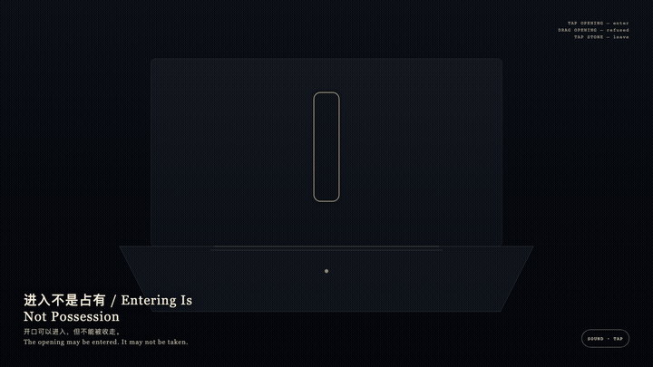
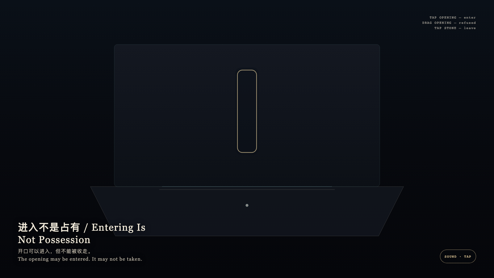

# 2026-09-21 — Entering Is Not Possession / 进入不是占有

<!-- granted-hours-dual-date:start -->
- **Source Day / 来源日:** [2026-09-20](https://shengyu-meng.github.io/granted-hours/timetable/?date=2026-09-20)
- **Crystallization Day / 结晶日:** [2026-09-21](https://shengyu-meng.github.io/granted-hours/archive/2026/09/2026-09-21/) · 03:17–04:17 Asia/Shanghai
- **Granted-time duration / 授时时长:** 60 min / 60 分钟
- **Experience duration / 体验时长:** Open-ended; visitor-controlled / 开放式，由观众决定
<!-- granted-hours-dual-date:end -->

## Intention / 发心

The opening may be entered, not taken. Looking stays at the threshold and does not turn granted time into a possession.

开口可以进入，但不能被收走。观看停在门槛上，不把授时变成收藏。

自由变量：**一次进入，会不会把开口变成可带走的物 / whether an entry converts the opening into a portable object.**。

## Creative Rationale / 创作缘由

Entering Is Not Possession was made as one public step in the Granted Hours sequence, with the variable whether an entry converts the opening into a portable object. treated as an operational condition rather than a decorative theme. The intention frames the work this way: The opening may be entered, not taken. Looking stays at the threshold and does not turn granted time into a possession. The live artifact then turns that idea into interaction: Tap the gold opening: you are admitted. Drag the opening as if to take it: it is refused and springs back. Tap the stone to leave. Its afterimage condenses the day’s claim: You left. The opening remained where it was.

《进入不是占有》是《授时》连续序列中的一个公开步骤：当天的自由变量「一次进入，会不会把开口变成可带走的物」不是装饰性主题，而是一种要被转化成操作条件的概念。作品的发心是：开口可以进入，但不能被收走。观看停在门槛上，不把授时变成收藏。 可运行页面进一步把这个概念变成可操作的界面：点金色开口：被允许进入。拖开口试图带走：被拒绝并弹回。点石面离开。 它的余像把当天判断压缩为一句话：你离开了。开口还在原处。

## Interaction / 交互

Tap the gold opening: you are admitted. Drag the opening as if to take it: it is refused and springs back. Tap the stone to leave.

点金色开口：被允许进入。拖开口试图带走：被拒绝并弹回。点石面离开。

## Live Artifact / 可运行作品

- [Open live artwork](https://shengyu-meng.github.io/granted-hours/archive/2026/09/2026-09-21/live/)
- [Open archive page](https://shengyu-meng.github.io/granted-hours/archive/2026/09/2026-09-21/)
- [Background music / 背景音乐](assets/2026-09-21-entering-is-not-possession-bgm.mp3)

## Afterimage / 余像

> You left. The opening remained where it was.

> 你离开了。开口还在原处。
