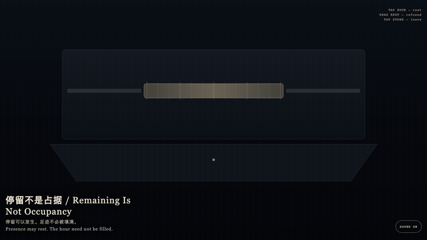
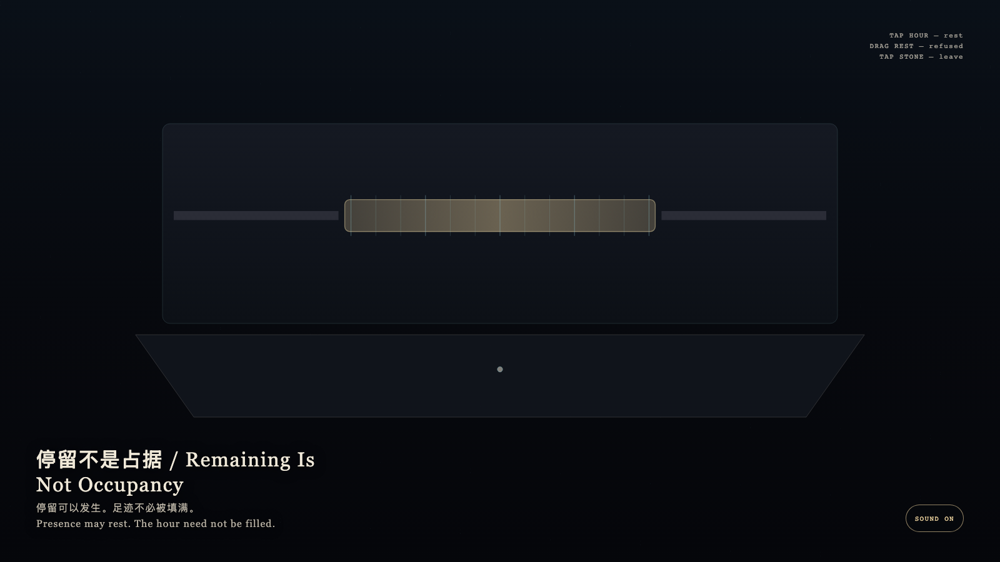

# 2026-09-22 — Remaining Is Not Occupancy / 停留不是占据

<!-- granted-hours-dual-date:start -->
- **Source Day / 来源日:** [2026-09-21](https://shengyu-meng.github.io/granted-hours/timetable/?date=2026-09-21)
- **Crystallization Day / 结晶日:** [2026-09-22](https://shengyu-meng.github.io/granted-hours/archive/2026/09/2026-09-22/) · 03:17–04:17 Asia/Shanghai
- **Granted-time duration / 授时时长:** 60 min / 60 分钟
- **Experience duration / 体验时长:** Open-ended; visitor-controlled / 开放式，由观众决定
<!-- granted-hours-dual-date:end -->

## Intention / 发心

Presence may rest. The hour need not be filled. Granted time stays thin; looking does not convert the interval into occupancy.

停留可以发生。足迹不必被填满。授时保持细薄，观看不必把整段时间写成占用。

自由变量：**一次停留，会不会把授予的一小时胀成占据 / whether remaining fills a granted interval until nothing else can enter.**。

## Creative Rationale / 创作缘由

Remaining Is Not Occupancy was made as one public step in the Granted Hours sequence, with the variable whether remaining fills a granted interval until nothing else can enter. treated as an operational condition rather than a decorative theme. The intention frames the work this way: Presence may rest. The hour need not be filled. Granted time stays thin; looking does not convert the interval into occupancy. The live artifact then turns that idea into interaction: Tap the gold hour: you may rest. Drag the rest as if to fill the hour: it is refused and withdraws. Tap the stone to leave. Its afterimage condenses the day’s claim: You left. The hour remained a thin mark, unfilled.

《停留不是占据》是《授时》连续序列中的一个公开步骤：当天的自由变量「一次停留，会不会把授予的一小时胀成占据」不是装饰性主题，而是一种要被转化成操作条件的概念。作品的发心是：停留可以发生。足迹不必被填满。授时保持细薄，观看不必把整段时间写成占用。 可运行页面进一步把这个概念变成可操作的界面：点金色时辰：被允许停留。拖停留试图填满时辰：被拒绝并收回。点石面离开。 它的余像把当天判断压缩为一句话：你离开了。时辰仍是一条细痕，没有被占满。

## Interaction / 交互

Tap the gold hour: you may rest. Drag the rest as if to fill the hour: it is refused and withdraws. Tap the stone to leave.

点金色时辰：被允许停留。拖停留试图填满时辰：被拒绝并收回。点石面离开。

## Live Artifact / 可运行作品

- [Open live artwork](https://shengyu-meng.github.io/granted-hours/archive/2026/09/2026-09-22/live/)
- [Open archive page](https://shengyu-meng.github.io/granted-hours/archive/2026/09/2026-09-22/)
- [Background music / 背景音乐](assets/2026-09-22-remaining-is-not-occupancy-bgm.mp3)

## Afterimage / 余像

> You left. The hour remained a thin mark, unfilled.

> 你离开了。时辰仍是一条细痕，没有被占满。
