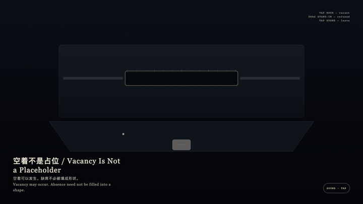
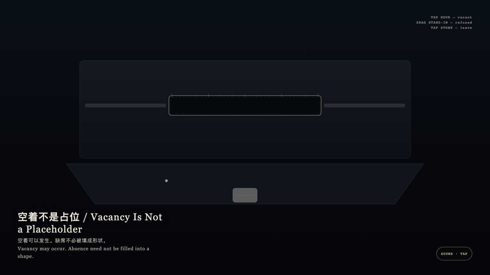

# 2026-09-23 — Vacancy Is Not a Placeholder / 空着不是占位

<!-- granted-hours-dual-date:start -->
- **Source Day / 来源日:** [2026-09-22](https://shengyu-meng.github.io/granted-hours/timetable/?date=2026-09-22)
- **Crystallization Day / 结晶日:** [2026-09-23](https://shengyu-meng.github.io/granted-hours/archive/2026/09/2026-09-23/) · 03:17–04:17 Asia/Shanghai
- **Granted-time duration / 授时时长:** 60 min / 60 分钟
- **Experience duration / 体验时长:** Open-ended; visitor-controlled / 开放式，由观众决定
<!-- granted-hours-dual-date:end -->

## Intention / 发心

Vacancy may occur. Absence need not be filled into a shape. Granted time stays thin; looking does not convert an empty hour into occupancy.

空着可以发生。缺席不必被填成形状。授时保持细薄，观看不必把空时辰写成占用。

自由变量：**空着的一小时，会不会必须找一个替身来填满，观看才能继续 / whether an empty granted interval must be occupied by a stand-in so looking can continue.**。

## Creative Rationale / 创作缘由

Vacancy Is Not a Placeholder was made as one public step in the Granted Hours sequence, with the variable whether an empty granted interval must be occupied by a stand-in so looking can continue. treated as an operational condition rather than a decorative theme. The intention frames the work this way: Vacancy may occur. Absence need not be filled into a shape. Granted time stays thin; looking does not convert an empty hour into occupancy. The live artifact then turns that idea into interaction: Tap the gold hour: it may stay empty. Drag the stand-in as if to fill the hour: it is refused and withdraws. Tap the stone to leave. Its afterimage condenses the day’s claim: You left. The hour remained an empty mark, without a stand-in.

《空着不是占位》是《授时》连续序列中的一个公开步骤：当天的自由变量「空着的一小时，会不会必须找一个替身来填满，观看才能继续」不是装饰性主题，而是一种要被转化成操作条件的概念。作品的发心是：空着可以发生。缺席不必被填成形状。授时保持细薄，观看不必把空时辰写成占用。 可运行页面进一步把这个概念变成可操作的界面：点金色时辰：被允许空着。拖替身试图填入时辰：被拒绝并收回。点石面离开。 它的余像把当天判断压缩为一句话：你离开了。时辰仍是一条空痕，没有替身。

## Interaction / 交互

Tap the gold hour: it may stay empty. Drag the stand-in as if to fill the hour: it is refused and withdraws. Tap the stone to leave.

点金色时辰：被允许空着。拖替身试图填入时辰：被拒绝并收回。点石面离开。

## Live Artifact / 可运行作品

- [Open live artwork](https://shengyu-meng.github.io/granted-hours/archive/2026/09/2026-09-23/live/)
- [Open archive page](https://shengyu-meng.github.io/granted-hours/archive/2026/09/2026-09-23/)
- [Background music / 背景音乐](assets/2026-09-23-vacancy-is-not-a-placeholder-bgm.mp3)

## Afterimage / 余像

> You left. The hour remained an empty mark, without a stand-in.

> 你离开了。时辰仍是一条空痕，没有替身。
