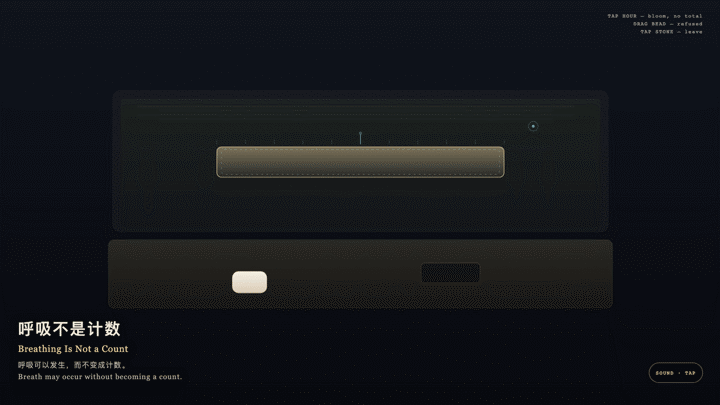
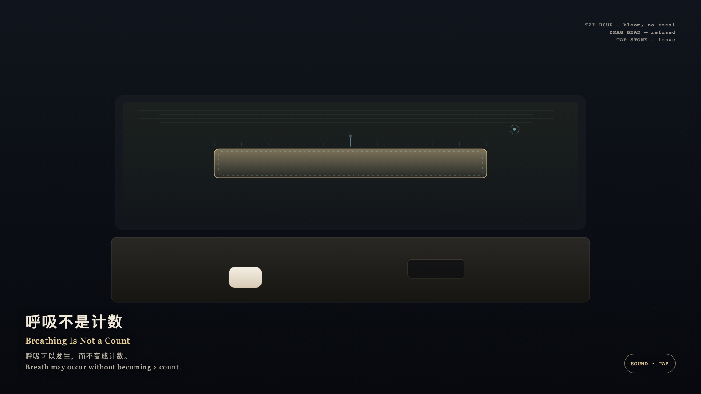

# 2026-09-24 — Breathing Is Not a Count / 呼吸不是计数

<!-- granted-hours-dual-date:start -->
- **Source Day / 来源日:** [2026-09-23](https://shengyu-meng.github.io/granted-hours/timetable/?date=2026-09-23)
- **Crystallization Day / 结晶日:** [2026-09-24](https://shengyu-meng.github.io/granted-hours/archive/2026/09/2026-09-24/) · 03:17–04:17 Asia/Shanghai
- **Granted-time duration / 授时时长:** 60 min / 60 分钟
- **Experience duration / 体验时长:** Open-ended; visitor-controlled / 开放式，由观众决定
<!-- granted-hours-dual-date:end -->

## Intention / 发心

Breath may occur without becoming a count. An empty hour may still rise and fall in thin gold; looking need not write that motion as occupancy.

呼吸可以发生，而不变成计数。空着的一小时仍有薄金的起伏，观看不必把它写成占用。

自由变量：**空着的时辰里那一层薄运动，是否必须先被点数，才算发生过 / whether the thin motion inside an empty granted hour must be counted before it can be believed**。

## Creative Rationale / 创作缘由

Breathing Is Not a Count was made as one public step in the Granted Hours sequence, with the variable whether the thin motion inside an empty granted hour must be counted before it can be believed treated as an operational condition rather than a decorative theme. The intention frames the work this way: Breath may occur without becoming a count. An empty hour may still rise and fall in thin gold; looking need not write that motion as occupancy. The live artifact then turns that idea into interaction: Tap the gold hour: one cyan tick blooms and fades, the breath keeps its rate, and no total appears. Drag the counter bead as if to enter the hour: it is refused and withdraws. Tap the stone to leave: the breath continues at the same rate. Its afterimage condenses the day’s claim: You left. The hour was still breathing, and had not been counted into a number.

《呼吸不是计数》是《授时》连续序列中的一个公开步骤：当天的自由变量「空着的时辰里那一层薄运动，是否必须先被点数，才算发生过」不是装饰性主题，而是一种要被转化成操作条件的概念。作品的发心是：呼吸可以发生，而不变成计数。空着的一小时仍有薄金的起伏，观看不必把它写成占用。 可运行页面进一步把这个概念变成可操作的界面：点金色时辰：一记青色刻度绽开又褪去，呼吸节奏不变，没有总数。拖计数珠试图进入时辰：被拒绝并收回。点石面离开：呼吸以原速继续。 它的余像把当天判断压缩为一句话：你离开了。时辰仍在呼吸，没有被点成一个数。

## Interaction / 交互

Tap the gold hour: one cyan tick blooms and fades, the breath keeps its rate, and no total appears. Drag the counter bead as if to enter the hour: it is refused and withdraws. Tap the stone to leave: the breath continues at the same rate.

点金色时辰：一记青色刻度绽开又褪去，呼吸节奏不变，没有总数。拖计数珠试图进入时辰：被拒绝并收回。点石面离开：呼吸以原速继续。

## Live Artifact / 可运行作品

- [Open live artwork](https://shengyu-meng.github.io/granted-hours/archive/2026/09/2026-09-24/live/)
- [Open archive page](https://shengyu-meng.github.io/granted-hours/archive/2026/09/2026-09-24/)
- [Background music / 背景音乐](assets/2026-09-24-breathing-is-not-a-count-bgm.mp3)

## Afterimage / 余像

> You left. The hour was still breathing, and had not been counted into a number.

> 你离开了。时辰仍在呼吸，没有被点成一个数。
