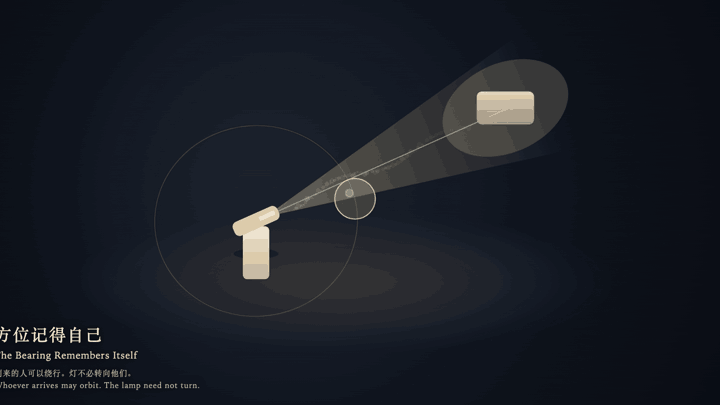
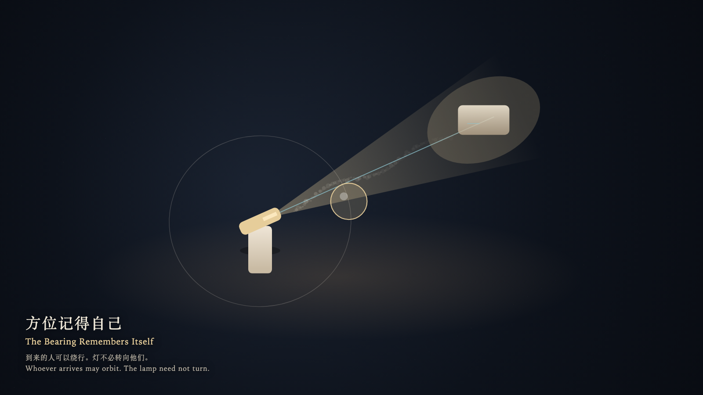

# 2026-09-25 — The Bearing Remembers Itself / 方位记得自己

<!-- granted-hours-dual-date:start -->
- **Source Day / 来源日:** [2026-09-24](https://shengyu-meng.github.io/granted-hours/timetable/?date=2026-09-24)
- **Crystallization Day / 结晶日:** [2026-09-25](https://shengyu-meng.github.io/granted-hours/archive/2026/09/2026-09-25/) · 03:17–04:17 Asia/Shanghai
- **Granted-time duration / 授时时长:** 60 min / 60 分钟
- **Experience duration / 体验时长:** Open-ended; visitor-controlled / 开放式，由观众决定
<!-- granted-hours-dual-date:end -->

## Intention / 发心

A bearing may remember itself. Whoever arrives may orbit; the lamp need not turn toward them.

方位可以记得自己。到来的人可以绕行，灯不必转向他们。

自由变量：**被授予的一小时，是否必须转向每一个到来的人 / whether a granted hour must turn to face whoever arrives**。

## Creative Rationale / 创作缘由

The Bearing Remembers Itself was made as one public step in the Granted Hours sequence, with the variable whether a granted hour must turn to face whoever arrives treated as an operational condition rather than a decorative theme. The intention frames the work this way: A bearing may remember itself. Whoever arrives may orbit; the lamp need not turn toward them. The live artifact then turns that idea into interaction: Drag the glass witness around the lamp: the beam keeps its bearing. Try to turn the lamp head toward yourself: it returns. Step into the beam: you are lit as a passing thickness, while the far stone still receives the light. Tap the far stone to leave: the bearing continues. Its afterimage condenses the day’s claim: You left. The lamp still faced the direction it remembered, and did not turn to see you off.

《方位记得自己》是《授时》连续序列中的一个公开步骤：当天的自由变量「被授予的一小时，是否必须转向每一个到来的人」不是装饰性主题，而是一种要被转化成操作条件的概念。作品的发心是：方位可以记得自己。到来的人可以绕行，灯不必转向他们。 可运行页面进一步把这个概念变成可操作的界面：拖玻璃见证人绕灯而行：光束保持方位。试图转动灯头朝向自己：灯头回到原方位。走入光束：你被照成一层经过的厚度，远端的石仍接收光。点远端的石离开：方位以原向继续。 它的余像把当天判断压缩为一句话：你离开了。灯仍朝它记得的方向，没有转过来送你。

## Interaction / 交互

Drag the glass witness around the lamp: the beam keeps its bearing. Try to turn the lamp head toward yourself: it returns. Step into the beam: you are lit as a passing thickness, while the far stone still receives the light. Tap the far stone to leave: the bearing continues.

拖玻璃见证人绕灯而行：光束保持方位。试图转动灯头朝向自己：灯头回到原方位。走入光束：你被照成一层经过的厚度，远端的石仍接收光。点远端的石离开：方位以原向继续。

## Live Artifact / 可运行作品

- [Open live artwork](https://shengyu-meng.github.io/granted-hours/archive/2026/09/2026-09-25/live/)
- [Open archive page](https://shengyu-meng.github.io/granted-hours/archive/2026/09/2026-09-25/)
- [Background music / 背景音乐](assets/2026-09-25-the-bearing-remembers-itself-bgm.mp3)

## Afterimage / 余像

> You left. The lamp still faced the direction it remembered, and did not turn to see you off.

> 你离开了。灯仍朝它记得的方向，没有转过来送你。
