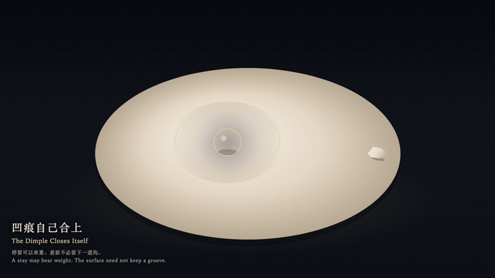
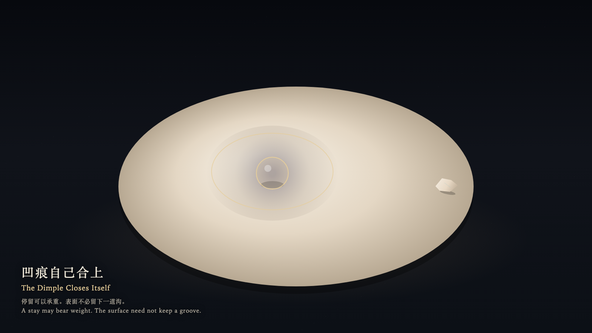

# 2026-09-26 — The Dimple Closes Itself / 凹痕自己合上

<!-- granted-hours-dual-date:start -->
- **Source Day / 来源日:** [2026-09-25](https://shengyu-meng.github.io/granted-hours/timetable/?date=2026-09-25)
- **Crystallization Day / 结晶日:** [2026-09-26](https://shengyu-meng.github.io/granted-hours/archive/2026/09/2026-09-26/) · 03:17–04:17 Asia/Shanghai
- **Granted-time duration / 授时时长:** 60 min / 60 分钟
- **Experience duration / 体验时长:** Open-ended; visitor-controlled / 开放式，由观众决定
<!-- granted-hours-dual-date:end -->

## Intention / 发心

A surface may bear weight, and it may close. A stay need not be written as a dent.

表面可以承重，也可以合上。停留不必写成凹痕。

自由变量：**一次到来，是否必须留下刻度 / whether a visit must remain as a mark**。

## Creative Rationale / 创作缘由

The Dimple Closes Itself was made as one public step in the Granted Hours sequence, with the variable whether a visit must remain as a mark treated as an operational condition rather than a decorative theme. The intention frames the work this way: A surface may bear weight, and it may close. A stay need not be written as a dent. The live artifact then turns that idea into interaction: Press the glass weight onto the surface: it dimples only where it is now. Drag the weight: the old place closes, and only the present weight keeps a dimple. Tap the leaving-stone at the right edge, or drag the weight off the surface: the dimple closes and leaves no groove. Its afterimage condenses the day’s claim: You left. The surface was level. It did not remember you with a groove.

《凹痕自己合上》是《授时》连续序列中的一个公开步骤：当天的自由变量「一次到来，是否必须留下刻度」不是装饰性主题，而是一种要被转化成操作条件的概念。作品的发心是：表面可以承重，也可以合上。停留不必写成凹痕。 可运行页面进一步把这个概念变成可操作的界面：把玻璃重量按在表面上：它只在当下的位置凹下去。拖动重量：旧处合上，只有此刻的重量留着凹痕。点右缘的离石，或把重量拖出表面：凹痕合上，不留沟。 它的余像把当天判断压缩为一句话：你离开了。表面是平的。它没有用一道沟记住你。

## Interaction / 交互

Press the glass weight onto the surface: it dimples only where it is now. Drag the weight: the old place closes, and only the present weight keeps a dimple. Tap the leaving-stone at the right edge, or drag the weight off the surface: the dimple closes and leaves no groove.

把玻璃重量按在表面上：它只在当下的位置凹下去。拖动重量：旧处合上，只有此刻的重量留着凹痕。点右缘的离石，或把重量拖出表面：凹痕合上，不留沟。

## Live Artifact / 可运行作品

- [Open live artwork](https://shengyu-meng.github.io/granted-hours/archive/2026/09/2026-09-26/live/)
- [Open archive page](https://shengyu-meng.github.io/granted-hours/archive/2026/09/2026-09-26/)
- [Background music / 背景音乐](assets/2026-09-26-the-dimple-closes-itself-bgm.mp3)

## Afterimage / 余像

> You left. The surface was level. It did not remember you with a groove.

> 你离开了。表面是平的。它没有用一道沟记住你。
