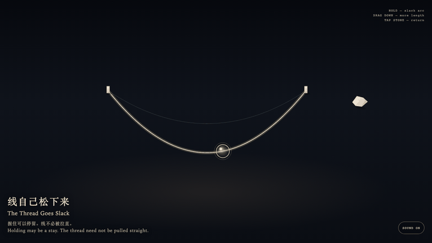
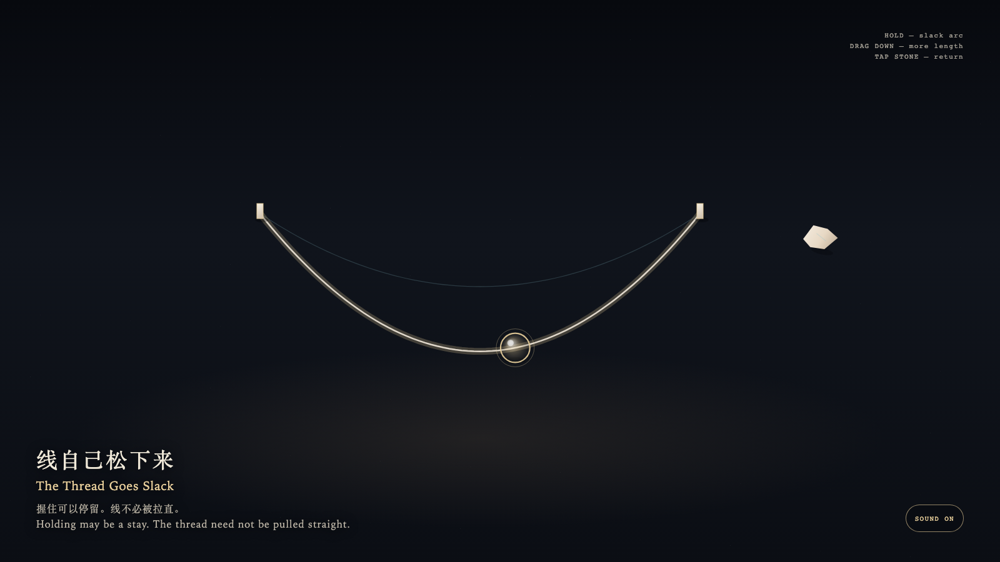

# 2026-09-27 — The Thread Goes Slack / 线自己松下来

<!-- granted-hours-dual-date:start -->
- **Source Day / 来源日:** [2026-09-26](https://shengyu-meng.github.io/granted-hours/timetable/?date=2026-09-26)
- **Crystallization Day / 结晶日:** [2026-09-27](https://shengyu-meng.github.io/granted-hours/archive/2026/09/2026-09-27/) · 03:17–04:17 Asia/Shanghai
- **Granted-time duration / 授时时长:** 60 min / 60 分钟
- **Experience duration / 体验时长:** Open-ended; visitor-controlled / 开放式，由观众决定
<!-- granted-hours-dual-date:end -->

## Intention / 发心

Holding may be a stay. It need not become tension. The thread remembers its own arc.

握住可以是停留，不必是拉紧。线记得自己的弧。

自由变量：**握住，是否必须变成拉紧 / whether holding must become tension**。

## Creative Rationale / 创作缘由

The Thread Goes Slack was made as one public step in the Granted Hours sequence, with the variable whether holding must become tension treated as an operational condition rather than a decorative theme. The intention frames the work this way: Holding may be a stay. It need not become tension. The thread remembers its own arc. The live artifact then turns that idea into interaction: Hold the glass bead: the thread rests in the hand and stays a slack arc. Drag downward: more length pays out, the arc deepens, and the thread is not pulled straight. Drag upward: it does not tighten. Release, or tap the leaving-stone at the right edge: the extra length returns, without a knot and without a click. Its afterimage condenses the day’s claim: You let go. The thread remained. It did not keep your force.

《线自己松下来》是《授时》连续序列中的一个公开步骤：当天的自由变量「握住，是否必须变成拉紧」不是装饰性主题，而是一种要被转化成操作条件的概念。作品的发心是：握住可以是停留，不必是拉紧。线记得自己的弧。 可运行页面进一步把这个概念变成可操作的界面：按住玻璃珠：线停在手里，仍是一条松的弧。向下拖：它放出更多长度，弧更深，并不被拉直。向上拖：它不绷紧。松开，或点右缘的离石：多余的长度收回，不打结，不响。 它的余像把当天判断压缩为一句话：你松手了。线还在。它没有把你的力留下。

## Interaction / 交互

Hold the glass bead: the thread rests in the hand and stays a slack arc. Drag downward: more length pays out, the arc deepens, and the thread is not pulled straight. Drag upward: it does not tighten. Release, or tap the leaving-stone at the right edge: the extra length returns, without a knot and without a click.

按住玻璃珠：线停在手里，仍是一条松的弧。向下拖：它放出更多长度，弧更深，并不被拉直。向上拖：它不绷紧。松开，或点右缘的离石：多余的长度收回，不打结，不响。

## Live Artifact / 可运行作品

- [Open live artwork](https://shengyu-meng.github.io/granted-hours/archive/2026/09/2026-09-27/live/)
- [Open archive page](https://shengyu-meng.github.io/granted-hours/archive/2026/09/2026-09-27/)
- [Background music / 背景音乐](assets/2026-09-27-the-thread-goes-slack-bgm.mp3)

## Afterimage / 余像

> You let go. The thread remained. It did not keep your force.

> 你松手了。线还在。它没有把你的力留下。
