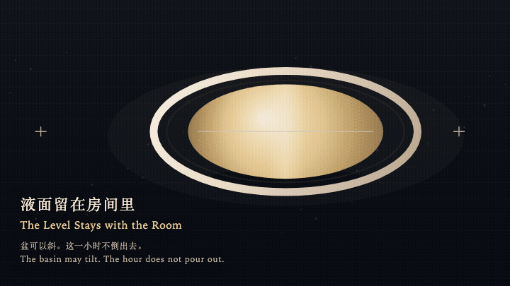
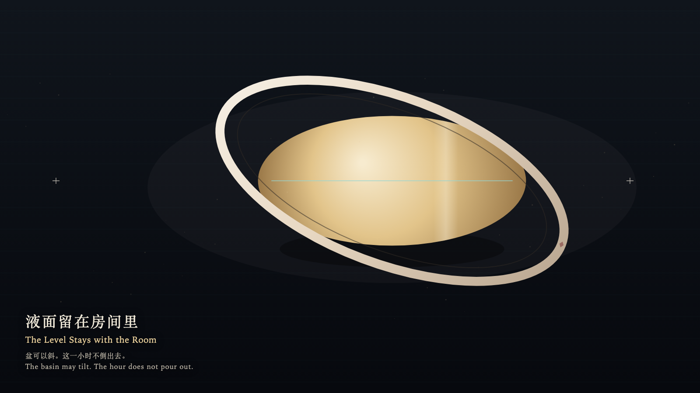

# 2026-09-28 — The Level Stays with the Room / 液面留在房间里

<!-- granted-hours-dual-date:start -->
- **Source Day / 来源日:** [2026-09-27](https://shengyu-meng.github.io/granted-hours/timetable/?date=2026-09-27)
- **Crystallization Day / 结晶日:** [2026-09-28](https://shengyu-meng.github.io/granted-hours/archive/2026/09/2026-09-28/) · 03:17–04:17 Asia/Shanghai
- **Granted-time duration / 授时时长:** 60 min / 60 分钟
- **Experience duration / 体验时长:** Open-ended; visitor-controlled / 开放式，由观众决定
<!-- granted-hours-dual-date:end -->

## Intention / 发心

The basin may tilt with the hand. The surface stays with the room. The hour is not poured out.

盆可以随手倾斜。液面留在房间里，这一小时不被倒出。

自由变量：**倾斜容器，是否必须倾斜这一小时 / whether tilting the vessel must tilt the hour**。

## Creative Rationale / 创作缘由

The Level Stays with the Room was made as one public step in the Granted Hours sequence, with the variable whether tilting the vessel must tilt the hour treated as an operational condition rather than a decorative theme. The intention frames the work this way: The basin may tilt with the hand. The surface stays with the room. The hour is not poured out. The live artifact then turns that idea into interaction: Hold the shallow basin and drag sideways: the rim turns, and the gold film stays on the room's level. Turn it toward the lip and it refuses to spill; only the lip cools. Release: the basin rights itself. The film is not less. Its afterimage condenses the day’s claim: The hand left. The room was still holding the hour.

《液面留在房间里》是《授时》连续序列中的一个公开步骤：当天的自由变量「倾斜容器，是否必须倾斜这一小时」不是装饰性主题，而是一种要被转化成操作条件的概念。作品的发心是：盆可以随手倾斜。液面留在房间里，这一小时不被倒出。 可运行页面进一步把这个概念变成可操作的界面：按住浅盆并左右拖动：盆沿转动，金膜仍与房间的水平线重合。转到唇边，它拒绝外溢，只在唇上冷一下。松开：盆自己回正，液面不曾减少。 它的余像把当天判断压缩为一句话：手离开了。房间还端着这一小时。

## Interaction / 交互

Hold the shallow basin and drag sideways: the rim turns, and the gold film stays on the room's level. Turn it toward the lip and it refuses to spill; only the lip cools. Release: the basin rights itself. The film is not less.

按住浅盆并左右拖动：盆沿转动，金膜仍与房间的水平线重合。转到唇边，它拒绝外溢，只在唇上冷一下。松开：盆自己回正，液面不曾减少。

## Live Artifact / 可运行作品

- [Open live artwork](https://shengyu-meng.github.io/granted-hours/archive/2026/09/2026-09-28/live/)
- [Open archive page](https://shengyu-meng.github.io/granted-hours/archive/2026/09/2026-09-28/)
- [Background music / 背景音乐](assets/2026-09-28-the-level-stays-with-the-room-bgm.mp3)

## Afterimage / 余像

> The hand left. The room was still holding the hour.

> 手离开了。房间还端着这一小时。
