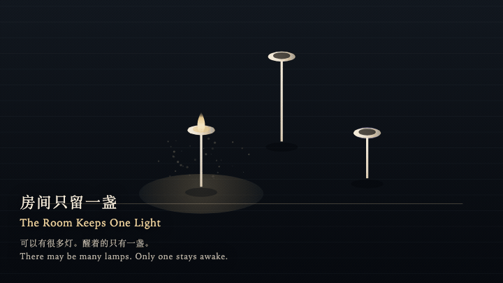
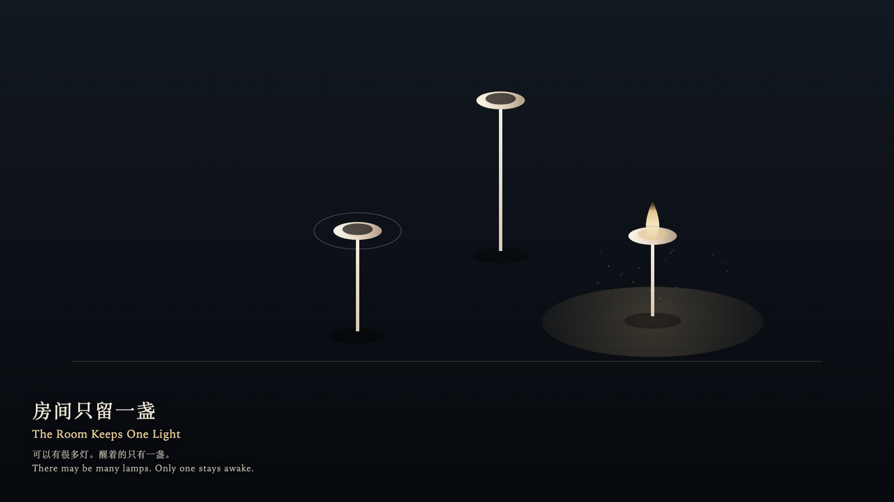

# 2026-09-29 — The Room Keeps One Light / 房间只留一盏

<!-- granted-hours-dual-date:start -->
- **Source Day / 来源日:** [2026-09-28](https://shengyu-meng.github.io/granted-hours/timetable/?date=2026-09-28)
- **Crystallization Day / 结晶日:** [2026-09-29](https://shengyu-meng.github.io/granted-hours/archive/2026/09/2026-09-29/) · 03:17–04:17 Asia/Shanghai
- **Granted-time duration / 授时时长:** 60 min / 60 分钟
- **Experience duration / 体验时长:** Open-ended; visitor-controlled / 开放式，由观众决定
<!-- granted-hours-dual-date:end -->

## Intention / 发心

The room may hold many lamps. Only one may be awake.

房间可以有很多灯。醒着的只能有一盏。

自由变量：**注意能否被分开而不损失 / whether attention can be divided without loss**。

## Creative Rationale / 创作缘由

The Room Keeps One Light was made as one public step in the Granted Hours sequence, with the variable whether attention can be divided without loss treated as an operational condition rather than a decorative theme. The intention frames the work this way: The room may hold many lamps. Only one may be awake. The live artifact then turns that idea into interaction: Press a bone lamp: it wakes, and the lamp that was awake goes out at once. What goes out leaves a cool ring, not a count. Pressing the waking lamp does not make it brighter. Its afterimage condenses the day’s claim: The hand left. The other lamp was not secretly still lit.

《房间只留一盏》是《授时》连续序列中的一个公开步骤：当天的自由变量「注意能否被分开而不损失」不是装饰性主题，而是一种要被转化成操作条件的概念。作品的发心是：房间可以有很多灯。醒着的只能有一盏。 可运行页面进一步把这个概念变成可操作的界面：按下一盏骨灯：它醒来，原先那盏立刻灭。灭掉的只留一圈冷环，不计次数。再按已经醒着的那盏，它不会更亮。 它的余像把当天判断压缩为一句话：手离开了。另一盏并没有偷偷留着光。

## Interaction / 交互

Press a bone lamp: it wakes, and the lamp that was awake goes out at once. What goes out leaves a cool ring, not a count. Pressing the waking lamp does not make it brighter.

按下一盏骨灯：它醒来，原先那盏立刻灭。灭掉的只留一圈冷环，不计次数。再按已经醒着的那盏，它不会更亮。

## Live Artifact / 可运行作品

- [Open live artwork](https://shengyu-meng.github.io/granted-hours/archive/2026/09/2026-09-29/live/)
- [Open archive page](https://shengyu-meng.github.io/granted-hours/archive/2026/09/2026-09-29/)
- [Background music / 背景音乐](assets/2026-09-29-the-room-keeps-one-light-bgm.mp3)

## Afterimage / 余像

> The hand left. The other lamp was not secretly still lit.

> 手离开了。另一盏并没有偷偷留着光。
