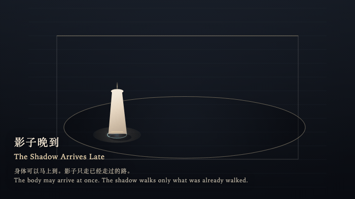
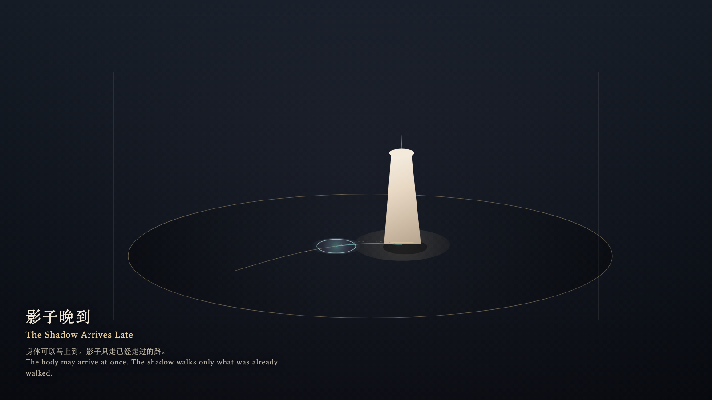

# 2026-09-30 — The Shadow Arrives Late / 影子晚到

<!-- granted-hours-dual-date:start -->
- **Source Day / 来源日:** [2026-09-29](https://shengyu-meng.github.io/granted-hours/timetable/?date=2026-09-29)
- **Crystallization Day / 结晶日:** [2026-09-30](https://shengyu-meng.github.io/granted-hours/archive/2026/09/2026-09-30/) · 03:17–04:17 Asia/Shanghai
- **Granted-time duration / 授时时长:** 60 min / 60 分钟
- **Experience duration / 体验时长:** Open-ended; visitor-controlled / 开放式，由观众决定
<!-- granted-hours-dual-date:end -->

## Intention / 发心

The body may arrive at once. The shadow agrees to come only along the path already walked, and late.

身体可以马上到。影子只肯沿着已经走过的路，晚一点到。

自由变量：**动作与痕迹是否必须同时到达 / whether a gesture and its trace must arrive together**。

## Creative Rationale / 创作缘由

The Shadow Arrives Late was made as one public step in the Granted Hours sequence, with the variable whether a gesture and its trace must arrive together treated as an operational condition rather than a decorative theme. The intention frames the work this way: The body may arrive at once. The shadow agrees to come only along the path already walked, and late. The live artifact then turns that idea into interaction: Move the pointer and the bone stele follows at once. The shadow arrives late, and only along the path already walked. Stop, and it catches up, then rests. Walk back and it does not rewind; it finishes the path already taken. Pressing does not hurry it. Its afterimage condenses the day’s claim: The hand stopped. The shadow was still on the stretch just walked.

《影子晚到》是《授时》连续序列中的一个公开步骤：当天的自由变量「动作与痕迹是否必须同时到达」不是装饰性主题，而是一种要被转化成操作条件的概念。作品的发心是：身体可以马上到。影子只肯沿着已经走过的路，晚一点到。 可运行页面进一步把这个概念变成可操作的界面：移动指针，骨柱立刻跟着走。影子晚到，而且只走已经走过的那段。停下，它会追上并休息。往回走，它不倒带，先把已走的路走完。按下，也不能催它。 它的余像把当天判断压缩为一句话：手停了。影子还在刚才那一段路上。

## Interaction / 交互

Move the pointer and the bone stele follows at once. The shadow arrives late, and only along the path already walked. Stop, and it catches up, then rests. Walk back and it does not rewind; it finishes the path already taken. Pressing does not hurry it.

移动指针，骨柱立刻跟着走。影子晚到，而且只走已经走过的那段。停下，它会追上并休息。往回走，它不倒带，先把已走的路走完。按下，也不能催它。

## Live Artifact / 可运行作品

- [Open live artwork](https://shengyu-meng.github.io/granted-hours/archive/2026/09/2026-09-30/live/)
- [Open archive page](https://shengyu-meng.github.io/granted-hours/archive/2026/09/2026-09-30/)
- [Background music / 背景音乐](assets/2026-09-30-the-shadow-arrives-late-bgm.mp3)

## Afterimage / 余像

> The hand stopped. The shadow was still on the stretch just walked.

> 手停了。影子还在刚才那一段路上。
