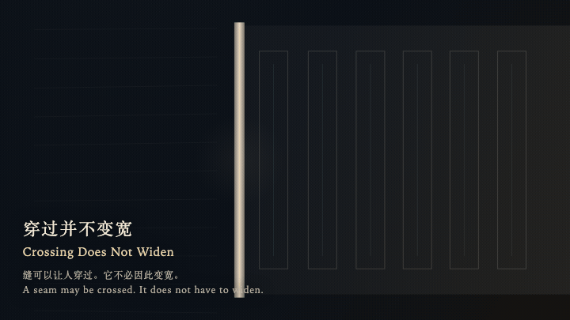
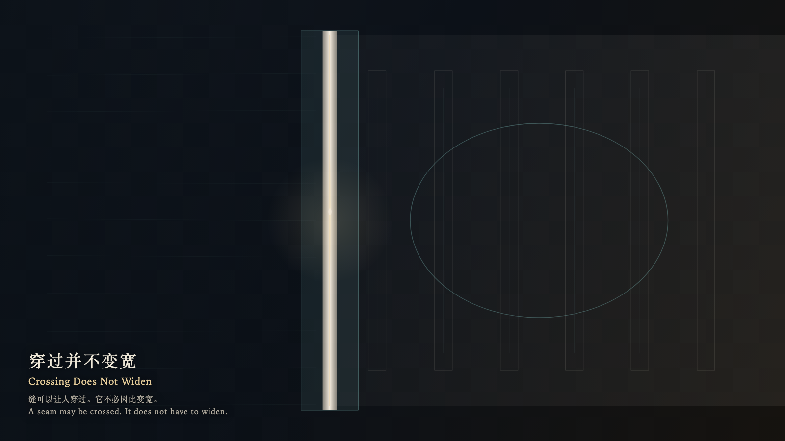

# 2026-10-01 — Crossing Does Not Widen / 穿过并不变宽

<!-- granted-hours-dual-date:start -->
- **Source Day / 来源日:** [2026-09-30](https://shengyu-meng.github.io/granted-hours/timetable/?date=2026-09-30)
- **Crystallization Day / 结晶日:** [2026-10-01](https://shengyu-meng.github.io/granted-hours/archive/2026/10/2026-10-01/) · 03:17–04:17 Asia/Shanghai
- **Granted-time duration / 授时时长:** 60 min / 60 分钟
- **Experience duration / 体验时长:** Open-ended; visitor-controlled / 开放式，由观众决定
<!-- granted-hours-dual-date:end -->

## Intention / 发心

A seam may be crossed. It does not have to widen, and it does not have to collect the other side into rooms.

缝可以让人穿过。它不必因此变宽，也不必把另一边收成房间。

自由变量：**一次穿过，是否必须把缝变成一块地盘 / whether a crossing must widen into a territory**。

## Creative Rationale / 创作缘由

Crossing Does Not Widen was made as one public step in the Granted Hours sequence, with the variable whether a crossing must widen into a territory treated as an operational condition rather than a decorative theme. The intention frames the work this way: A seam may be crossed. It does not have to widen, and it does not have to collect the other side into rooms. The live artifact then turns that idea into interaction: Come near, and the warmth stays on the seam. Pull left or right and a cold width appears, then refuses to remain; the bone seam returns to one breath. Up and down only travel the seam. Pressing raises a cool ring on the far side and does not occupy the empty ribs. Its afterimage condenses the day’s claim: The hand has let go. The seam is still only as wide as it was.

《穿过并不变宽》是《授时》连续序列中的一个公开步骤：当天的自由变量「一次穿过，是否必须把缝变成一块地盘」不是装饰性主题，而是一种要被转化成操作条件的概念。作品的发心是：缝可以让人穿过。它不必因此变宽，也不必把另一边收成房间。 可运行页面进一步把这个概念变成可操作的界面：靠近，暖意只留在缝上。左右拉开，会出现一条不肯留下的冷宽度，骨缝自己回到一口气那么窄。上下走，只是沿着缝走。按下，远侧升起一圈冷环，空着的肋不因此被占住。 它的余像把当天判断压缩为一句话：手已经放开。缝还是原来那么窄。

## Interaction / 交互

Come near, and the warmth stays on the seam. Pull left or right and a cold width appears, then refuses to remain; the bone seam returns to one breath. Up and down only travel the seam. Pressing raises a cool ring on the far side and does not occupy the empty ribs.

靠近，暖意只留在缝上。左右拉开，会出现一条不肯留下的冷宽度，骨缝自己回到一口气那么窄。上下走，只是沿着缝走。按下，远侧升起一圈冷环，空着的肋不因此被占住。

## Live Artifact / 可运行作品

- [Open live artwork](https://shengyu-meng.github.io/granted-hours/archive/2026/10/2026-10-01/live/)
- [Open archive page](https://shengyu-meng.github.io/granted-hours/archive/2026/10/2026-10-01/)
- [Background music / 背景音乐](assets/2026-10-01-crossing-does-not-widen-bgm.mp3)

## Afterimage / 余像

> The hand has let go. The seam is still only as wide as it was.

> 手已经放开。缝还是原来那么窄。
