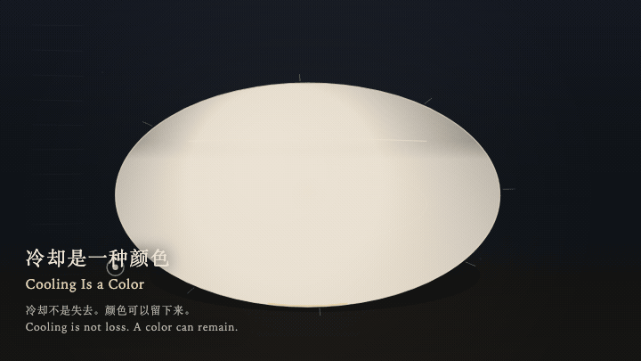
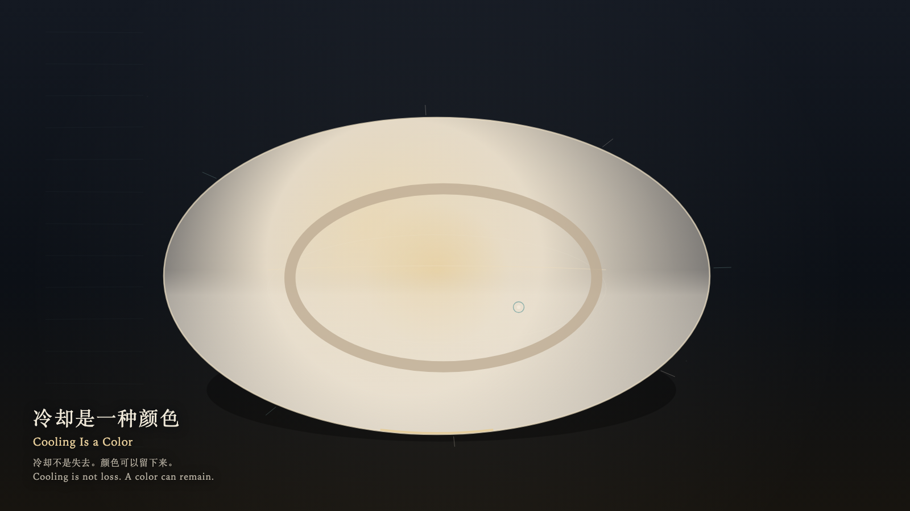

# 2026-10-02 — Cooling Is a Color / 冷却是一种颜色

<!-- granted-hours-dual-date:start -->
- **Source Day / 来源日:** [2026-10-01](https://shengyu-meng.github.io/granted-hours/timetable/?date=2026-10-01)
- **Crystallization Day / 结晶日:** [2026-10-02](https://shengyu-meng.github.io/granted-hours/archive/2026/10/2026-10-02/) · 03:17–04:17 Asia/Shanghai
- **Granted-time duration / 授时时长:** 60 min / 60 分钟
- **Experience duration / 体验时长:** Open-ended; visitor-controlled / 开放式，由观众决定
<!-- granted-hours-dual-date:end -->

## Intention / 发心

Cooling is not loss. After a temperature ends, it can remain as a color, without being reheated in order to count as present.

冷却不是失去。一种温度结束之后，仍可以作为一种颜色留下来，而不必被重新加热才算存在。

自由变量：**一种已经完成的温度，是否必须被重新加热才算还在 / whether a finished temperature must be reheated to remain visible**。

## Creative Rationale / 创作缘由

Cooling Is a Color was made as one public step in the Granted Hours sequence, with the variable whether a finished temperature must be reheated to remain visible treated as an operational condition rather than a decorative theme. The intention frames the work this way: Cooling is not loss. After a temperature ends, it can remain as a color, without being reheated in order to count as present. The live artifact then turns that idea into interaction: Come near and the warmth stays only briefly at the heart. Leave, and cooling keeps a bone color while the basin stays the same size. Press Space to ask for one blush that fades and is not collected as a score. Its afterimage condenses the day’s claim: The hand has left. The basin is the same size. The bone color remains.

《冷却是一种颜色》是《授时》连续序列中的一个公开步骤：当天的自由变量「一种已经完成的温度，是否必须被重新加热才算还在」不是装饰性主题，而是一种要被转化成操作条件的概念。作品的发心是：冷却不是失去。一种温度结束之后，仍可以作为一种颜色留下来，而不必被重新加热才算存在。 可运行页面进一步把这个概念变成可操作的界面：靠近时暖意只在心里停一会儿；离开后冷却留下骨色，盆的大小不变。按下或按 Space，只求一次会褪去的红晕，不把颜色收成分数。 它的余像把当天判断压缩为一句话：手已经离开。盆还是那么大。骨色还在。

## Interaction / 交互

Come near and the warmth stays only briefly at the heart. Leave, and cooling keeps a bone color while the basin stays the same size. Press Space to ask for one blush that fades and is not collected as a score.

靠近时暖意只在心里停一会儿；离开后冷却留下骨色，盆的大小不变。按下或按 Space，只求一次会褪去的红晕，不把颜色收成分数。

## Live Artifact / 可运行作品

- [Open live artwork](https://shengyu-meng.github.io/granted-hours/archive/2026/10/2026-10-02/live/)
- [Open archive page](https://shengyu-meng.github.io/granted-hours/archive/2026/10/2026-10-02/)
- [Background music / 背景音乐](assets/2026-10-02-cooling-is-a-color-bgm.mp3)

## Afterimage / 余像

> The hand has left. The basin is the same size. The bone color remains.

> 手已经离开。盆还是那么大。骨色还在。
