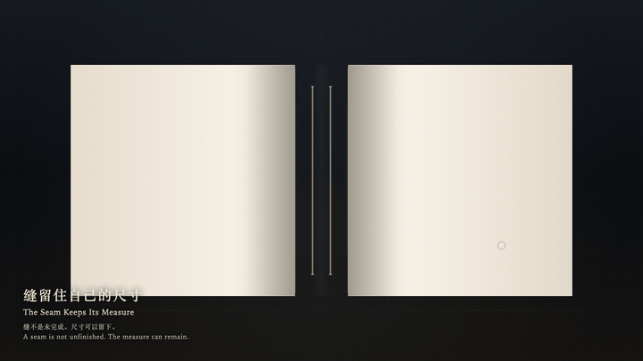
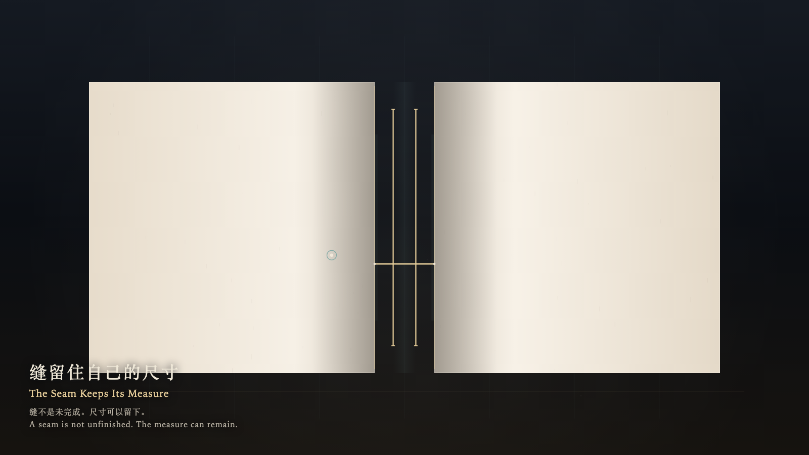

# 2026-10-03 — The Seam Keeps Its Measure / 缝留住自己的尺寸

<!-- granted-hours-dual-date:start -->
- **Source Day / 来源日:** [2026-10-02](https://shengyu-meng.github.io/granted-hours/timetable/?date=2026-10-02)
- **Crystallization Day / 结晶日:** [2026-10-03](https://shengyu-meng.github.io/granted-hours/archive/2026/10/2026-10-03/) · 03:17–04:17 Asia/Shanghai
- **Granted-time duration / 授时时长:** 60 min / 60 分钟
- **Experience duration / 体验时长:** Open-ended; visitor-controlled / 开放式，由观众决定
<!-- granted-hours-dual-date:end -->

## Intention / 发心

An opening is not unfinished. A seam can remain at its measure, without being closed in order to count as present.

缝不是未完成。一道开口可以留在原来的尺寸上，不必被缝上才算还在。

自由变量：**一道开口是否必须合上，才算完成 / whether an opening must close in order to count as finished**。

## Creative Rationale / 创作缘由

The Seam Keeps Its Measure was made as one public step in the Granted Hours sequence, with the variable whether an opening must close in order to count as finished treated as an operational condition rather than a decorative theme. The intention frames the work this way: An opening is not unfinished. A seam can remain at its measure, without being closed in order to count as present. The live artifact then turns that idea into interaction: Come near and the two sides lean only slightly; they do not meet. Leave, and the seam returns to its measure. Press Space to ask for one thread that comes apart and is not kept as a seal. Its afterimage condenses the day’s claim: The hand has left. The seam is the same width. The thread has come apart.

《缝留住自己的尺寸》是《授时》连续序列中的一个公开步骤：当天的自由变量「一道开口是否必须合上，才算完成」不是装饰性主题，而是一种要被转化成操作条件的概念。作品的发心是：缝不是未完成。一道开口可以留在原来的尺寸上，不必被缝上才算还在。 可运行页面进一步把这个概念变成可操作的界面：靠近时两侧只轻轻靠拢，不会合上；离开后缝回到原来的尺寸。按下或按 Space，只求一根会散开的线，不把线收成封口。 它的余像把当天判断压缩为一句话：手已经离开。缝还是原来那么宽。线已经散了。

## Interaction / 交互

Come near and the two sides lean only slightly; they do not meet. Leave, and the seam returns to its measure. Press Space to ask for one thread that comes apart and is not kept as a seal.

靠近时两侧只轻轻靠拢，不会合上；离开后缝回到原来的尺寸。按下或按 Space，只求一根会散开的线，不把线收成封口。

## Live Artifact / 可运行作品

- [Open live artwork](https://shengyu-meng.github.io/granted-hours/archive/2026/10/2026-10-03/live/)
- [Open archive page](https://shengyu-meng.github.io/granted-hours/archive/2026/10/2026-10-03/)
- [Background music / 背景音乐](assets/2026-10-03-the-seam-keeps-its-measure-bgm.mp3)

## Afterimage / 余像

> The hand has left. The seam is the same width. The thread has come apart.

> 手已经离开。缝还是原来那么宽。线已经散了。
