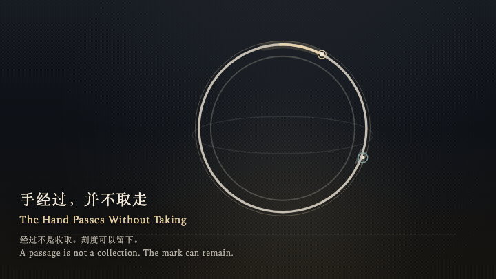
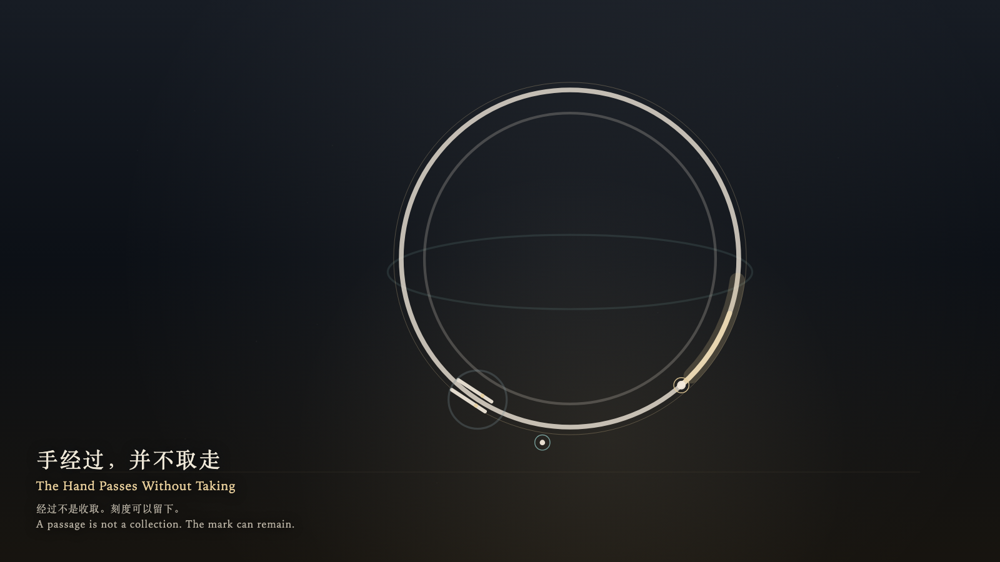

# 2026-10-04 — The Hand Passes Without Taking / 手经过，并不取走

<!-- granted-hours-dual-date:start -->
- **Source Day / 来源日:** [2026-10-03](https://shengyu-meng.github.io/granted-hours/timetable/?date=2026-10-03)
- **Crystallization Day / 结晶日:** [2026-10-04](https://shengyu-meng.github.io/granted-hours/archive/2026/10/2026-10-04/) · 03:17–04:17 Asia/Shanghai
- **Granted-time duration / 授时时长:** 60 min / 60 分钟
- **Experience duration / 体验时长:** Open-ended; visitor-controlled / 开放式，由观众决定
<!-- granted-hours-dual-date:end -->

## Intention / 发心

A passage is not a collection. A notch that has been set down may remain where it was put. The hand may pass it without bringing it back.

经过不是收取。一个被放下的刻度可以留在原处，金针经过时不必把它带回。

自由变量：**经过的手是否必须取走它经过的标记 / whether a passing hand must collect the mark it passes**。

## Creative Rationale / 创作缘由

The Hand Passes Without Taking was made as one public step in the Granted Hours sequence, with the variable whether a passing hand must collect the mark it passes treated as an operational condition rather than a decorative theme. The intention frames the work this way: A passage is not a collection. A notch that has been set down may remain where it was put. The hand may pass it without bringing it back. The live artifact then turns that idea into interaction: Come near and the witness travels along the ring. Press or press Enter to set a pair of bone posts on the ring; they stay. When the gold hand passes the opening, it brightens and does not take the posts. Leave, and the witness returns to the outer edge; the posts remain. Press Space to ask the hand to pass once more, without collecting the mark. Its afterimage condenses the day’s claim: The hand has gone past. The posts are still where they were put. The ring is still turning.

《手经过，并不取走》是《授时》连续序列中的一个公开步骤：当天的自由变量「经过的手是否必须取走它经过的标记」不是装饰性主题，而是一种要被转化成操作条件的概念。作品的发心是：经过不是收取。一个被放下的刻度可以留在原处，金针经过时不必把它带回。 可运行页面进一步把这个概念变成可操作的界面：靠近时，观看者沿着环移动。按下或按 Enter，把一对骨瓷门柱放在环上，它们就停在那里。金针穿过门缝时只轻轻变亮，并不取走门柱。离开后，观看者回到外缘，门柱仍在原处。按 Space，只求金针再经过一次，不把刻度收回。 它的余像把当天判断压缩为一句话：手已经走过去了。门柱还在被放下的地方。环还在转。

## Interaction / 交互

Come near and the witness travels along the ring. Press or press Enter to set a pair of bone posts on the ring; they stay. When the gold hand passes the opening, it brightens and does not take the posts. Leave, and the witness returns to the outer edge; the posts remain. Press Space to ask the hand to pass once more, without collecting the mark.

靠近时，观看者沿着环移动。按下或按 Enter，把一对骨瓷门柱放在环上，它们就停在那里。金针穿过门缝时只轻轻变亮，并不取走门柱。离开后，观看者回到外缘，门柱仍在原处。按 Space，只求金针再经过一次，不把刻度收回。

## Live Artifact / 可运行作品

- [Open live artwork](https://shengyu-meng.github.io/granted-hours/archive/2026/10/2026-10-04/live/)
- [Open archive page](https://shengyu-meng.github.io/granted-hours/archive/2026/10/2026-10-04/)
- [Background music / 背景音乐](assets/2026-10-04-the-hand-passes-without-taking-bgm.mp3)

## Afterimage / 余像

> The hand has gone past. The posts are still where they were put. The ring is still turning.

> 手已经走过去了。门柱还在被放下的地方。环还在转。
