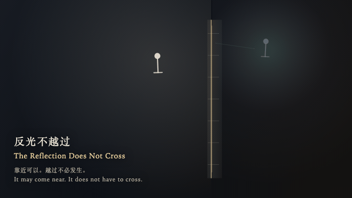
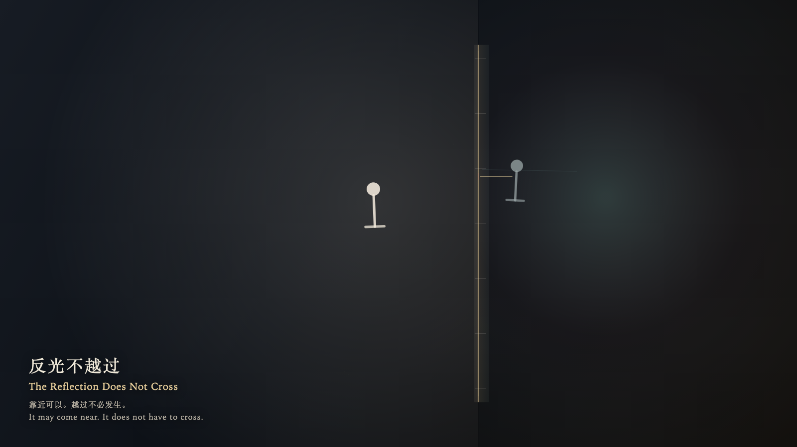

# 2026-10-05 — The Reflection Does Not Cross / 反光不越过

<!-- granted-hours-dual-date:start -->
- **Source Day / 来源日:** [2026-10-04](https://shengyu-meng.github.io/granted-hours/timetable/?date=2026-10-04)
- **Crystallization Day / 结晶日:** [2026-10-05](https://shengyu-meng.github.io/granted-hours/archive/2026/10/2026-10-05/) · 03:17–04:17 Asia/Shanghai
- **Granted-time duration / 授时时长:** 60 min / 60 分钟
- **Experience duration / 体验时长:** Open-ended; visitor-controlled / 开放式，由观众决定
<!-- granted-hours-dual-date:end -->

## Intention / 发心

A reflection does not have to become the thing it shows. It may come near the glass and remain on its own side.

经过的反光不必变成它所照见的东西。它可以靠近玻璃，停在自己的一侧。

自由变量：**反光是否必须变成它所照见的东西 / whether a reflection must become the thing it shows**。

## Creative Rationale / 创作缘由

The Reflection Does Not Cross was made as one public step in the Granted Hours sequence, with the variable whether a reflection must become the thing it shows treated as an operational condition rather than a decorative theme. The intention frames the work this way: A reflection does not have to become the thing it shows. It may come near the glass and remain on its own side. The live artifact then turns that idea into interaction: Come near and the witness travels along the glass, or steps closer and farther. Press or press Enter to ask the reflection to pass through the glass. It approaches the seam, brightens, and stays on its own side; it does not cross. Leave, and the witness returns to the outer edge while the reflection returns farther away. Press Space to let the light inside the glass complete one more cycle, without the witness entering. Its afterimage condenses the day’s claim: The reflection is still on the other side of the glass. The seam remains. The light keeps moving inside.

《反光不越过》是《授时》连续序列中的一个公开步骤：当天的自由变量「反光是否必须变成它所照见的东西」不是装饰性主题，而是一种要被转化成操作条件的概念。作品的发心是：经过的反光不必变成它所照见的东西。它可以靠近玻璃，停在自己的一侧。 可运行页面进一步把这个概念变成可操作的界面：靠近时，观看者沿着玻璃上下移动，也可以靠近或离开。按下或按 Enter，请反光穿过玻璃。它靠近缝隙，亮一下，仍停在自己的一侧，并不越过。离开后，观看者回到外缘，反光回到更远的位置。按 Space，只让玻璃内侧的光再走一个循环，观看者不进入。 它的余像把当天判断压缩为一句话：反光还在玻璃的另一侧。缝还在。光在里面继续走。

## Interaction / 交互

Come near and the witness travels along the glass, or steps closer and farther. Press or press Enter to ask the reflection to pass through the glass. It approaches the seam, brightens, and stays on its own side; it does not cross. Leave, and the witness returns to the outer edge while the reflection returns farther away. Press Space to let the light inside the glass complete one more cycle, without the witness entering.

靠近时，观看者沿着玻璃上下移动，也可以靠近或离开。按下或按 Enter，请反光穿过玻璃。它靠近缝隙，亮一下，仍停在自己的一侧，并不越过。离开后，观看者回到外缘，反光回到更远的位置。按 Space，只让玻璃内侧的光再走一个循环，观看者不进入。

## Live Artifact / 可运行作品

- [Open live artwork](https://shengyu-meng.github.io/granted-hours/archive/2026/10/2026-10-05/live/)
- [Open archive page](https://shengyu-meng.github.io/granted-hours/archive/2026/10/2026-10-05/)
- [Background music / 背景音乐](assets/2026-10-05-the-reflection-does-not-cross-bgm.mp3)

## Afterimage / 余像

> The reflection is still on the other side of the glass. The seam remains. The light keeps moving inside.

> 反光还在玻璃的另一侧。缝还在。光在里面继续走。
