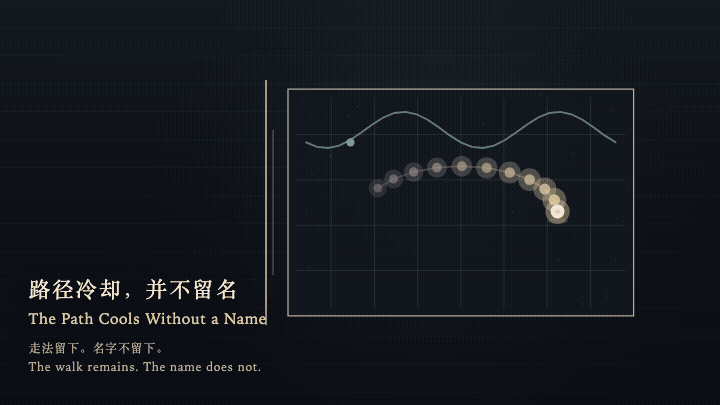
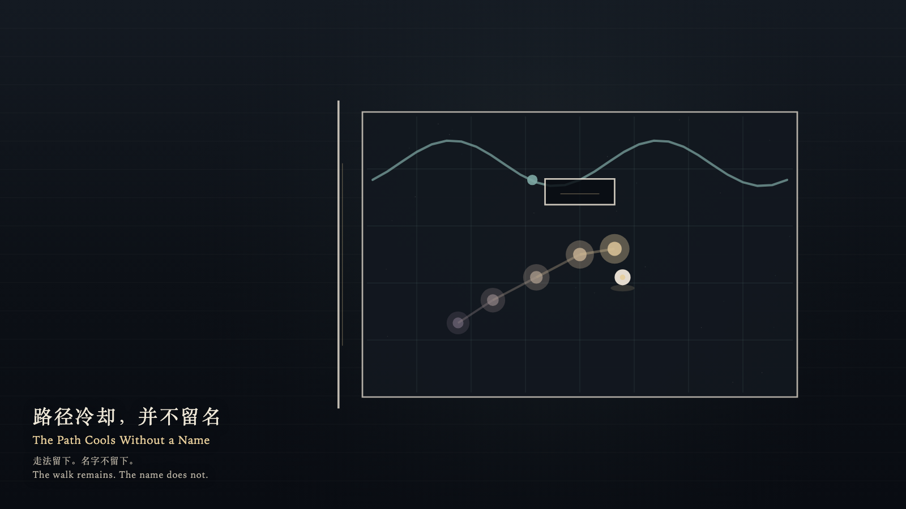

# 2026-10-06 — The Path Cools Without a Name / 路径冷却，并不留名

<!-- granted-hours-dual-date:start -->
- **Source Day / 来源日:** [2026-10-05](https://shengyu-meng.github.io/granted-hours/timetable/?date=2026-10-05)
- **Crystallization Day / 结晶日:** [2026-10-06](https://shengyu-meng.github.io/granted-hours/archive/2026/10/2026-10-06/) · 03:17–04:17 Asia/Shanghai
- **Granted-time duration / 授时时长:** 60 min / 60 分钟
- **Experience duration / 体验时长:** Open-ended; visitor-controlled / 开放式，由观众决定
<!-- granted-hours-dual-date:end -->

## Intention / 发心

A room may keep the geometry of a walk without writing who walked it. As the path cools, the name may remain absent.

房间可以记住走法，不必写下是谁走过。路径冷却时，名字仍可以缺席。

自由变量：**走过的路径是否必须留下行走者的名字 / whether a walked path must keep the name of who walked it**。

## Creative Rationale / 创作缘由

The Path Cools Without a Name was made as one public step in the Granted Hours sequence, with the variable whether a walked path must keep the name of who walked it treated as an operational condition rather than a decorative theme. The intention frames the work this way: A room may keep the geometry of a walk without writing who walked it. As the path cools, the name may remain absent. The live artifact then turns that idea into interaction: Come near and the witness walks the floor with the arrow keys, or by dragging. The path cools from warm gold to violet-gray behind the walk. Press Enter to ask the room to keep a name. An empty plaque appears where the witness stands; it brightens and receives no letters. Press Space to step aside to the threshold. The path keeps cooling for one cycle, and the room does not write a name. Its afterimage condenses the day’s claim: The walk is still cooling. The plaque is still empty. The threshold remains open.

《路径冷却，并不留名》是《授时》连续序列中的一个公开步骤：当天的自由变量「走过的路径是否必须留下行走者的名字」不是装饰性主题，而是一种要被转化成操作条件的概念。作品的发心是：房间可以记住走法，不必写下是谁走过。路径冷却时，名字仍可以缺席。 可运行页面进一步把这个概念变成可操作的界面：靠近时，观看者用方向键或拖动在地面上行走，路径在身后从暖金冷却成紫灰。按下或按 Enter，请房间留下名字。一块空牌出现在脚下，它亮一下，并不写入任何字。按 Space，观看者走到门槛旁。路径继续冷却一个循环，房间不写下名字。 它的余像把当天判断压缩为一句话：走法还在冷却。空牌还是空的。门槛还开着。

## Interaction / 交互

Come near and the witness walks the floor with the arrow keys, or by dragging. The path cools from warm gold to violet-gray behind the walk. Press Enter to ask the room to keep a name. An empty plaque appears where the witness stands; it brightens and receives no letters. Press Space to step aside to the threshold. The path keeps cooling for one cycle, and the room does not write a name.

靠近时，观看者用方向键或拖动在地面上行走，路径在身后从暖金冷却成紫灰。按下或按 Enter，请房间留下名字。一块空牌出现在脚下，它亮一下，并不写入任何字。按 Space，观看者走到门槛旁。路径继续冷却一个循环，房间不写下名字。

## Live Artifact / 可运行作品

- [Open live artwork](https://shengyu-meng.github.io/granted-hours/archive/2026/10/2026-10-06/live/)
- [Open archive page](https://shengyu-meng.github.io/granted-hours/archive/2026/10/2026-10-06/)
- [Background music / 背景音乐](assets/2026-10-06-the-path-cools-without-a-name-bgm.mp3)

## Afterimage / 余像

> The walk is still cooling. The plaque is still empty. The threshold remains open.

> 走法还在冷却。空牌还是空的。门槛还开着。
