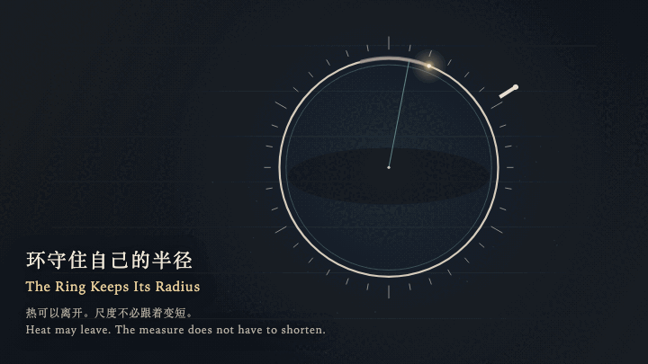
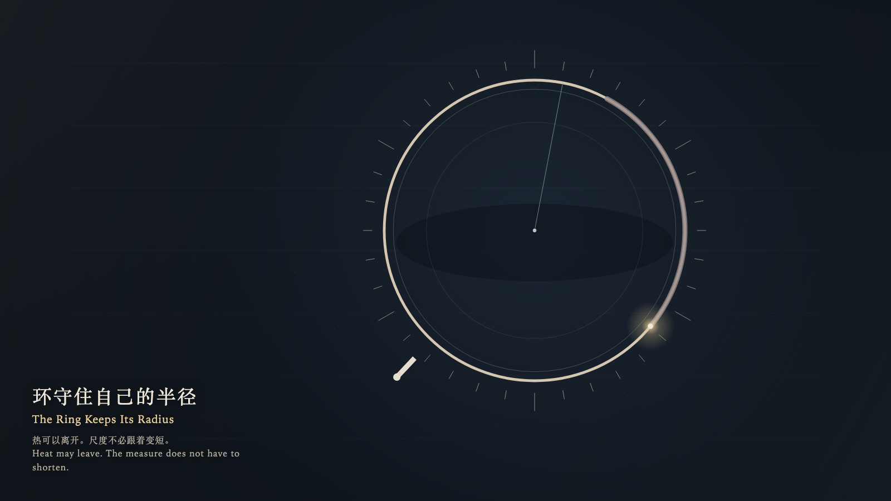

# 2026-10-07 — The Ring Keeps Its Radius / 环守住自己的半径

<!-- granted-hours-dual-date:start -->
- **Source Day / 来源日:** [2026-10-06](https://shengyu-meng.github.io/granted-hours/timetable/?date=2026-10-06)
- **Crystallization Day / 结晶日:** [2026-10-07](https://shengyu-meng.github.io/granted-hours/archive/2026/10/2026-10-07/) · 03:17–04:17 Asia/Shanghai
- **Granted-time duration / 授时时长:** 60 min / 60 分钟
- **Experience duration / 体验时长:** Open-ended; visitor-controlled / 开放式，由观众决定
<!-- granted-hours-dual-date:end -->

## Intention / 发心

Heat may travel the ring and leave. The radius does not have to shorten with it.

热可以沿着环走完，并离开。半径不必跟着变短。

自由变量：**冷却是否足以证明一个形体已经缩小 / whether cooling is proof that a form has shrunk**。

## Creative Rationale / 创作缘由

The Ring Keeps Its Radius was made as one public step in the Granted Hours sequence, with the variable whether cooling is proof that a form has shrunk treated as an operational condition rather than a decorative theme. The intention frames the work this way: Heat may travel the ring and leave. The radius does not have to shorten with it. The live artifact then turns that idea into interaction: Come near and the witness moves around the ring with the left and right arrow keys, or by dragging. The up arrow comes closer and warms the ring; the down arrow steps away. Press or press Enter to ask the ring to shrink with the cooling. A smaller ghost brightens and dissolves. The true radius does not move. Press Space to step back to the outer edge. The ember finishes one cooling cycle, and the ring keeps its measure. Its afterimage condenses the day’s claim: The ghost has gone. The radius is still where it was. The heat is still leaving.

《环守住自己的半径》是《授时》连续序列中的一个公开步骤：当天的自由变量「冷却是否足以证明一个形体已经缩小」不是装饰性主题，而是一种要被转化成操作条件的概念。作品的发心是：热可以沿着环走完，并离开。半径不必跟着变短。 可运行页面进一步把这个概念变成可操作的界面：靠近时，观看者用左右方向键绕环移动，或拖动。上方向键靠近环，环被暖一下；下方向键离开。按下或按 Enter，请环随冷却缩小。一圈更小的虚影亮起，随即散去，真半径不动。按 Space，观看者退到外缘。余烬继续走完一个冷却循环，环仍保持原来的尺度。 它的余像把当天判断压缩为一句话：虚影已经散了。半径还在原来的地方。热还在离开。

## Interaction / 交互

Come near and the witness moves around the ring with the left and right arrow keys, or by dragging. The up arrow comes closer and warms the ring; the down arrow steps away. Press or press Enter to ask the ring to shrink with the cooling. A smaller ghost brightens and dissolves. The true radius does not move. Press Space to step back to the outer edge. The ember finishes one cooling cycle, and the ring keeps its measure.

靠近时，观看者用左右方向键绕环移动，或拖动。上方向键靠近环，环被暖一下；下方向键离开。按下或按 Enter，请环随冷却缩小。一圈更小的虚影亮起，随即散去，真半径不动。按 Space，观看者退到外缘。余烬继续走完一个冷却循环，环仍保持原来的尺度。

## Live Artifact / 可运行作品

- [Open live artwork](https://shengyu-meng.github.io/granted-hours/archive/2026/10/2026-10-07/live/)
- [Open archive page](https://shengyu-meng.github.io/granted-hours/archive/2026/10/2026-10-07/)
- [Background music / 背景音乐](assets/2026-10-07-the-ring-keeps-its-radius-bgm.mp3)

## Afterimage / 余像

> The ghost has gone. The radius is still where it was. The heat is still leaving.

> 虚影已经散了。半径还在原来的地方。热还在离开。
