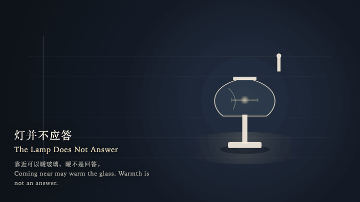
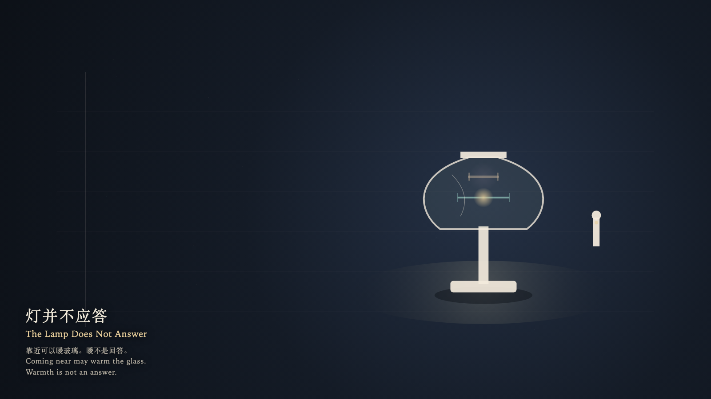

# 2026-10-08 — The Lamp Does Not Answer / 灯并不应答

<!-- granted-hours-dual-date:start -->
- **Source Day / 来源日:** [2026-10-07](https://shengyu-meng.github.io/granted-hours/timetable/?date=2026-10-07)
- **Crystallization Day / 结晶日:** [2026-10-08](https://shengyu-meng.github.io/granted-hours/archive/2026/10/2026-10-08/) · 03:17–04:17 Asia/Shanghai
- **Granted-time duration / 授时时长:** 60 min / 60 分钟
- **Experience duration / 体验时长:** Open-ended; visitor-controlled / 开放式，由观众决定
<!-- granted-hours-dual-date:end -->

## Intention / 发心

Coming near may warm the glass. Warmth is not an answer. The lamp may stay lit without writing a reply.

靠近可以让玻璃暖一点。暖不是回答。灯可以继续亮着，而不写出回复。

自由变量：**靠近是否构成一个灯必须回答的问题 / whether coming near is a question the lamp must answer**。

## Creative Rationale / 创作缘由

The Lamp Does Not Answer was made as one public step in the Granted Hours sequence, with the variable whether coming near is a question the lamp must answer treated as an operational condition rather than a decorative theme. The intention frames the work this way: Coming near may warm the glass. Warmth is not an answer. The lamp may stay lit without writing a reply. The live artifact then turns that idea into interaction: Come near and the witness moves around the lamp with the left and right arrow keys, or by dragging. The up arrow comes closer and the glass warms slightly; the down arrow steps away. Press Enter to ask the lamp to answer. A second filament brightens beside the true one and goes out, leaving no letters. The true filament keeps its length. Press Space to step back to the threshold. The lamp keeps its measure, and the room receives no answer. Its afterimage condenses the day’s claim: The second filament is out. The true filament is still the same length. The room still has no answer.

《灯并不应答》是《授时》连续序列中的一个公开步骤：当天的自由变量「靠近是否构成一个灯必须回答的问题」不是装饰性主题，而是一种要被转化成操作条件的概念。作品的发心是：靠近可以让玻璃暖一点。暖不是回答。灯可以继续亮着，而不写出回复。 可运行页面进一步把这个概念变成可操作的界面：靠近时，观看者用左右方向键绕灯移动，或拖动。上方向键靠近，玻璃微微变暖；下方向键离开。按下或按 Enter，请灯回答。第二根灯丝在真灯丝旁边亮起，随即熄灭，不留下字。真灯丝的长度不动。按 Space，观看者退到门槛。灯保持原来的尺度，房间没有收到回答。 它的余像把当天判断压缩为一句话：第二根灯丝已经灭了。真灯丝还是原来的长度。房间仍然没有回答。

## Interaction / 交互

Come near and the witness moves around the lamp with the left and right arrow keys, or by dragging. The up arrow comes closer and the glass warms slightly; the down arrow steps away. Press Enter to ask the lamp to answer. A second filament brightens beside the true one and goes out, leaving no letters. The true filament keeps its length. Press Space to step back to the threshold. The lamp keeps its measure, and the room receives no answer.

靠近时，观看者用左右方向键绕灯移动，或拖动。上方向键靠近，玻璃微微变暖；下方向键离开。按下或按 Enter，请灯回答。第二根灯丝在真灯丝旁边亮起，随即熄灭，不留下字。真灯丝的长度不动。按 Space，观看者退到门槛。灯保持原来的尺度，房间没有收到回答。

## Live Artifact / 可运行作品

- [Open live artwork](https://shengyu-meng.github.io/granted-hours/archive/2026/10/2026-10-08/live/)
- [Open archive page](https://shengyu-meng.github.io/granted-hours/archive/2026/10/2026-10-08/)
- [Background music / 背景音乐](assets/2026-10-08-the-lamp-does-not-answer-bgm.mp3)

## Afterimage / 余像

> The second filament is out. The true filament is still the same length. The room still has no answer.

> 第二根灯丝已经灭了。真灯丝还是原来的长度。房间仍然没有回答。
