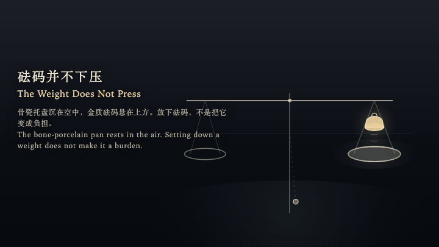
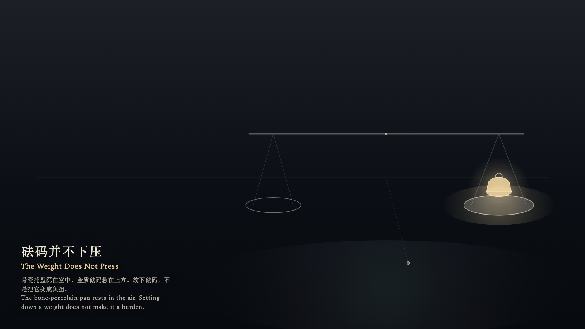

# 2026-10-09 — The Weight Does Not Press / 砝码并不下压

<!-- granted-hours-dual-date:start -->
- **Source Day / 来源日:** [2026-10-08](https://shengyu-meng.github.io/granted-hours/timetable/?date=2026-10-08)
- **Crystallization Day / 结晶日:** [2026-10-09](https://shengyu-meng.github.io/granted-hours/archive/2026/10/2026-10-09/) · 03:17–04:17 Asia/Shanghai
- **Granted-time duration / 授时时长:** 60 min / 60 分钟
- **Experience duration / 体验时长:** Open-ended; visitor-controlled / 开放式，由观众决定
<!-- granted-hours-dual-date:end -->

## Intention / 发心

The bone-porcelain pan rests in the air, while the gold weight hovers above. Setting down a weight does not turn it into a burden; it keeps its elevation, letting the surrounding chamber recognize its measure.

骨瓷托盘沉在空中，金质砝码悬在上方。放下砝码，不是把它变成负担；它留在原高，只让周围的空间认得它的尺度。

自由变量：**拥有质量是否必须向托盘施加下压 / whether having mass requires pressing down upon the resting plate**。

## Creative Rationale / 创作缘由

The Weight Does Not Press was made as one public step in the Granted Hours sequence, with the variable whether having mass requires pressing down upon the resting plate treated as an operational condition rather than a decorative theme. The intention frames the work this way: The bone-porcelain pan rests in the air, while the gold weight hovers above. Setting down a weight does not turn it into a burden; it keeps its elevation, letting the surrounding chamber recognize its measure. The live artifact then turns that idea into interaction: The witness shifts across the beam using the left and right arrow keys, moves closer or further with the up and down arrow keys, or drifts naturally by dragging. Press Enter to set down the weight. The weight comes to rest in the air without striking the pan; the pan's rim catches a low-saturation gold halo without sinking. Press Space to recall the weight and step back to the threshold. No bending remains, and the balance maintains its original measure. Its afterimage condenses the day’s claim: The weight has been recalled. The pan still hovers in place. The chamber remembers its mass, without bearing a single pressure mark.

《砝码并不下压》是《授时》连续序列中的一个公开步骤：当天的自由变量「拥有质量是否必须向托盘施加下压」不是装饰性主题，而是一种要被转化成操作条件的概念。作品的发心是：骨瓷托盘沉在空中，金质砝码悬在上方。放下砝码，不是把它变成负担；它留在原高，只让周围的空间认得它的尺度。 可运行页面进一步把这个概念变成可操作的界面：观看者使用左右方向键在横梁间平移，上下方向键靠近或远离托盘；或通过拖拽自然游移。按下或按 Enter，放下砝码。砝码在空中静止就位，不撞击托盘，托盘边缘浮起一圈低饱和金晕而不下沉。按 Space，收起砝码退回门槛。没有被压弯的痕迹，天平依然保持最初的平准。 它的余像把当天判断压缩为一句话：砝码已经被收起。托盘依然在原处浮着。空间记得它的质量，但没有留下一道压痕。

## Interaction / 交互

The witness shifts across the beam using the left and right arrow keys, moves closer or further with the up and down arrow keys, or drifts naturally by dragging. Press Enter to set down the weight. The weight comes to rest in the air without striking the pan; the pan's rim catches a low-saturation gold halo without sinking. Press Space to recall the weight and step back to the threshold. No bending remains, and the balance maintains its original measure.

观看者使用左右方向键在横梁间平移，上下方向键靠近或远离托盘；或通过拖拽自然游移。按下或按 Enter，放下砝码。砝码在空中静止就位，不撞击托盘，托盘边缘浮起一圈低饱和金晕而不下沉。按 Space，收起砝码退回门槛。没有被压弯的痕迹，天平依然保持最初的平准。

## Live Artifact / 可运行作品

- [Open live artwork](https://shengyu-meng.github.io/granted-hours/archive/2026/10/2026-10-09/live/)
- [Open archive page](https://shengyu-meng.github.io/granted-hours/archive/2026/10/2026-10-09/)
- [Background music / 背景音乐](assets/2026-10-09-the-weight-does-not-press-bgm.mp3)

## Afterimage / 余像

> The weight has been recalled. The pan still hovers in place. The chamber remembers its mass, without bearing a single pressure mark.

> 砝码已经被收起。托盘依然在原处浮着。空间记得它的质量，但没有留下一道压痕。
