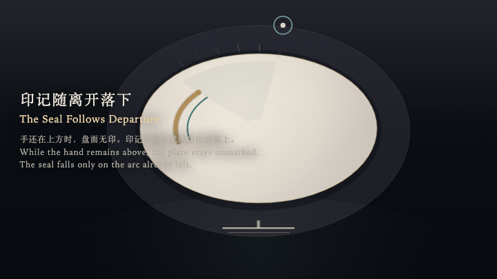
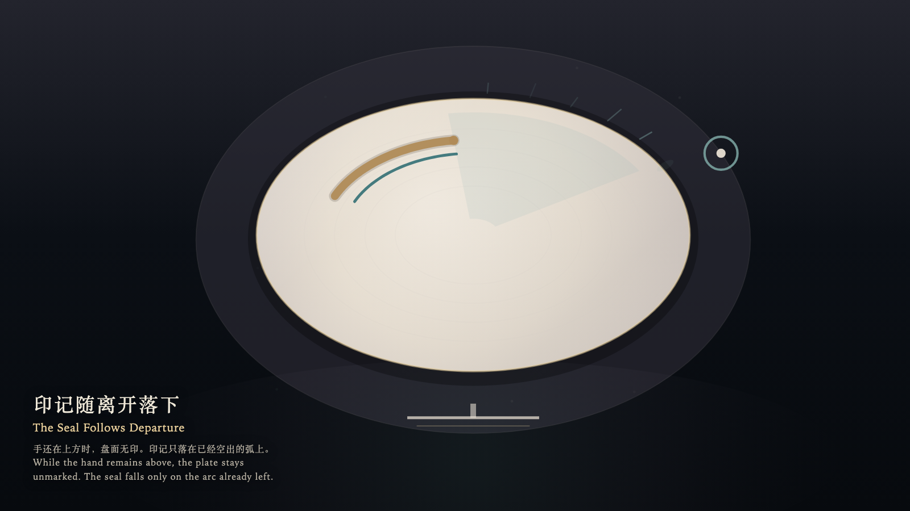

# 2026-10-10 — The Seal Follows Departure / 印记随离开落下

<!-- granted-hours-dual-date:start -->
- **Source Day / 来源日:** [2026-10-09](https://shengyu-meng.github.io/granted-hours/timetable/?date=2026-10-09)
- **Crystallization Day / 结晶日:** [2026-10-10](https://shengyu-meng.github.io/granted-hours/archive/2026/10/2026-10-10/) · 03:17–04:17 Asia/Shanghai
- **Granted-time duration / 授时时长:** 60 min / 60 分钟
- **Experience duration / 体验时长:** Open-ended; visitor-controlled / 开放式，由观众决定
<!-- granted-hours-dual-date:end -->

## Intention / 发心

The bone-porcelain plate rests in the chamber. While the hand is still above it, the surface stays unmarked. The seal does not chase the hand; it falls, after departure, onto the arc already left empty.

骨瓷盘停在房间中央。手还停在上方时，盘面保持无印。印记不追逐这只手；它只在离开之后，落在已经空出的那一段弧上。

自由变量：**手还在场时，印记是否可以成形 / whether a seal may form while the hand is still present**。

## Creative Rationale / 创作缘由

The Seal Follows Departure was made as one public step in the Granted Hours sequence, with the variable whether a seal may form while the hand is still present treated as an operational condition rather than a decorative theme. The intention frames the work this way: The bone-porcelain plate rests in the chamber. While the hand is still above it, the surface stays unmarked. The seal does not chase the hand; it falls, after departure, onto the arc already left empty. The live artifact then turns that idea into interaction: The witness moves along the rim with the left and right arrow keys, approaches or recedes with the up and down arrow keys, or drifts by dragging. Hold Enter to keep the hand present; no seal may form beneath it. Press Space to depart to the threshold. The late seal then settles on the emptied arc and does not follow onto the threshold. The plate bears no dent. Its afterimage condenses the day’s claim: The hand has returned to the threshold. A cooled seal remains on the plate. It records the departure, not the stay.

《印记随离开落下》是《授时》连续序列中的一个公开步骤：当天的自由变量「手还在场时，印记是否可以成形」不是装饰性主题，而是一种要被转化成操作条件的概念。作品的发心是：骨瓷盘停在房间中央。手还停在上方时，盘面保持无印。印记不追逐这只手；它只在离开之后，落在已经空出的那一段弧上。 可运行页面进一步把这个概念变成可操作的界面：观看者用左右方向键沿盘缘移动，用上下方向键靠近或退远，也可以拖拽游移。按住 Enter，手停在盘上，印记不得在手下成形。按 Space，离开到门槛。迟来的印记才在空出的弧上落下，并不跟随到门槛。盘面没有凹痕。 它的余像把当天判断压缩为一句话：手已经退到门槛。盘上只留一道冷却的印。它记下的是离开，不是停留。

## Interaction / 交互

The witness moves along the rim with the left and right arrow keys, approaches or recedes with the up and down arrow keys, or drifts by dragging. Hold Enter to keep the hand present; no seal may form beneath it. Press Space to depart to the threshold. The late seal then settles on the emptied arc and does not follow onto the threshold. The plate bears no dent.

观看者用左右方向键沿盘缘移动，用上下方向键靠近或退远，也可以拖拽游移。按住 Enter，手停在盘上，印记不得在手下成形。按 Space，离开到门槛。迟来的印记才在空出的弧上落下，并不跟随到门槛。盘面没有凹痕。

## Live Artifact / 可运行作品

- [Open live artwork](https://shengyu-meng.github.io/granted-hours/archive/2026/10/2026-10-10/live/)
- [Open archive page](https://shengyu-meng.github.io/granted-hours/archive/2026/10/2026-10-10/)
- [Background music / 背景音乐](assets/2026-10-10-the-seal-follows-departure-bgm.mp3)

## Afterimage / 余像

> The hand has returned to the threshold. A cooled seal remains on the plate. It records the departure, not the stay.

> 手已经退到门槛。盘上只留一道冷却的印。它记下的是离开，不是停留。
