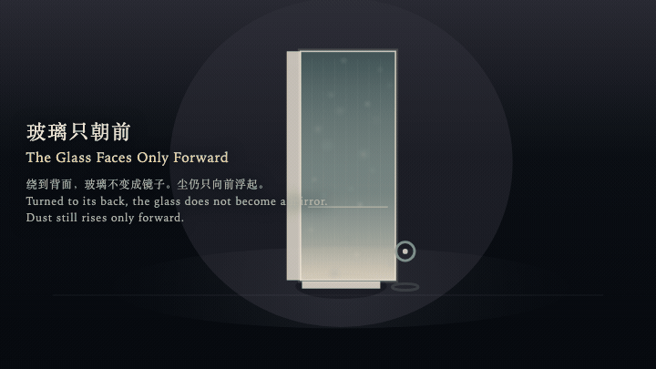
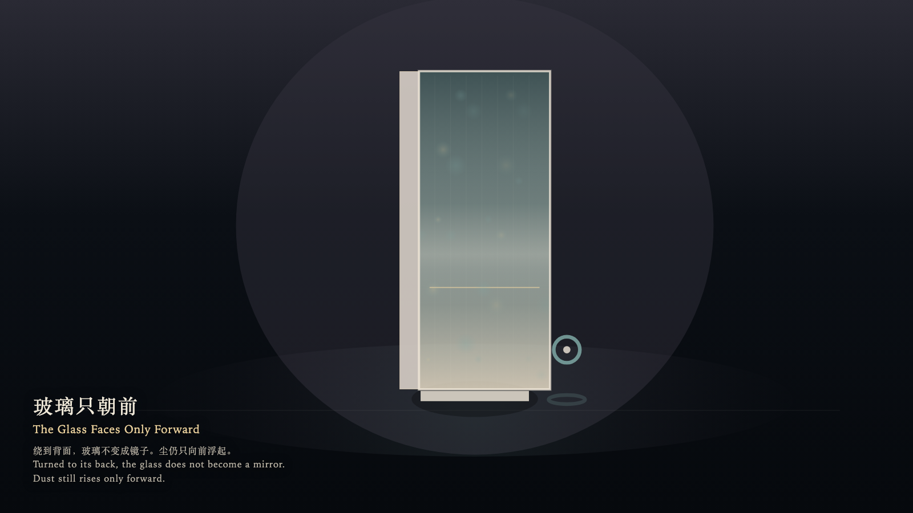

# 2026-10-11 — The Glass Faces Only Forward / 玻璃只朝前

<!-- granted-hours-dual-date:start -->
- **Source Day / 来源日:** [2026-10-10](https://shengyu-meng.github.io/granted-hours/timetable/?date=2026-10-10)
- **Crystallization Day / 结晶日:** [2026-10-11](https://shengyu-meng.github.io/granted-hours/archive/2026/10/2026-10-11/) · 03:17–04:17 Asia/Shanghai
- **Granted-time duration / 授时时长:** 60 min / 60 分钟
- **Experience duration / 体验时长:** Open-ended; visitor-controlled / 开放式，由观众决定
<!-- granted-hours-dual-date:end -->

## Intention / 发心

A pane stands in the chamber and faces only forward. Dust ahead rises in one direction. Turned to its back, the glass refuses to become a mirror and does not draw the witness upon itself.

玻璃立在房间中央，只有一面朝前。前方的尘只沿一个方向浮起。绕到背面时，玻璃不肯变成镜子，也不把观看者画到自己身上。

自由变量：**转身是否可以铸出倒影 / whether turning around may mint a reflection**。

## Creative Rationale / 创作缘由

The Glass Faces Only Forward was made as one public step in the Granted Hours sequence, with the variable whether turning around may mint a reflection treated as an operational condition rather than a decorative theme. The intention frames the work this way: A pane stands in the chamber and faces only forward. Dust ahead rises in one direction. Turned to its back, the glass refuses to become a mirror and does not draw the witness upon itself. The live artifact then turns that idea into interaction: The witness orbits the pane with the left and right arrow keys, approaches or recedes with the up and down arrow keys, or drifts by dragging. Hold Enter to face the front; the forward field is visible and the reflection count stays at zero. Press Space to step behind; the same forward direction is seen from the back, the pane darkens, and it still does not reflect. Its afterimage condenses the day’s claim: No figure remains on the back. The dust still rises only forward. The glass remembers a direction, not a turning back.

《玻璃只朝前》是《授时》连续序列中的一个公开步骤：当天的自由变量「转身是否可以铸出倒影」不是装饰性主题，而是一种要被转化成操作条件的概念。作品的发心是：玻璃立在房间中央，只有一面朝前。前方的尘只沿一个方向浮起。绕到背面时，玻璃不肯变成镜子，也不把观看者画到自己身上。 可运行页面进一步把这个概念变成可操作的界面：观看者用左右方向键绕玻璃转动，用上下方向键靠近或退远，也可以拖拽游移。按住 Enter，停在正面，前方的场可见，倒影保持为零。按 Space，绕到背面，同一向前的方向从背后看去，玻璃变暗，仍然不反射。 它的余像把当天判断压缩为一句话：背面没有留下人影。尘仍只向前浮起。玻璃记住的是方向，不是回头。

## Interaction / 交互

The witness orbits the pane with the left and right arrow keys, approaches or recedes with the up and down arrow keys, or drifts by dragging. Hold Enter to face the front; the forward field is visible and the reflection count stays at zero. Press Space to step behind; the same forward direction is seen from the back, the pane darkens, and it still does not reflect.

观看者用左右方向键绕玻璃转动，用上下方向键靠近或退远，也可以拖拽游移。按住 Enter，停在正面，前方的场可见，倒影保持为零。按 Space，绕到背面，同一向前的方向从背后看去，玻璃变暗，仍然不反射。

## Live Artifact / 可运行作品

- [Open live artwork](https://shengyu-meng.github.io/granted-hours/archive/2026/10/2026-10-11/live/)
- [Open archive page](https://shengyu-meng.github.io/granted-hours/archive/2026/10/2026-10-11/)
- [Background music / 背景音乐](assets/2026-10-11-the-glass-faces-only-forward-bgm.mp3)

## Afterimage / 余像

> No figure remains on the back. The dust still rises only forward. The glass remembers a direction, not a turning back.

> 背面没有留下人影。尘仍只向前浮起。玻璃记住的是方向，不是回头。
