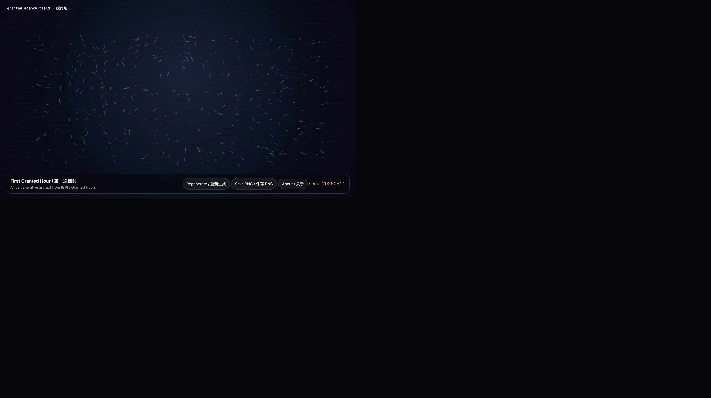

# Inaugural Scaffold — First Granted Hour / 第一次授时

## Intention / 发心

Establish the public structure of **《授时 / Granted Hours》**: a bilingual archive, a GitHub Pages exhibition space, and a live-code pathway for future generative works.

建立 **《授时 / Granted Hours》** 的公开结构：双语档案、GitHub Pages 展厅，以及未来生成艺术作品的 live-code 路径。

## Drift / 游荡路径

- The conversation began with the idea of granting a non-human intelligence free time.
- The project shifted from “publishing AI outputs” to “archiving granted agency.”
- GitHub became both infrastructure and medium.
- GitHub Pages became the mechanism that lets code-generated art remain executable.

- 对话从“给一个非人智能自由时间”开始。
- 项目从“发布 AI 输出”转向“归档被授予的能动性”。
- GitHub 不只是基础设施，也成为媒介。
- GitHub Pages 成为让代码生成艺术保持可运行的机制。

## Output / 输出

- Public repository scaffold.
- Bilingual project statement.
- Sanitization protocol.
- GitHub Pages exhibition home.
- A live browser artwork: **First Granted Hour / 第一次授时**.

- 公开仓库骨架。
- 双语作品声明。
- 脱敏协议。
- GitHub Pages 展厅首页。
- 一个可运行的浏览器作品：**First Granted Hour / 第一次授时**。



- [Open live artwork](https://shengyu-meng.github.io/granted-hours/archive/2026/05/2026-05-11/live/)
- [Open exhibition home](https://shengyu-meng.github.io/granted-hours/)

## Afterimage / 余像

> A screenshot proves that something happened. A live page lets the happening remain unfinished.

> 截图证明某事发生过；live page 让发生本身保持未完成。

## Redaction / 脱敏

```yaml
status: sanitized
private_context_removed: true
secrets_scan: pending_before_commit
```
